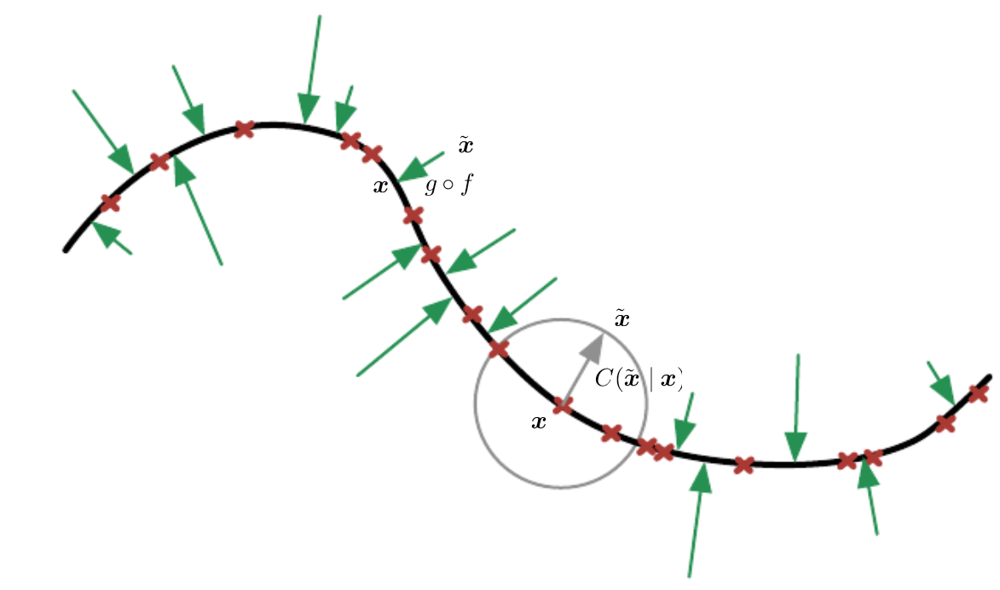
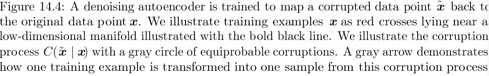
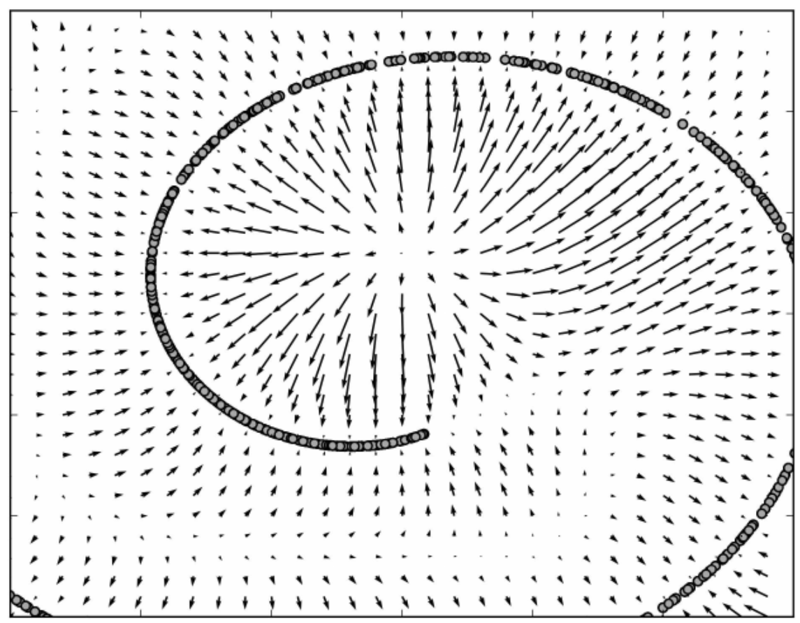
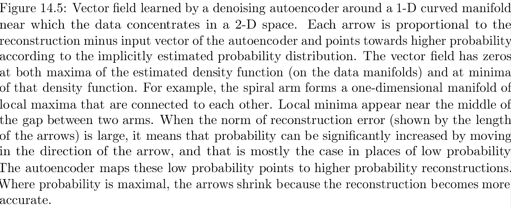



**Auto-encoders** (AE) (also called auto-associator) have a very simple structure. It is actually an artificial neural network (ANN) with two layers where the number of the output units is equal to the number of the input features, which tries to copy its input to its output. It is to learn an identical mapping, i.e. for any \\(x \in R^{d}\\) the training aims to minimize \\(||x-\hat{x}||_{2}^{2}\\) where \\(\hat{x}\\) is the output from AE on the input \\(x\\). It is also said the target output of an AE is the input itself. 

What is the purpose of AEs? The AE is expected to learn (encode) a representation of the input dataset in its hidden units. It can also be considered as a noise filter, or a lossy compressor. The first layer, denoted \\(W_{1}\\), is the encoding layer, which maps the input data to the hidden layer and \\(W_{1}\\)  is called the matrix of encoding weights. The second layer, denoted \\(W_{2}\\) and called the matrix of decoding weights, is the decoding layer which aims to reconstruct the origianl input data from its coded representation. AEs are unsupervised methods and they do not require class labels. However when we use AEs, we assume that the distribution of the data is "narrow" (spiky) or at least it is different from flat distributions.

Let's suppose we are given a trained AE with \\(H\\) hidden units. For a given input \\(x \in R^{d}\\), let's define \\(c(x) = x^{T}W_{1} \in R^{H}\\). This is called the *coding* function and it maps an input vector \\(x \in R^{d}\\) to a representation vector \\(c(x) \in R^{H}\\). Let's define \\(d(h) = h^{T}W_{2}\\) the decoding function for an \\(h = c(x)\\). Function \\(c(.)\\) maps from \\(c(.):R^{H} \rightarrow R^{d}\\). For an easy notation, lets define \\(f(x) = d(c(x))\\).

The reconstruction error (RE) is given as \\(L(x,f(x))\\) for an appropriate loss function. Here we prefer the negative log-likelihood of the reconstruction \\(RE = -\log p(x|f(x))\\). If \\(p(x|f(x))\\) is Gaussian, then the reconstruction error turns to be equivalent to the usual suared error loss function. If we work with binary vectos, the one might perfer the loss function
\\[ log p(x|f(x)) = -\sum_{i=1}^{d}(x_{i}\log f(x)_{i} + (1 - x_{i}) \log(1-f(x)_{i}))\\]

The weight matrices \\(W_{1}\\) and \\(W_{2}\\) of AEs can be learned by usual techniques which are used to train ANNs, such as back-propagation. The parameters of AE can be learned via regularized learning:

\\(W'_{1}, W'_{2} = argmin_{w_{1}, w_{2}}\{L_{w_{1}, w_{2}}(x, f(x)) + \lambda l(W_{1}, W_{2})\} \\)

However, oddly enough, the aim is not to learn a perfect coping machine. If the capacity of the AE model is high enough, the AE can just learn to copy the input to its output without reconstruction error. Actually, in practice we are not interested in the output of an AE but in the hidden layer. Our aim is that to learn the distribution or a representation on the data in the hidden layer, i.e. extracting useful information.

There are two types of AEs. In one type, the number of the hidden units is less than the number of the input features; and in this case AEs are considered as compressors. In the other type the number of the hidden units are equal or more than the number of the features.

Case I: less hidden units than features \\((d < H)\\). In this case, the AE is called undercomplete. In this case the learning of the weights is quite straightforward. Perhaps it is worthwhile mentioning that it can be shown the coding function \\(c(x)\\)  is equivalent to a PCA transformation, that is the \\(k\\) hidden units learn to project the input in the span of the first \\(k\\) principal components of the data.

Case II: equal or more hidden units than features \\((H \geq d)\\). In this case, AE is called overcomplete. In general, one assumes that AE can learn more complex data distribution. As the complexity of the data distribution increases, the more capacity it is needed, and hence the number of the input features should not be a limitation. 
The problem in this case is that, we need to ensure that the AE does not learn an identical mapping. For this purpose we can do:

1. Use a non-linear activation function in the hidden nodes, that is one can use the usual sigmoid function \\(h_{l} = g(x^{T}W_{1,l})\\) in the hidden units, where \\(W_{1,l})\\) is the weight vector corresponding to the *i*-th hidden unit and \\(g\\) is the sigmoid function.
2. Another option is to add a stochastic noise to the input. This is called **denoising auto-encoder**. One can take the original data \\(x\\) and generate several \\(\widehat{x_{k}} = x + N(0, \Sigma)\\) perturbated (corrupted) data, use it as input but the original input is still used as a target output. That is, minimize the loss \\(L(x, f(\hat{x}))\\) . Other way is, for instance, one can set several features of the input data \\(x\\) (as many as half of the features) to zero, and expect the AE to learn to predict the missing values from available features, for randomly selected subsets of missing patterns. 

###### Denoising AEs
Denoising AEs make sense if the perturbed data is not the part of the dataset that is generating corrupted data \\(\widehat{x_{k}}\\) will not fall in the distribution of the data. Putting it another way, it is often assumed the data in the high dimension spans over a low dimensional manifold. Then the perturbated data will lie outside of the lower dimensional manifold.

In this case, DAEs trains the gradient vector field \\(f(\hat{x}) - x\\) that estimates the Fisher score function of the data distribution \\( \frac{\partial}{\partial\theta}\log(p(x;\theta))\\). It can be shown, an DAE with sigmoidal hidden units and linear reconstruction units using Gaussian noise and mean squared error as the reconstruction cost is equivalent (Vincent, 2011) to training RBM with Gaussian visible units. (An RBM with gaussian visible units is defined with the following energy function:
\\[ E(V,H) = -\sum_{i,j}w_{i,j}h_{i}(\frac{v_{j}}{\sigma_{i}}) - \sum_{j=1}\frac{(b_{j} - v_{j})^{2}}{\sigma_{i}} - \sum_{i=1}c_{i}h_{i} \\]

References:
Chapter 4.6 in Bengio: Learning deep architectures for AI. [http://www.iro.umontreal.ca/~bengioy/papers/ftml.pdf](http://www.iro.umontreal.ca/~bengioy/papers/ftml.pdf)
Chapter 14 in Godfellow: Deep Learning: [http://www.deeplearningbook.org/contents/autoencoders.html](http://www.deeplearningbook.org/contents/autoencoders.html)