

Last class, we have seen the linear and logistic regressions. It can be represented for a single data \\(x=[1,x_{1},x_{2},..,,x_{n}]^{T}\\) and a parameter \\(\theta = [\theta_{0},\theta_{1},\theta_{2},..,,\theta_{n}]\\) as:
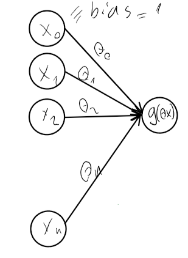

**Figure.** Representation of Linear (for \\(g(x) = x\\)) or Logistic (for \\(g(x) = \frac{1}{1+e^{-x}}\\)) Regression model.

The multi-class logistic regression can be represented as (Note that these are just different binary logistic regression models placed next to each other):

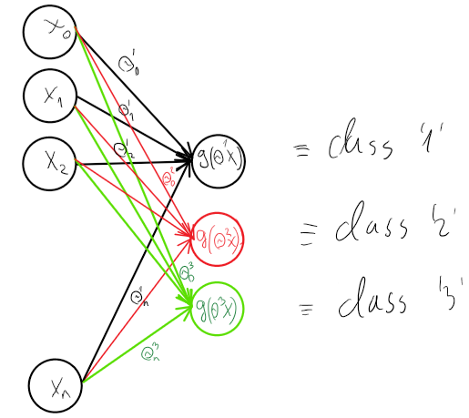

Linear and logistic regression methods are linear models. The linear regression can represent any linear relationship between input and output. The logistic regression can split the space into two halves (one for positive, another for negative) by a linear decision boundary. 

**Figure.** Logistic regression with two features.

What are the model parameters of a logistic regression having the following decision boundary:
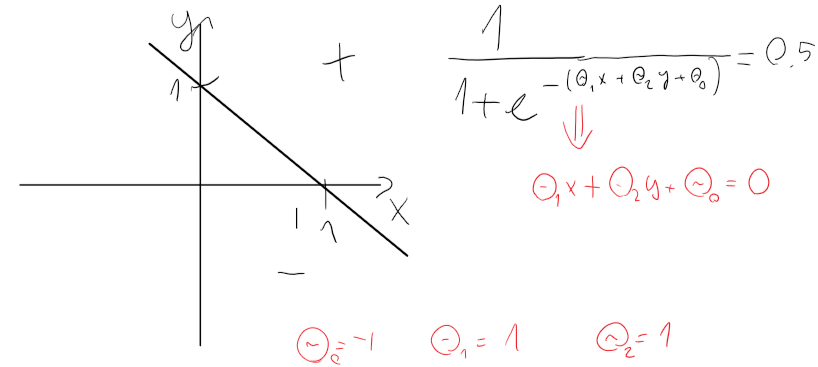

The models above can be extended and more generalized as follows: we can combine more than one sigmoid or linear functions and they can be nested as well. 
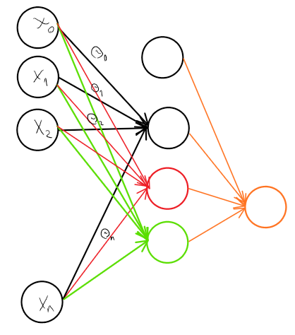

**Figure.** A multilayer Neural Network.

It is worthwhile nothing that, the model is fully connected, without loops, and no jumps over units.
While one sigmoid function can learn a S-shaped function, combination of several sigmoid function can learn more different functions.
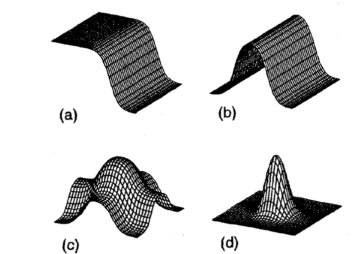

**Figure.** Functions that a neural network can learn with a) one, b) two, and c-d) 4 hidden nodes. Figure is taken from: Christopher Bishop, Neural Networks (1995).

Exercises:
1. Design a neural network (single input binary variables: \\(x\\)) and give its weights, which represents: \\(\lnot x\\) (not)
2. Design a neural network (for two input binary variables: \\(x,y\\)) and give its weights, which represents: \\(x \lor y\\) (or)
3. Design a neural network (for two input binary variables: \\(x,y\\)) and give its weights, which represents: \\(x \wedge y\\) (and) 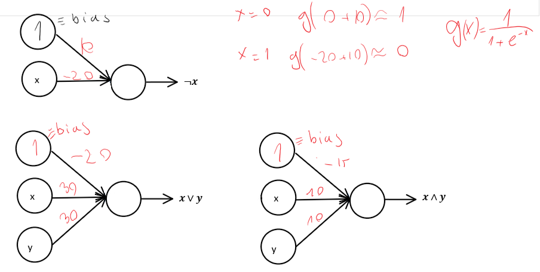
4. Design a neural network (for two input binary variables: \\(x,y\\)) and give its weights, which represents: \\(x \oplus y (xor= (x \lor \lnot y)\wedge(\lnot x \lor y))\\): 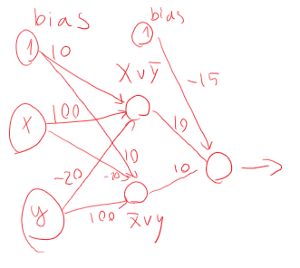
5. Design a neural network for the following decision boundaries: 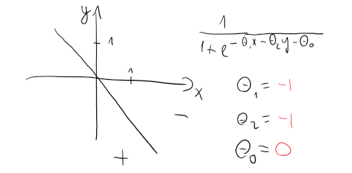
6. Design a neural network for the following decision boundaries: 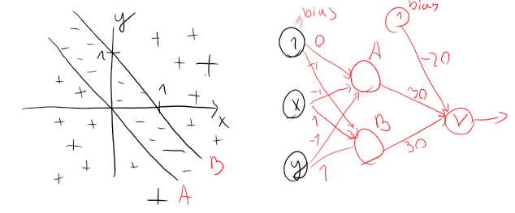

Neural networks have the power to represent more complicated decision boundaries:
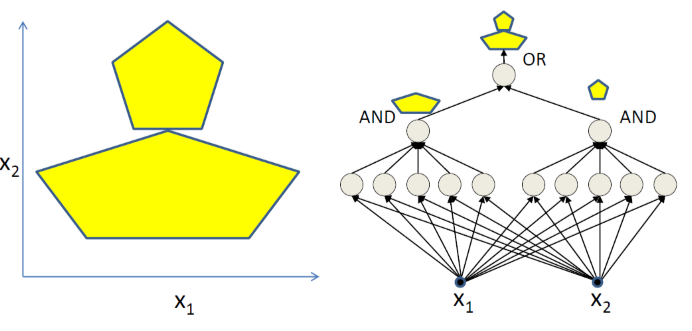

Or any boolean formula:
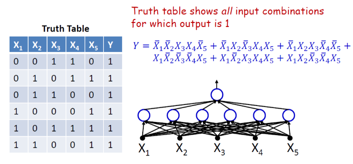

It looks like ANN can learn any functions. In fact, single hidden layer ANNs are universal approximators meaning they can approximate any continuous function arbitrary well. This is known as universal approximation theorem:

**Universal approximation theorem**

Let \\(\phi(.)\\) be a non-constant, monotonically increasing, bounded continious function, \\(x \subseteq R^{m}\\) a compact set and \\(C(X)\\) be the space of continious funcions on \\(X\\). Then \\(\forall f \in C(X), \forall \epsilon > 0 \\) there exist \\(n \in N, a_{ij}, b_{i}, w_{i} \in R, i=1, ..., n\\) and \\(j=1,..., m\\) such that
\\[ \widetilde{f}(x) = \sum_{i=1}^{n} w_{i}\phi (\sum_{j=1}^{m}a_{ij}x_{j} + b_{i}) \\] Eq. 1
and
\\[ ||f(x) - \widetilde{f}(x)|| < \epsilon \\]

This was shown by Kurt Hornik in 1991 [1]. The theorem says that, loosely, every continuous function can be approximated (or represented) by a model in a form in eq. (1). It also turns out the model in eq. (1) can be represented as an artificial neural network where the hidden units are composed of sigmoid functions and the ANN has a single linear output unit. As a consequence any continuous functions can be approximated by such neural network. See ref [2]. 
Note that, this theorem is not particularly useful in practice for few reasons:
1. In practice, we are not given a target function to approximate it. We are given a set of data. 
2. The theorem above is not constructive, and it does not give us a hint about the number of the hidden units (n).
3. It also does not provide as a good parameter weights. The weights in practice are learned by back-propagation (we will discuss it later) via optimizing the weights w.r.t. some cost function. The cost function is non-convex, and the back-propagation can stuck in a local minimum. In addition, the global minimum might have a worse generalization error (i.e. this is the error measured on a test set (a data set which was not seen by the learner during training)) than a local minimum.
4. It is not so 'universal', because it is restricted to continuous functions.

The universal approximation theorem claims only the existence of an approximator for every continuous function but it does not give us hints how to find it.

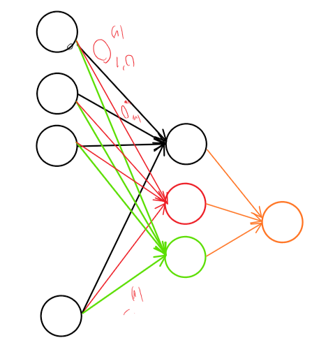

**Figure.** A universal approximator.

### Calculating the function represented by Neural Network

Some definitions:
A hidden layer can be a layer of weights or a layer of units. This is confusing and a convention has not been made yet.

Number of hidden layers: \\(L\\).  In the example above \\(L = 3\\).

Number of hidden units in the hidden or output layer \\( 2 \leq l \leq L\\) is \\(s_{l}\\).

Parameters of a hidden unit \\( 1 \leq s_{i,l} \leq s_{l}\\) of hidden layer \\(l: \theta_{i}^{l}\\)  which contains the bias parameter \\(\theta_{l}^{0}\\).

For a layer \\(l\\), we can arrange the parameters \\(\theta_{i}^{l}\\) in a matrix form as 
\\[ \theta^{l} = 
\left[\begin{array}{cccc}
\theta_{1,0}^{l} & \theta_{1,1}^{l} & ... & \theta_{1,s_{l-1}}^{l}   \\\
\theta_{2,0}^{l} & \theta_{2,1}^{l} & ... & \theta_{2,s_{l-1}}^{l}   \\\
& & . & & \\\
& & . & & \\\
\theta_{s_{l},0}^{l} & \theta_{s_{l},1}^{l} & ... & \theta_{s_{l},s_{l-1}}^{l}
\end{array}\right] = \left[\begin{array}{cccc}
\theta_{1}^{l}  \\\
\theta_{2}^{l}  \\\
. \\\
. \\\
\theta_{s_{l}}^{l}
\end{array}\right]
\\]

This gives us a matrix of parameters for each layer, and it has \\(s_{l}\\) rows, one row for each unit, and the matrix has \\(s_{l-1} + 1\\) columns, column \\(i\\) stands for the input \\(i\\). Note that the first column stands for the bias variable in each row.

Activation of unit \\(s_{i,l}\\) is defined as \\(a_{i,l} = g(\Theta_{i}^{l}A_{l-1})\\), where \\(A_{0} = x\\) the input, and \\(A_{i} = [1, g(\Theta_{1}^{l-1}A_{l-1}), g(\Theta_{2}^{l-1}A_{l-1}), ..., g(\Theta_{s_{i},l-1}^{l-1}A_{l-1})]^{T}\\). The first constant 1 used for the bias parameter.

The function which is represented by the neural network is:
\\[h_{\Theta(x)} = A_{L}\\]
Except that, there is no 1 for the bias at the output layer.
This can be written in a recursive form:
\\[h_{\Theta(x)} = g(\Theta^{L}g(\Theta^{(L-1)}g(...g(\Theta^{3}g(\Theta^{2}g(\Theta^{1}x)))))\\]
Except that, the constant 1s have to be handled properly.

### Forward propagation.

ANN takes an input data and it pushes the input through the network.
Formally, it is defined as \\(h_{\Theta(x)} = A_{L}\\). It produces a single value in case of binary classification problems, or a vector in case of multi-class classification problems. In the second case, for a data \\(x\\), every vector component \\((A_{L})_{i}\\)  gives a score on how much the input data \\(x\\) belongs to the ith class.

**Semantic of ANNs:** It is very important to know that what we want from a multi-layer neural network. We expect it to propagate the input data through its layers towards the output. The first layer is the raw data layer. Higher layers aim to give a higher abstraction of the data, often referred to as *features*. At every layer \\(l\\) , it performs first a linear transofmation \\(R^{s_{l-1}} \rightarrow R^{s_{l}}: \Theta^{l}A_{l-1}\\), where the linear transofmation is parameterised by \\(\Theta^{l}\\), followed by non-linear activation function applied element-wise. The last layer can correspond either to class labels y in classification tasks or some other high-level cause in generative tasks. That is, an ANN propagates data through several level of abstractions: from the raw data to a higher level meaning, and at every step we expect to get a higher level of abstraction of the data by feature transformations. We also expect that the dataset becomes "more and more linearly separable" at higher levels.

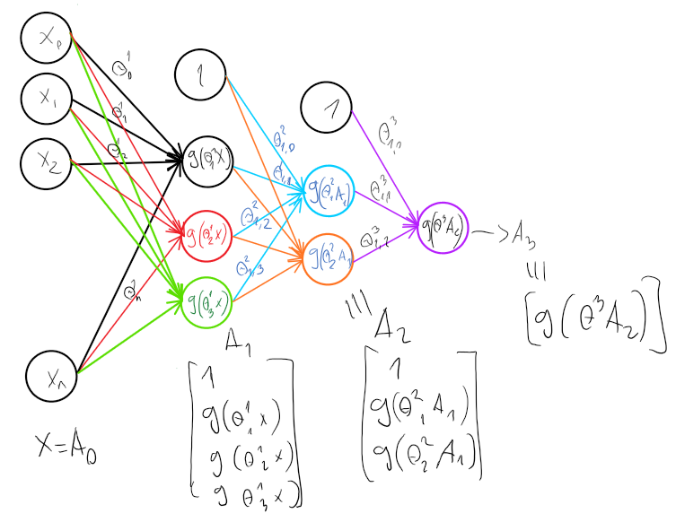

So far, we defined the ANN. It is not a big deal. The important questions is that how can we specify (or learn) the weights of it, mainly from a given dataset. We could do it manually but this would be too cumbersome. 
Now, we will focus on how one could calculate (i.e. train) the weights of a ANN from a given dataset. Let's suppose, we have the following dataset \\(D = \\{(X_{i}, Y_{i})|X_{i} \in R^{n}, y_{i} \in C\\}\\). Data are usually represented as column vectors, and we can arrange our data in a matrix form:
\\[
X = \left[\begin{array}{cccc}
1 & 1 & ... & 1   \\\
X_{1} & X_{2} & ... & X_{m}
\end{array}\right] =
\left[\begin{array}{cccc}
1 & 1 & ... & 1   \\\
x_{1,1} & x_{1,2} & ... & x_{1,m} \\\
. & . & . & . \\\
x_{n,1} & x_{n,2} & ... & x_{n,m} 
\end{array}\right]
\\]
where the first element in each column vector is used for the bias parameter.
For binary classification problems, we define one output unit in the last layer. 
For multi-class classification problems (\\(y = \\{0,1,2,...,K\\}\\)) for each class label \\(y_{i}\\)  we define column vector \\(Y_{i} \in B^{k \times 1}\\) such that
\\[Y = \left[\begin{array}{cccc}
0 \\\
. \\\
1 \\\
. \\\
0 
\end{array}\right]
\\]
where \\(B = \\{0,1\\}\\) and the vector contains 1 only at the yth postion, and contains 0's in all the other places. This is also known as (a.k.a) one-hot encoding. In addition, we define one unit for each class in the last layer, thus for 10 class classification problem the neural network will have 10 output units.

For the training we need a cost function (a.k.a. learning objective) what we could optimize/minimize.

### Error calculation:

Let us consider a K-class classification problem. Let's suppose we have the following dataset \\(D = \\{(X_{i}, Y_{i})|X_{i} \in R^{n}, y_{i} \in \\{1, ..., K\\}\\} \\) and \\(Y_{i} \in B^{k \times 1}\\)	are the one-hot encoded class labels.
Let \\(h_{\Theta(x)}\\) denote a multi-layer neural network \\(h_{\Theta}(x) = A_{L}\\), where \\(A_{i} = [1, g(\Theta_{1}^{l-1}A_{l-1}), g(\Theta_{2}^{l-1}A_{l-1}), ..., g(\Theta_{s_{i}}^{l-1}A_{l-1})]^{T}\\) for \\(1 \leq i \leq L \\) and \\(A_{0} = x\\).

The error made by a \\(h_{\Theta(x)}\\) on a data can be calculated in the way similarly to the error function J of the Logistic Regression.

\\[J(\Theta\mid D) = \frac{1}{m}\sum_{i=1}^{m}\sum_{k}^{K}(-(Y_{i})\_{k}\log(h_{\Theta}(x_{i})\_{k})) - (1 - (Y_{i})\_{k})\log(1 - h_{\Theta}(x_{i})\_{k}) + \frac{\lambda}{2}\sum_{l=1}^{l_{n}}\sum_{i=1}^{s_{l}}\sum_{j=1}^{s_{l+1}}(\theta_{j,i}^{l})^{2}\\]
\\[J(\Theta\mid D) = \frac{1}{m}\sum_{i=1}^{m} 1^{T} (-Y_{i}\log(h_{\Theta}(x_{i})) - (1 - Y_{i})\log(1-h_{\Theta}(x_{i})) + \frac{\lambda}{2}\sum_{l=1}^{l_{n}}\sum_{i=1}^{s_{l}}\sum_{j=1}^{s_{l+1}}(\Theta_{j,i}^{l})^{2} \\]

**1** stands for a vector containing only 1's and log(.) is applied element-wise.
It is basically defined as the cumulative difference from the desired output made by each "output", combined with the regularization term, where the difference is expressed by cross-entropy.
Note that, this error function is no longer convex, thus finding an optimum is hindered by the local optima problem.

The weights of a neural network can be calculated with gradient descent algorithm.

Now the training algorithm can be formulated as:
\\[ 
    \begin{array}{ll}
    	\text{initialize } \theta_{j} \text{ with random values.} \\\
        \text{repeat until convergence \\{} \\\
        \widetilde{\theta_{i,j}^{l}} = \theta_{i,j}^{l} - \mu \frac{\partial}{\partial\theta_{i,j}^{l}J(\theta|D)} & \text{for all j in all layers l;} \\\
        \widetilde{\theta_{i,j}^{l}} = \theta_{i,j}^{l} & \text{for all j in all layers l;} \\\
        \text{\\}}
    \end{array}       
\\]

Let us introduce the simple notation for the derivatives: \\( \\)
What we need is "just" calculation of the derivatives of the cost function. The main problem with this is that variables depend on each other and they influence each other. To calculate the derivate of such nested functions we need the chain rule from the calculus.

Calculus Refresher (chain rule):
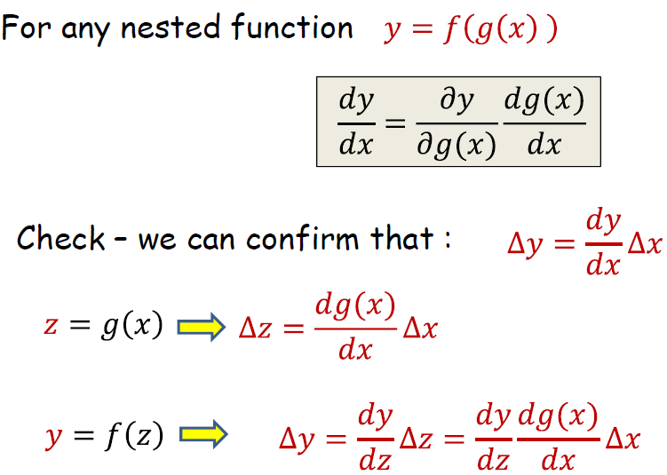

Example for real-valued functions \\(f(g(x))\\):
\\(frac{\partial f(x(g(x)))}{\partial x} = \frac{\partial f(x(g(x)))}{\partial g(x)} \frac{\partial g(x)}{\partial x} = f'(g(x)) g'(x)\\)

Influence diagram:
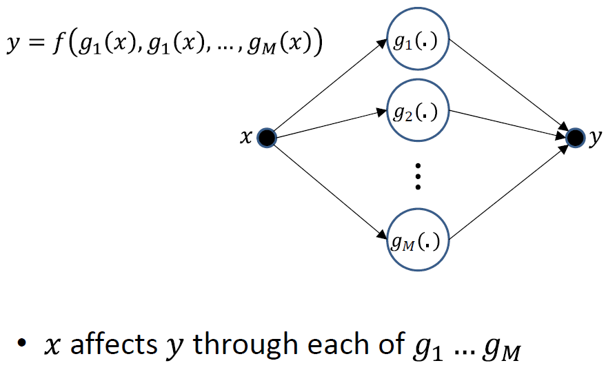

Small perturbation in \\(x\\) cause small perturbations in each \\(g_{i}\\)'s, each of which individually additively perturbs \\(y\\).
Let's get back to the calculation of derivatives:

The method, which calculates that how wrong the parameters were and uses these errors to update the weights from the output toward the input (backward) is called the backpropagation (short for backward propagation of errors).

###### Backward propagation

Let \\(h_{\theta}(x)\\) represent a neural network \\(A_{L} = h_{\theta}(x)\\) and let \\(\Sigma^{L} = A_{L} - Y_{i}\\), which is basically a column vector containing the difference between the actual output and the expected output. This is actually the error at the output level. The top level of the neural network is basically a logistic regression \\(A_{L} = g(\theta^{L}A_{L-1})\\) in which the input comes from the previous layer L-1. Let us consider \\(A_{L-1}\\) as a constant input here (instead of a recursive function). Thus, the error here:
\\[J = (-Y_{i}\log(A_{L})) - (1 - Y_{i}) \log(1-A_{L} = (-Y_{i}\log(g(\theta^{L} A_{L-1})) - (1-Y_{i}) \log(1-g(\theta^{L} A_{L-1})))\\]

Note: we handle the regularization terms later.
We calculate the derivatives with respect to the parameters at every layer.

###### The derivatives of J wrt the parameters \\(Θ^{L}\\)  in the last layer L is calculated as follows:

\\[\frac{\partial J}{\theta^{L}} = \frac{\partial(-Y_{i}\log(g(\theta^{L}A_{L-1})) - (1-Y_{i}) \log(1 - g(\theta^{L}A_{L-1})))}{\partial\theta^{L}}\\]

Using \\(\log'(x) = \frac{1}{x}\\)

\\[ -\frac{Y_{i}}{g(\theta^{L}A_{L-1})}g'(\theta^{L}A_{L-1}) - \frac{1-Y_{i}}{1 - g(\theta^{L}A_{L-1})}(1 - g(\theta^{L}A_{L-1}))' = \\]

Using \\(g'(x) = g(x)(1 - g(x))x'\\) Remember: \\(g\\) is the sigmoid function.

\\[ -\frac{Y_{i}}{g(\theta^{L}A_{L-1})} (g(\theta^{L}A_{L-1}))(1 - g(\theta^{L}A_{L-1}))(\theta^{L}A_{L-1})' - \frac{1-Y_{i}}{1 - g(\theta^{L}A_{L-1})}(-1)(1 - g(\theta^{L}A_{L-1}))(\theta^{L}A_{L-1}) = \\]

\\[ -Y_{i}(1 - g(\theta^{L}A_{L-1}))A_{L-1}^{T} + (1 - Y_{i})(g(\theta^{L}A_{L-1}))(\theta^{L}A_{L-1}))(\theta^{L}A_{L-1}))' = \\]

\\[(-Y_{i} + Y_{i}g(\theta^{L} A_{L-1}) + g(\theta^{L}A_{L-1}) -Y_{i}(g(\theta^{L}A_{L-1})))A_{L-1}^{T} = (g(\theta{L}A_{L-1}) - Y_{i})A_{L-1}^{T} \\]

Thus, we have:
\\[\nablaJ = \frac{\partial J}{\partial\theta^{L} = (g(\theta{L}A_{L-1}) - Y_{i})A_{L-1}^{T} = (A_{L} - Y_{i})A_{L-1}^{T} = \Sigma^{L}A_{L-1}^{T} \\]

Let \\( \nabla^{L} = \Sigma^{L}A_{L-1}^{T}\\), which is the amount by which the weight in the last layer are to be corrected (updated). We use this amount to update the weigths.

###### The derivatives of J wrt. the parameters \\(Θ^{L−1}\\)  in the layer \\(L-1\\) is calculated as

Now, the next step is to calculate the derivatives for the parameters \\(Θ^{L−1}\\) at layer \\(L-1\\). We consider \\(A_{L-1}\\) as a function of \\(A_{L-2}\\), but consider \\(A_{L-2}\\) as a constant input: \\(A_{L-1} = g(\theta^{L-1}A_{L-2}\\):
The cost function now is:
\\[J = (-Y_{i}\log(g(\theta^{L}g(\theta^{L-1}A_{L-2}))) - (1 - Y_{i}) \log(1 - g(\theta^{L}g(\theta^{L-1}A_{L-2})))) \\]

\\[ \frac{\partial J}{\partial\theta^{L-1}} = \frac{\partial J}{\partial g(\theta^{L}g(\theta^{L-1}A_{L-2}))} \dot \frac{\partial g(\theta^{L}g(\theta^{L-1}A_{L-2}))}{\partial g(\theta^{L-1}A_{L-2})} \dot \frac{\partial g(\theta^{L-1}A_{L-2})}{\partial \theta^{L-1}}\\]

Now, we will calculate the derivatives of each factors:

\\[\\]

References:
1. Kurt Hornik: Approximation Capabilities of Multilayer Feedforward Networks. Neural Networks, vol. 4, 1991.
2. [http://citeseerx.ist.psu.edu/viewdoc/download?doi=10.1.1.101.2647&rep=rep1&type=pdf](http://citeseerx.ist.psu.edu/viewdoc/download?doi=10.1.1.101.2647&rep=rep1&type=pdf)