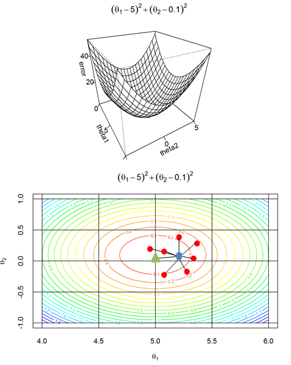



#### Bias-Variance trade-off and model selection.

(Note that we do not discuss here the bias-variance decomposition of error)

In the previous lessons we used the Gradient Descent optimization method to find a model which fits the most to the data if it converges. Other optimization methods could be employed, all would give more-or-less the same model.
The model returned may depend on
* The random initialization of the theta parameters.
* The termination condition in the iteration.
* The level of noise during data sampling methods
* The data.

We do not discuss the first three problems, but will focus on the last, the data.
The model resulted in the training depends on the data, and it varies upon resampling the training data. 
When resampling your training data, it could result in a different model. 

Let \\(G\\) be class of models, and let \\(\widehat{\Theta} \in G\\) denote the true model we are looking for. This is the model we could get on sufficiently large dataset sampled without any noise, and the learning algorithm would give the exact global optimum without involving any numerical instability and we assume that it is fixed, but unknown. Note that this is not the model which generated data, the real true model might not be a member of \\(G\\), or it might not be computable. In reality, data is not perfect, learning algorihms can terminate early. Hence, the learning proceudre can be considered as a point estimation of \\(\widehat{\Theta}\\) which is a function of the data. Let \\(\Theta\\) denote the estimation of \\(\widehat{\Theta}\\). Since the data drawn from a random procedure, any estimation \\(\Theta\\) of \\(\widehat{\Theta}\\) is random, and it has mean and variance.

**Figure 1.** Bias and Variance of the model selection. Green triangle (in the middle) represents the true model \\(\Theta\\) and red dots represent point estimations \\(\Theta\\) of \\(\widehat{\Theta}\\). Blue rectangle represents the mean of the point estimations.

Let \\(\Theta_{m}\\) be an estimation of \\(\widehat{\Theta}\\) calculated on a dataset containing \\(m\\) data.
The **bias of an estimator** is defined as:
\\[bias(\Theta_{m}) = E[\Theta] - \\(\widehat{\Theta}\\)]

where \\(E(.)\\) denotes the statistical expected value over the models. The bias measures how far the point estimation can be expected from the true model. An estimator is said to be unbiased if \\(bias(\Theta_{m}) = 0\\), and it is said to be asymptotically unbiased if \\(\lim_{m \rightarrow \inf}bias(\Theta_{m} = 0\\)

The **variance of an estimator** is defined as:
\\[Var(\Theta_{m}) = E[\Theta_{m}^{2}] - E[\Theta_{m}]^{2}\\]

The variance provides a measure on how the estimation would vary as we resample the dataset independently \\(m\\) times. The higher the variance is the more the estimation depends on the data. This means small change in data would result in big change in the model.
In practice, bias cannot be estimated as we don't know the true model. Moreover, in practice the data is often obtained during capturing real-world events (such as taking pictures of cats dogs or recording speech) and the true model is not a member of a parametrized model class.  
However, the calculation of the variance is not involved to the true model, and it could be estimated!

#### Jackknife estimation of variance

This approach iteratively calculates statistics by removing one different data in each iteration. It is often called *leave-one-out*. Let \\(D_{m} = \\{(X_{i}, Y_{i})\mid X_{i} \in R^{n}, y_{i} \in C\\}\_{i=1}^{m} \\) the training dataset, and let \\(\theta_{-i}\\) a model estimation obtained on the dataset \\(D_{m-1}\\) without the data \\(i\\).
The mean of the models can be estimated by:
\\[E_{jk}[\theta_{m}] = \frac{m-1}{m}\sum_{i=1}^{m}\theta_{-i}\\]

Using this mean one can give an estimation on the variance.

\\[Var_{jk}(\Theta_{m}) \approx \frac{m-1}{m}\sum_{i=1}^{m}[\Theta_{-i} - E_{jk}[\Theta_{m}]]^{2} \\]

This estimation method can be time consuming in large datasets.

#### Bootstrap estimation of variance

Bootstrap datasets is created via selecting \\(m\\) data from \\(D_{m} = \{(X_{i}, Y_{i})|X_{i} \in R^{n}, y_{i} \in C\}_{i=1}^{m} \\), with replacement. Using replacement in the data sampling means that the bootstrapped data contains some duplications. Using \\(B\\) bootstrapped datasets (drawn independently) can be used to estimate the variance of the models. Let \\(\theta_{i}\\) be the model learned on the \\(i\\)-th bootstrapped dataset, \\(i = 1,...,B\\). (Note that, here \\(\theta_{i}\\) does not denote the ith parameter in \\(\theta\\), but it means the full parameter set obtained on the \\(i\\)-th training bootstrapped dataset.)

The mean and variance estimated via bootstrap:

\\[E_{bs}[\theta_{m}] = \frac{1}{B}\sum_{i=1}^{B}\theta_{i}\\]

\\[Var_{bs}(\theta_{m}) \approx \frac{m-1}{m}\sum{m}{i=1}[\theta_{i} - E_{bs}[\theta_{m}]]^{2} \\]

The benefit of the bootstrap estimation over the jackknife is that the number of the bootstrap datasets \\(B\\) can be adapted to the computational resources available. However, the more bootstrapped datasets are used the better variance estimation we get.

#### What does the variance tell us?

High variance means that the model obtained with the learning algorithm depends on the current training data. It also can mean, the model possibly performs well on the training dataset, but it might perform poor on an unseen data. **Generalization** means that how well a trained model (logistic regression, Neural Networks, SVMs) performs well on an unseen data. In practice we do not care how well a learning algorithm performs on the training dataset, but we want to know how well it performs on a real data in the future application. Hence we do not want our model to highly depend on the actual data but have a good generalization.

**Overfitting** happens when the model adapts to the current dataset well, but performs on the test set poorly. In this case, usually, the model depends on the training data too much, and thus the variance is high. In other words, overfitting can mean that the model "learns" the noise as well and this hinders the generalization. 

**Underfitting** happens when the model does not fit neither to the training set nor to the test set.

**Figure 2.** Over and under fitting. Left hand side (LHS) shows an example for overfitting. Right hand side (RHS) shows an example of underfitting. The middle plot shows a reasonably good fit to the data.

#### Learning curves

One can plot the actual error achieved on the train and the test sets as a function of the number of iterations used. The error (accuracy) on the training set should grow as the training iteration increases, while the test error should decreases. These curves are called **learning curves**. In the case of overfitting there is a gap in the error on the train and test sets.  Figures 3-5 show examples for under-, over-, and well- fitting.

**Figure 3.** Learning curves in overfitting. In case of overfitting, the model achieves low error on the training set, but still has high error on the test sets.

**Figure 4.** Learning curves in underfitting. Underfitting happens when the model does not fit to the data. In this case the model achieves high error on both training and test sets.

**Figure 5.** In a good fit the model achieves low and nearly the same error on test set as on the train set.

**Model Capacity (model Complexity)** gives an intuition how much the model is capable to learn "complicated" models. The capacity of a linear model, such as linear regression, or linear SVM, can be considered low. However, a multi-layer neural networks using many hidden units can be considered highly capable models. If the model capacity is low, then model may underfit the data. If the capacity of a model is too high, then it might overfit and might learn noise as well.

**The Minimum Description Length (MDL)** principle states that one should use the model having the smallest  Kolmogorov complexity among all the good models that fit the data well i.e.

\\[K(\theta, D) = K(\theta) + K(D using \theta)\\]

where \\(K)\\ denotes the Kolmogorov complexity of its argument. The Kolmogorov complexity (or also called algorithmic complexity) of a string (binary string) x is the length of the shortest program that prints the string \\(x\\) as an output. The Kolmogorov complexity is uncomputable, and it has little practical interests.

#### Structural risk minimization

It gives a preference to a model where the estimation error and the model complexity is low \\(\theta = argmin_{\theta \in G}(J(\theta|D) + K(\theta,D))\\)

This is in accordance with the Occam's Razors which states that among equally adequate  models (theory, proof, etc) the simpler is preferred.

**Empirical Risk Minimization.** The idea here is to use a model which has the lowest estimation error overall without preference toward smooth or simple models:

#### Parameters and hyper parameters

Parameters are estimated via learning, however not all parameters can be learned. Typically the \\(k\\) in the kNN, the number of the hidden layers and the number of the units within each layer in Neural Networks, the kernel function, and its parameters, the regularization parameter, the learning rate are not learned, but manually tuned. The parameters which are tuned manually and not by the optimizer are called hyper parameters.  In order to manually tune the hyper parameters, usually the data set given to us is split into 3 parts, say 60%-20%-20%. The 60% of the data is used to train the model parameters, 
The hyper parameters are tuned using the 20% validation set. Finally, when we think that the parameters and hyper-parameters of the model is well calibrated, a final test is carried out on the third 20% dataset.

#### The n-fold cross validation (CV). 

In this approach the dataset is partitioned in n sets (of equal size). Then iteratively one set is left out for validation while the n-1 datasets are merged and used for training. In practice, 10-fold cross validation, and 5-fold cross-validation are the most commonly used.

#### Class imbalance problem

This phenomena occurs when the size of one of the class is relatively too high compared to the other class. Let's say in a binary classification problem the ratio of the negative and positive data instances is 99:1. In such case the underrepresented data might not get enough attention (weight) from the learner.

#### Missing values
Often data is not complete and some missing values can occur in the data set. This can be a result of a sensor failure during data acquisition.
When a presence of a missing value is uncorrelated to the class labels, one can use a missing value estimation method. However, if a missing value is correlated to the class labels, then it is advised to incorporate this fact to the model.