

Learning by analogy.

"Frank Abagnale Jr. is one of the most notorious con men in history. Abagnale, portrayed by Leonardo DiCaprio in Spielberg’s movie Catch Me If You Can, forged millions of dollars’ worth of checks, impersonated an attorney and a college instructor, and traveled the world as a fake
Pan Am pilot—all before his twenty-first birthday. But perhaps his most jaw-dropping exploit was to successfully pose as a doctor for nearly a year in late-1960s Atlanta. Practicing medicine supposedly requires many years in med school, a license, a residency, and whatnot, but Abagnale managed to bypass all these niceties and never got called on it.
Imagine for a moment trying to pull off such a stunt. You sneak into an absent doctor’s office, and before long a patient comes in and tells you all his symptoms. Now you have to diagnose him, except you know nothing about medicine. All you have is a cabinet full of patient files: their symptoms, diagnoses, treatments undergone, and so on. What do you do? The easiest way out is to look in the files for the patient whose symptoms most closely resemble your current one’s and make the same diagnosis. If your bedside manner is as convincing as Abagnale’s, that might just do the trick. 
Analogy was the spark that ignited many of history’s greatest scientific advances. The theory of natural selection was born when Darwin, on reading Malthus’s Essay on Population, was struck by the parallels between the struggle for survival in the economy and in nature. Bohr’s
model of the atom arose from seeing it as a miniature solar system, with electrons as the planets and the nucleus as the sun. Kekulé discovered the ring shape of the benzene molecule after daydreaming of a snake eating its own tail."[ref: The Master Algorithm by P. Domingo.]

**Instance-based learning, k-Nearest Neighbor (kNN).** The idea is that, classify a new object as the class of the "closest" instance-reference.
It requires 1) a distance function to measure the distance between data instances, and 2) and a policy to determine the closeness of a data instance to a class based on the distance between new instance and the members of the given class.
1. For example, one can use the Euclidean distance defined for \\(x, y \in R^{n}\\):
\\[d(x,y) = \lVert x - y \rVert_{2} = \sqrt{\sum_{i=1}^{m}(x_{i} - y_{i})^{2}}\\]
2. Given a dataset \\(D = \{X_{i}, Y_{i} \mid X_{i} \in R^{n}, y_{i} \in C\}\\), where \\(C\\) is categorical, and let's define a set of indices indicating the index of the k-nearest data as: \\(I_{k}(t) = argmin_{i}^{k}\\{d(t, x_{i})\\}\\), where \\(argmin^{k}\\) denotes the set of indeces of the \\(k\\) minimal elements in its argument. Now the class label of the new elemet can be chosen on the majority of \\(\\{y_{i}: i \in I_{k}(t)\\}\\).

k-Nearest Neighbor (kNN) can be considered as a voting algorithm where each of the k nearest neighbors votes to its own class label.

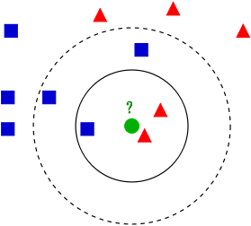

This method using a distance metric function and the given database gives a partition of the space into regions (for k=1):

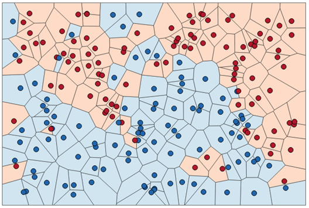

This approach can be easily defined for multi-class classification problems:

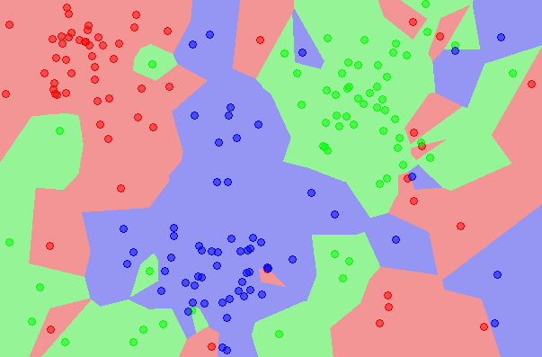

The main benefits of this algorithm are:
* Fast, if the reference dataset is small
* Non-parametric,
* Does not require learning, the dataset itself represents the model/knowledge.

The disadvantage of this method:
* Slow, if the reference dataset is large
* it does not work well in very high dimensional spaces.
* Sensitive to class-imbalanced cases.

Note also that, kNN does not require proper distance metric and it also can be used with any similarity-like measure (just change argmin to argmax). However, in this case, some error guarantees cannot be held anymore and perhaps these functions will not provide a proper Voronoi-partition of the space. But on the other hand, sometimes application specific similarity measures can provide better classification results with kNNs.

"One of the reasons researchers were initially skeptical of nearest neighbor was that it wasn’t clear if it could learn the true borders between concepts. But in 1967 Tom Cover and Peter Hart proved that, given enough data, nearest-neighbor is at worst only twice as error-prone as
the best imaginable classifier. If, say, at least 1 percent of test examples will inevitably be misclassified because of noise in the data, then nearest-neighbor is guaranteed to get at most 2 percent wrong. Up until then, all known classifiers assumed that the frontier had a very specific form, typically a straight line. This was a double-edged sword: on the one hand, it made proofs of correctness possible, as in the case of the perceptron, but it also meant that the classifier was strictly limited in what it could learn. Nearest-neighbor was the first algorithm in history that could take advantage of unlimited amounts of data to learn arbitrarily complex concepts. No human being could hope to trace the frontiers it forms in hyperspace from millions of examples, but because of Cover and Hart’s proof, we know that they are probably not far off the mark." [ref: The Master Algorithm by P.D.]

We can observe that, the decision boundary does not change if you erase the data points surrounded by instances of the same type:

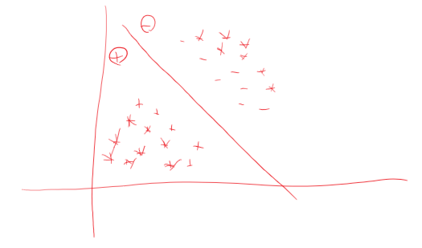

The support vector machine (SVM), loosely speaking, looks a lot like weighted k-nearest-neighbor: the frontier between the positive and negative classes is defined by a set of examples and their weights, together with a similarity measure. A test example belongs to the positive class if, on average, it looks more like the positive examples than the negative ones. The average is weighted, and the SVM remembers only the key examples required to pin down the frontier. These examples are called support vectors because they’re the vectors that “hold up” the frontier: remove one, and a section of the frontier slides to a different place. You may also notice that the frontier is a jagged line, with sudden corners that depend on the exact location of the examples. Real concepts tend to have smoother borders, which means
nearest-neighbor’s approximation is probably not ideal. But with SVMs, we can learn smooth frontiers, more like this:

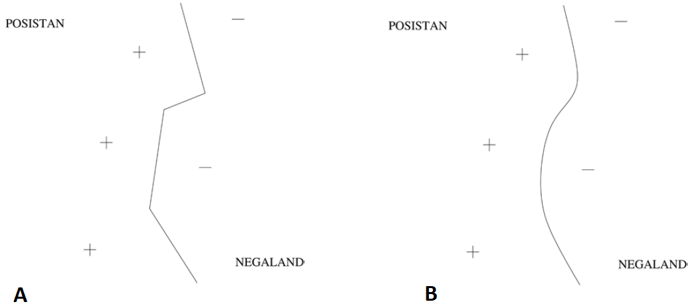

**Figure.** Decision Boundaries made by kNN (A) and by SVM (B).

Now let us have some data: \\(D = \\{X_{i}, Y_{i}\midX_{i} \in R^{n}, y_{i} \in C\\}\\), where \\(C\\) is categorical. For now, let's assume \\(C=\\{0,1\\}\\). In the case of Logistic Regression, parametrized by \\(\theta\\) (the bias is included), we used a sigmoid function to represent the relationship between \\(X\\) and \\(Y\\), and fitted an S-shaped sigmoid function over the data, and the LogReg provided us a linear decision boundary by solving the minimization of the following cost functions:

\\[J(\theta\mid D) = \frac{1}{m}\sum_{i=1}^{m}(-y_{i} \log(g(\theta^{T}x_{i})) - (1-y_{i}) \log(1 - g(\theta^{T}x_{i}))) + \lambda\sum_{j=1}^{n}\theta_{j}^{2}\\]

where \\(g(x) = \frac{1}{1+e^{-x}}\\) is the sigmoid function.
Now, let us change the log-functions \\(log(g(z))\\) which measured the cost of miss-classification and let us choose the following ones:
\\[(z)\_{+} = max(z,0)\\]

For a positive data \\((x_{i}, y_{i} = 1)\\), we want \\(\theta x_{i} \geq 1\\), hence we deinfe the cost function as \\((1 - \theta x_{i})\\)_{+} and
For a negative data \\((x_{i}, y_{i} = 0)\\), let us want \\(\theta x_{i} \leq -1\\), hence we deinfe the cost function as \\((\theta x_{i} + 1)\\)\_{+}.
The choise of \\(\pm 1\\) is arbitrary but it must be non-zero. This cost function is somewhat similar to the cost function used in Logistic Regression.

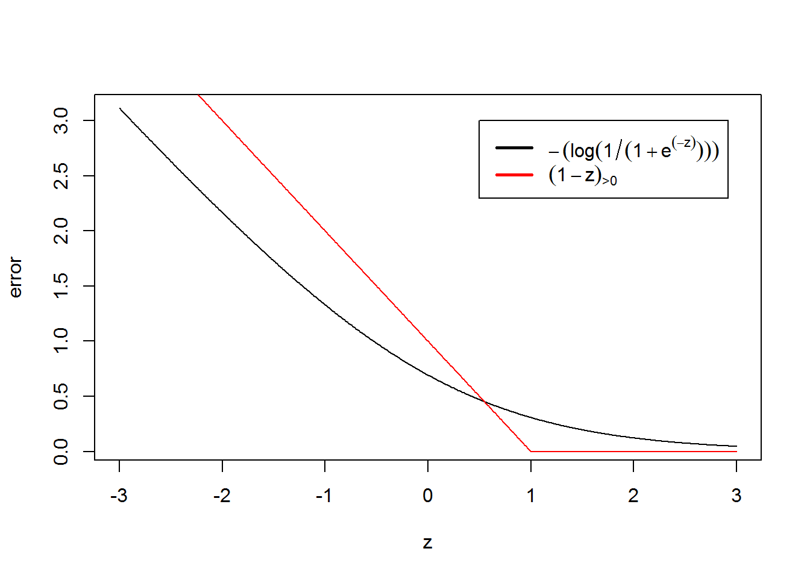
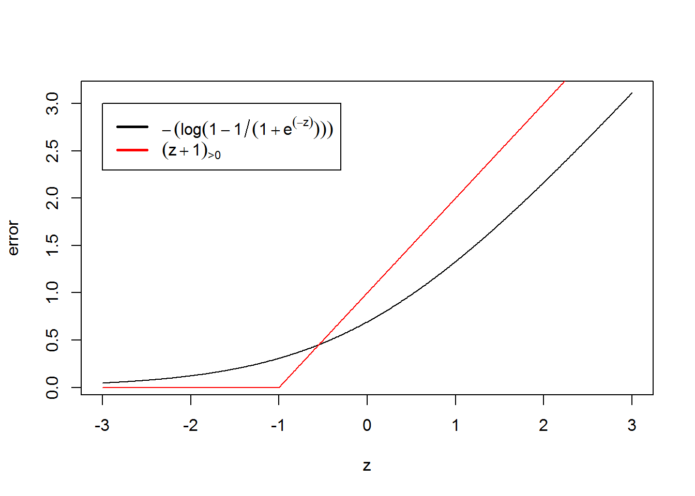

**Figure 2.** Cost functions of Logistic Regression and Support Vector Machines for positive (left) and negative (right) classes, respectively.

Using this cost functions we can formulate the objective function of SVM classification.
\\[J(\theta|D) = \frac{1}{m}\sum_{i=1}^{m} y_{i}(1 - \theta^{T}x_{i})_{+} + (1 - y_{i})(\theta^{T}x_{i} + 1)\_{+} + \lambda\sum_{j=1}^{n}\theta_{j}^{2}\\]

What does this mean? For a positive sample \\((y_{i} = 1)\\), if \\(\theta^{T}x_{i} > 1\\) then the corresponding cost is zero (yay). However, if \\(\theta^{T}x_{i} < 1\\) then we will introduce some positive error (nay). The same logic goes for the negative class. For a negative sample \\((y_{i} = 0)\\), if \\(\theta^{T}x_{i} < -1\\) then cost is zero (yay), but if \\(\theta^{T}x_{i} > -1\\), then some error is applied (nay).

n this case, if we interpret \\(\theta\\) as the norm vector of a line then it can be interpreted as a separation line between the classes where the separation might be violated if the data is not linearly separable. This linear separation boundary is called a line in 2D, plane in 3D, and hyperplane in higher dimensions or in general. 

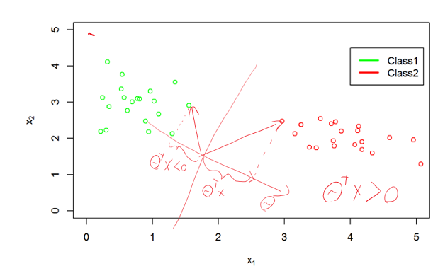

**Figure 1.** Separation of classes by a linear hyperplane.

The hyperplane can be formulated as \\(f(x) = \sum_{j=1}^{n}\theta_{j}x_{j} + \theta_{0}\\). If we insert constant 1 to our data \\(x = [1, x_{1}, x_{2}, ..., x_{n}]^{T}\\) and rearrange the parameter \\(\theta\\)'s in a vector form \\(\theta = [\theta_{0}, \theta_{1}, \theta_{2}, ..., \theta_{n}]^{T}\\), then we can rewrite the hyperplane as:

\\[f(x) = \theta^{T}x\\]

Now, if we are given by a new instance s to classify it, we can calculate which side of the hyperplane it falls, formally 

This model has a further and a useful property. Let us consider a linearly separable case (when positive and negative instances can be separated by a linear line). Then the parameters θ will be chosen which gives the largest margin. Consider two cases:

1. The positive data \\(x\\) lies close to the decision boundary. In this case \\(\theta^{T}x\\) will be small, but the cost functions would penalize it if \\(\theta^{T}x < 1\\), thus it needs to increase the length of \\(\theta\\) to avoid penalty. But it cannot really do this because then it will get another penalty from the regularizer \\(\theta_{i}^{2}\\).
2. Consider another case when the hyperplane is farther from the data \\(x\\). In this case the \\(\theta^{T}x\\) will be bigger (than in the previous case) so the regularizer can reduce the length of the norm vector \\(\theta_{i}^{2}\\) without hurting getting penalty from the cost function for violating \\(\theta^{T}x < 1\\).

This is illustrated below.

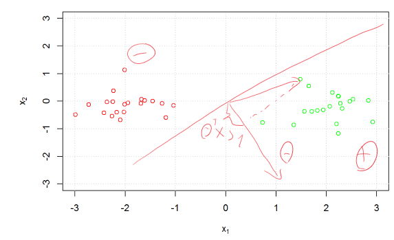

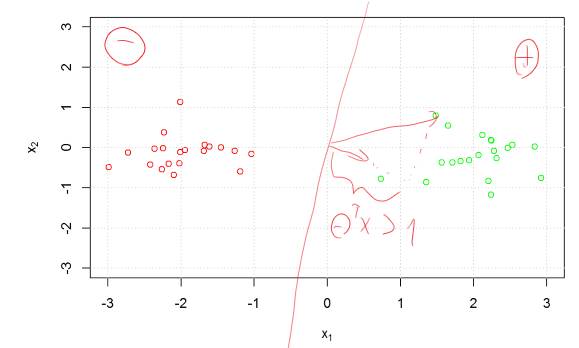

#### Non-linear classifier

SVM can be easily extended to a non-linear classifier. In order to do this so, the original dataset has to be transformed by a (nonlinear) kernel function. Kernel function is a symmetric and positive semi-definite functions that performs a non-linear transformation. More details about kernel functions will come later. For now, let's use the Gaussian kernel function, also called as Radial Basis Functions, defined as:

\\[k(x,y) = \exp\\]

Not that, hearth of RBF is essentially a distance metric, which is then transformed from distance-like measure to a similarity-like one. The parameter \\(\sigma\\) regulates the transformation of the disntance value. If \\(\sigma\\) is small, then close data points get meaningful similarity measures and data far from each other will be neglected and get scores score to zero (or zero). If \\(\sigma\\) is large, then close data points will get a value around 1.0 but data points farther from each other will obtain some meaningful values.

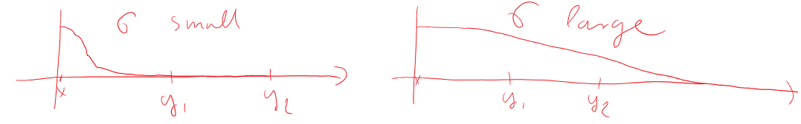

Let's transform each data \\(x_{i}\\) in the dataset \\(D = \\{(x_{i}, y_{i})\mid x \in R^{n}, y_{i} \in C\\}\_{i=1}^{m}\\) in the following way:

\\[k_{i} = [1, k(x_{i}, x_{1}), k(x_{i}, x_{2}), ..., k(x_{i}, x_{m})]^{T}\\]

Note that, the new dataset has \\(m\\) data instances, and each has \\(m\\) features. (Plus a constant 1 for the bias). Let us plug this into the learning objective and we get the following optimization problem:

\\[J(\theta|D) = \frac{1}{m}\sum_{m}^{i=1}y_{i}(1 - \theta^{T}k_{i})\_{+} + (1 - y_{i})(\theta^{T}k_{i} + 1)\_{+} + \lambda\sum_{m}^{j=1}\theta_{j}^{2} \\]

The obtained optimization problem has now m parameters. After the optimization we get a weigth for each training example:

\\[\theta = [\theta_{0},\theta_{1},\theta_{2}, ..., \theta_{m}]^{T}\\]
\\[k_{i} = [1, k(x_{i},x_{1}),k(x_{i},x_{2}), ..., k(x_{i},x_{m})]^{T}\\]

For training data \\(x_{i}\\) and test data \\(z_{i}\\), these can be organized in the kernel matrix as

That is, \\(\theta_{i}\\) can be assigned to data \\(x_{i}\\). Note that, these weights can be negative and positive, and in fact positive weights are assigned to positive data and negative weights are assigned to negative data.

To classify a new test data \\(t = [t_{1},t_{2},...,t_{n}]^{T}\\), first one needs to apply the transformation: \\(k_{t} = [1, k(t,x_{1}), k(t,x_{2}), ... ,k(t,x_{m})]^{T}\\). This test data \\(k_{t}\\) has \\(m\\) features and it is compatible with \\(\theta\\). The decision rule then can be formulated for a test sample \\(t\\) using the non zeros \\(\theta_{j}\\) parameters as follows:

\\[f(t) = \sum_{\theta_{j} \neq 0}\theta_{j}k(t,x_{i}) + \theta_{0}\\]

Note that, if a training example \\(x_{i}\\) does not have a significant impact on the classification, the corresponding weight \\(\theta_{i}\\) will be set to zero, because it does not have an impact on the cost but the regularizer will reduce it.

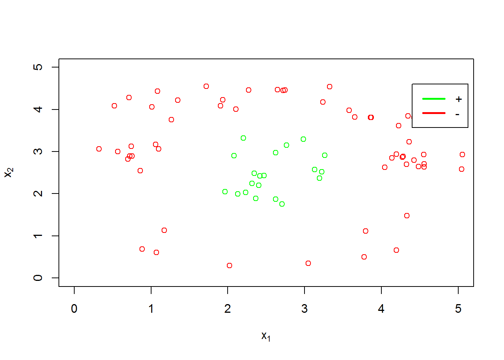

Note that, the number of parameters \\(\theta_{j}\\)'s is equal to the number of the training data.

The parameter \\(\sigma\\) is to be tuned manually. However, in practice setting \\(\sigma\\) to the median Euclidean distance from any positive training example to the nearest negative example is a good rule of thumb. 
Feature scaling is required with Gaussian kernel as well. Otherwise large feature values would dominate in the output of the kernel.

One can choose the standard inner product as a (linear) kernel: \\(k(t,x_{i}) := t^{T}x_{i}\\). Then the classification can be formulated as:

\\[f(t) = \sum_{\theta_{j} \neq 0}\theta_{j}t^{T}x_{j} + \theta_{0}\\]

Here, you can see that the decision is based on the linear combination of the support vectors. That is why SVM can be considered as a weighted nearest neighbor method.

A nice plugin to visualize SVM decision boundaries:
[https://www.csie.ntu.edu.tw/~cjlin/libsvm/](https://www.csie.ntu.edu.tw/~cjlin/libsvm/)