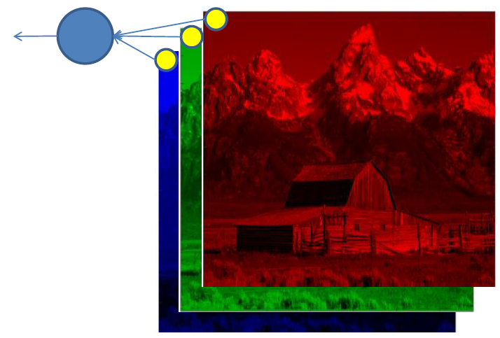




#### Neural Networks.

**Limitation of simple neural networks.** We saw that a simple logistic regression can learn to classify the hand-written digits from the MNIST dataset. The digits are represented in a 28x28 pixels. Thus the data lie in a 784 dimensional space. One logistic regression can recognize only one class, say, the logistic regression for the digit 2 can recognize whether the little image contains a hand-written digit 2 or not. To do this, it builds an S-shaped sigmoid function in the 784 dimensional space which looks like this:


Each image is a dot in the 784 dimensional space. Thus, the logistic regression learns a distributions of the digits '2' and non-'2's represented in the 784 dimensional space.

What is wrong with this? What are the limitations of this approach?

The first problem is that this system works only with 28x28 images. The second problem is that it cannot handle, for instance, the following situation:
If all training image samples look like this:


Then a neural network cannot recognize samples like this:


because the information (the non-zero features) lies now in different dimension and there are no proper corresponding weights to capture this information. In this case, it is said the system is not invariant to translation. LogRegs and vanilla neural networks are not invariant to translation and are not invariant to rotation as well. One way to overcome this issue is to generate more training samples in which original training samples are shifted and rotated randomly.

The third problem is that it cannot exploit information about the correlation of the neighboring pixels. This means that if we randomly permutate the columns and the rows of all the images (in the same way) then the performance of the logistic regression does not change.


Figure. LHS: an original sample from MNIST. RHS: the same sample but rows and columns are randomly permutated.

If we randomly permutate the images (permutate all images in the same way) and the weights of the LogReg model in the same way, its performance does not change. This is due to the fact the logistic regression independently weights the input pixels and sums them up: \\(\sum_{i}\theta_{i}x_{i}\\) (before applying the sigmoid functions). So Logreg and vanilla neural nets do not care about the order of the input pixels. 
This actually may be a good property in certain application in which the order of the features are not important. For instance, in bioinformatics application when features represent gene expression levels. In this case the order of the genes are totally indifferent.
But this is not the case for image recognition or some other pattern recognition problems.

From now on, we consider image data and we consider the input in matrix form (instead of a vector form. So, in case of MNIST data, the input data is 28x28 matrix instead of 784 dimensional vector).

Now, we discuss a method to handle the shortcomings mentioned above.

##### Convolution.

The convolution of \\(f\\) and \\(g\\) is written \\(f \ast g\\),  using an asterisk or star. It is defined as the integral of the product of the two functions after one is reversed and shifted. As such, it is a particular kind of integral transform:
\\[f \ast g(t) = \int f(t)g(t - \alpha)d\alpha = \int f(t - \alpha)g(t)d\alpha\\]
Now, let us consider a (possible large) two dimensional image \\(I\\) and \\(\alpha\\) (possible smaller) two-dimensional kernel \\(K\\) of size \\(m \times n\\). Then, their convolution is defined as:
\\[S(i,j) = (I \ast K)(i,j) = \sum_{m}\sum_{n} I(m,n)K(i - m, j - n) = \sum_{m}\sum_{n} I(i - m, i - n)K(m,n)\\]

The second formula is more straightforward to implement. As the indices of the kernel increases, the indices in the input image decreases. This is a bit counter intuitive, thus in the common machine learning libraries they flip the kernel and the following is used:
\\[S(i,j) = (I \ast K)(i,j) = \sum_{m}\sum_{n} I(i + m, i + n)K(m, n)\\]
In this case, this function is called cross-correlation (which is the same as convolution but without flipping the kernel) but it runs under the name convolution.

How is it used?
The kernel is iteratively applied over the image and at each position it convolves with the receptive part of the image. The parameters of the kernels do not change during scanning. In the following example, the kernel is of size 2x2 and its parameters are:
\\[K(1,1) = w; K(1,2) = x; K(2,1) = y; K(2,2) = z\\]


Image is from the Deep Learning book by Goodfellow. The shape of the input images is: 3x8, the size of the kernel: 2x2, the size of the output: 2x3


What does this mean?
A kernel \\(K\\) is considered as a filter, and it scans the whole input image for certain patterns. If the receptive field (sub-image) does not match to the kernel, the output is small. If the receptive field matches to the kernel, then it outputs a large value. Therefore, the output (known as feature map or activation map) will indicate whether a pattern has been found in the image or not. 
For an input image of size \\(k \times l\\) and a kernel of size \\(m \times n\\), the output activation map is of size: \\((k - m) \times (l - n)\\).


(source: [https://adeshpande3.github.io/adeshpande3.github.io/A-Beginner's-Guide-To-Understanding-Convolutional-Neural-Networks/](https://adeshpande3.github.io/adeshpande3.github.io/A-Beginner's-Guide-To-Understanding-Convolutional-Neural-Networks/))

This little pattern is also called feature. In this sense, the convolutional layer using a kernel can be considered as feature extraction. Each point in the output layer indicates whether the filter found a pattern or not.


Let us consider the following example:


Now, the filter (kernel) iteratively scans over the whole image. When the filter matches to a part of the images, then it outputs a large score.


If it does not match, then it outputs a small score.


It is important to note that the weights of a kernel does not change during scanning. Thus the number of the parameters is much less than in the case of a fully connected neural network. If an input image is of size \\(k \times l\\) (e.g. 3000x2000) and a kernel of size \\(m \times n\\) (e.g. 5x5), then there are the \\((k - m) \times (l - n)\\) output units (2995x1995=5975025), but the total number of parameters is only \\(m \times n\\) (25). However, for a fully connected nerual network it would be \\(k \times l \times (k - m) \times (l - n) \approx k^{2}l^{2}\\) (in this example it would be 3.585015e+13).

Every output obtained by a kernel at a given position can be considered as a hidden unit with linear activation function (usually), but 
1. these units share exactly the same parameters, and
2. they are not fully connected between all units. 


A layer in a multi-layer neural network which contains such convolution is called convolutional layer. A neural network containing at least one convolutional layer is called convolutional neural network (CNN).

So, on one hand, convolutional layers provides sparsity as they greatly can reduce the number of the parameters. 

Now, the interesting part is that the weights of a kernel can be learned (calculated) by simply using the backpropagation algorithm. Typically, these filters learn some very basic features that can detect edges, specific colors of edges, or some color patches when applied to natural images. Typically they look like something this:


(source: [http://cs231n.github.io](http://cs231n.github.io))


#### Convolutional Neural Networks (CNNs)

Now we discuss how CNNs are used with natural images and we will discuss some  case studies.

The input images are usually color images. Thus, they have three channels, one for red, green, and blue, respectively.


So the input data is of size \\(k \times l \times 3\\), a 3D matrix.  This is also called tensor. Therefore, kernels can be also 3D, e.g. of size \\(m \times m \times 3\\).Usually, squared kernels are used (so, less hypermarameter to tune).

On the input image, several filters can be applied. Thus the output activation map also can be three dimensional where the third dimension corresponds to the filters. 


Some terminology:

**Zero padding** means that the input is flanked by several zeros of columns and rows so that after the convolution the activation map will have the same size as the original image.


The input image is 32x32x3. If we add borders of two columns and rows of zeros around the original image, this gives as a 36x36x3 image. Then, after applying convolution using a kernel of size 5x5x3, then we will also get a 32x32x3 output activation map.
Note that, at the border the convolution will behave strangely, but we suppose the subject on the picture is around the center.

**Stride**. During the scanning the kernel is not necessarily needed to be shifted one-by-one. It can be shifted by 2 or 5, etc. Stride controls the size of this step.

Stride = 1


Stride = 2


**Kernel size**. Kernels for small images are usually of size 5x5, 3x3, or 1x1.
In the case of 1x1 the filter operates on the colors but it has no spatial content.



#### Rectified Linear Unit (ReLU)

After each conv layer, it is convention to apply a nonlinear layer (or activation layer) immediately afterward. The purpose of this layer is to introduce nonlinearity to a system that basically has just been computing linear operations during the conv layers (just element wise multiplications and summations). In the past, nonlinear functions like tanh and sigmoid were used, but researchers found out that ReLU layers work far better because it helps to cope with the vanishing gradient problem, which is the issue where the lower layers of the network train very slowly because the gradient decreases exponentially through the layers. Later, we will discuss this in more details. The ReLU layer applies the function \\(f(x) = max(0,x)\\) to all of the values in the input volume. In basic terms, this layer just changes all the negative activations to 0. This layer increases the nonlinear properties of the model and the overall network without affecting the receptive fields of the conv layer.

#### Pooling, also referred to as downsampling or subsampling.

This is somewhat similar to a kernel. It takes the outputs of hidden units at a certain region and outputs a summary statistics of them. For example, the most common is the max pooling which outputs the maximum output of the activation functions in a certain region. Pooling also has size and stride and they have the same meaning as the kernels in the convolutional layers. Other pooling functions include weighted average, \\(L^{2}\\) norm.

Max-pooling:


Filter size: 2x2, stride = 2.

The pooling helps the system become more invariant to small translations in the input. This can be a useful property, if we care more about the presence/absence of a certain feature than its exact location or the relative locations of features. Pooling layers drastically can reduce the size of the units. Using pooling filter size 2x2 with stride=2, it reduces the units by 75%. Thus it reduces the computational cost and the number of parameters. 

Some animation of how different convolutional layers work:

[https://github.com/vdumoulin/conv_arithmetic/blob/master/README.md](https://github.com/vdumoulin/conv_arithmetic/blob/master/README.md)


### ConvNet Architectures

A typical ConvNet architecture, it uses several convolutional and pooling layers for filtering. Typically, there is one (or more) fully connected (FC) layer at the top to make prediction.


#### Le-Net5

The first convolutional neural network from 1998 developed by a group at AT&T (Yann LeCun). It was designed to read checks and this systems read around 10% of all the checks in the USA by the end of 1990s. Its architecture is:


Source: [http://yann.lecun.com/exdb/publis/pdf/lecun-98.pdf](http://yann.lecun.com/exdb/publis/pdf/lecun-98.pdf)

* C1: 6 kernels, each of size 5x5. 
* S2: pooling, size 2x2, stride =2,  four inputs were added then multiplied by a trainable coefficient and added to a trainable bias. Results passed through sigmoidal function. 
* C3: 16 kernels, size of 5x5 . The layer S2->C3 is not fully connected.
* S4: is similar to S2.
* C5: convolutional layer, kernels 5x5: 120 outputs. Because the feature maps at S4 are 5x5, this is basically a fully connected layer. 
* F6: fully connected layer, 84 hidden units.

Output consists of Gaussian units defined as \\(y_{i} = \sum_{j}(x_{i} - w_{ij})^{2}\\).

#### AlexNex

This architecture was one of the first deep networks to push ImageNet Classification accuracy by a significant stride in comparison to traditional methodologies.
ImageNet Large Scale Visual Recognition Challenge (ILSVRC) contains half a million images from 200 categories. Pictures are big, size of around 482x415. Challenge includes recognition and localization. Later it was increased to 1.2 million images from 1000 classes. 

AlexNet is composed of 5 convolutional layers followed by 3 fully connected layers, as depicted below


Input images are 224x224 color. The number of the output classes are 1000.
This system used ReLU instead of tanh, sigm.

The first work that popularized Convolutional Networks in Computer Vision was the AlexNet, developed by Alex Krizhevsky, Ilya Sutskever and Geoff Hinton. The AlexNet was submitted to the ImageNet ILSVRC challenge in 2012 ([http://www.image-net.org/challenges/LSVRC/2014/](http://www.image-net.org/challenges/LSVRC/2014/)) and significantly outperformed the second runner-up (top 5 error of 16% compared to runner-up with 26% error). The Network had a very similar architecture to LeNet, but was deeper, bigger, and featured Convolutional Layers stacked on top of each other (previously it was common to only have a single convolutional layer always immediately followed by a pool layer).

#### ZFNet

The ILSVRC 2013 winner was a Convolutional Network from Matthew Zeiler and Rob Fergus. It became known as the ZFNet (short for Zeiler & Fergus Net). It was an improvement on AlexNet by tweaking the architecture hyper-parameters, in particular by expanding the size of the middle convolutional layers and making the stride and filter size on the first layer smaller.


Source: [https://arxiv.org/pdf/1311.2901.pdf](https://arxiv.org/pdf/1311.2901.pdf)

#### VGGNet

The runner-up in ILSVRC 2014 was the network from Karen Simonyan and Andrew Zisserman that became known as the VGGNet. Its main contribution was in showing that the depth of the network is a critical component for good performance. Their final best network contains 16 CONV/FC layers and, appealingly, features an extremely homogeneous architecture that only performs 3x3 convolutions and 2x2 pooling from the beginning to the end. Their pretrained model is available for plug and play use in Caffe. A downside of the VGGNet is that it is more expensive to evaluate and uses a lot more memory and parameters (140M). 
This is its structure:

```
INPUT: [224x224x3]        memory:  224*224*3=150K   weights: 0
CONV3-64: [224x224x64]  memory:  224*224*64=3.2M   weights: (3*3*3)*64 = 1,728
CONV3-64: [224x224x64]  memory:  224*224*64=3.2M   weights: (3*3*64)*64 = 36,864
POOL2: [112x112x64]  memory:  112*112*64=800K   weights: 0
CONV3-128: [112x112x128]  memory:  112*112*128=1.6M   weights: (3*3*64)*128 = 73,728
CONV3-128: [112x112x128]  memory:  112*112*128=1.6M   weights: (3*3*128)*128 = 147,456
POOL2: [56x56x128]  memory:  56*56*128=400K   weights: 0
CONV3-256: [56x56x256]  memory:  56*56*256=800K   weights: (3*3*128)*256 = 294,912
CONV3-256: [56x56x256]  memory:  56*56*256=800K   weights: (3*3*256)*256 = 589,824
CONV3-256: [56x56x256]  memory:  56*56*256=800K   weights: (3*3*256)*256 = 589,824
POOL2: [28x28x256]  memory:  28*28*256=200K   weights: 0
CONV3-512: [28x28x512]  memory:  28*28*512=400K   weights: (3*3*256)*512 = 1,179,648
CONV3-512: [28x28x512]  memory:  28*28*512=400K   weights: (3*3*512)*512 = 2,359,296
CONV3-512: [28x28x512]  memory:  28*28*512=400K   weights: (3*3*512)*512 = 2,359,296
POOL2: [14x14x512]  memory:  14*14*512=100K   weights: 0
CONV3-512: [14x14x512]  memory:  14*14*512=100K   weights: (3*3*512)*512 = 2,359,296
CONV3-512: [14x14x512]  memory:  14*14*512=100K   weights: (3*3*512)*512 = 2,359,296
CONV3-512: [14x14x512]  memory:  14*14*512=100K   weights: (3*3*512)*512 = 2,359,296
POOL2: [7x7x512]  memory:  7*7*512=25K  weights: 0
FC: [1x1x4096]  memory:  4096  weights: 7*7*512*4096 = 102,760,448
FC: [1x1x4096]  memory:  4096  weights: 4096*4096 = 16,777,216
FC: [1x1x1000]  memory:  1000 weights: 4096*1000 = 4,096,000

TOTAL memory: 24M * 4 bytes ~= 93MB / image (only forward! ~*2 for bwd)
TOTAL params: 138M parameters
```

As is common with Convolutional Networks, notice that most of the memory (and also compute time) is used in the early CONV layers, and that most of the parameters are in the last FC layers. In this particular case, the first FC layer contains 100M weights, out of a total of 140M.
While VGG achieves a phenomenal accuracy on ImageNet dataset, its deployment on even the most modest sized GPUs is a problem because of huge computational requirements, both in terms of memory and time. It becomes inefficient due to large width of convolutional layers. For instance, a convolutional layer with 3X3 kernel size which takes 512 channels as input and outputs 512 channels, the order of calculations is 9x512x512. 

#### Inception net (GoogLeNet)

The ILSVRC 2014 winner was a Convolutional Network from Szegedy et al. from Google. ([http://arxiv.org/abs/1409.4842](http://arxiv.org/abs/1409.4842)) Its main contribution was the development of an Inception Module that dramatically reduced the number of parameters in the network (4M, compared to AlexNet with 60M). Additionally, this paper uses Average Pooling instead of Fully Connected layers at the top of the ConvNet, eliminating a large amount of parameters that do not seem to matter much. There are also several follow-up versions to the GoogLeNet, most recently Inception-v4.


**Figure**. Inception module.

In a convolutional operation at one location, every output channel (512 in the example above), is connected to every input channel, and so we call it a dense connection architecture. The GoogLeNet builds on the idea that most of the activations in deep network are either unnecessary (value of zero) or redundant because of correlations between them. Therefore most efficient architecture of a deep network will have a sparse connection between the activations, which implies that all 512 output channels will not have a connection with all the 512 input channels. There are techniques to prune out such connections which would result in a sparse weight/connection. But kernels for sparse matrix multiplication are not optimized in BLAS or CuBlas(CUDA for GPU) packages which render them to be even slower than their dense counterparts.

So, GoogLeNet devised a module called inception module that approximates a sparse CNN with a normal dense construction(shown in the figure). Since only a small number of neurons are effective as mentioned earlier, width/number of the convolutional filters of a particular kernel size is kept small. Also, it uses convolutions of different sizes to capture details at varied scales(5x5, 3x3, 1x1).

Another salient point about the module is that it has a so-called bottleneck layer(1X1 convolutions in the figure). It helps in massive reduction of the computation requirement as explained below.

Let us take the first inception module of GoogLeNet as an example which has 192 channels as input. It has just 128 filters of 3x3 kernel size and 32 filters of 5x5 size. The order of computation for 5x5 filters is 25x32x192 which can blow up as we go deeper into the network when the width of the network and the number of 5X5 filter further increases. In order to avoid this, the inception module uses 1X1 convolutions before applying larger sized kernels to reduce the dimension of the input channels, before feeding into those convolutions. So in first inception module, the input to the module is first fed into 1X1 convolutions with just 16 filters before it is fed into 5x5 convolutions. This reduces the computations to 16x192 +  25x32x16. All these changes allow the network to have a large width and depth.
The model was designed to keep a computational budget of 1,5 billion multiply-adds at inference time, so that the they do not end up to be a purely academic curiosity, but could be put to real world use, even on large datasets, at a reasonable cost.

**Residual Networks**, It turned out, adding more layers after some point degradates the performance. 

* The LeNet5 has 7 layers.
* AlexNet consists of 8 layers.
* ZFNet consists of 8 layers.
* VGGNet consists of 13 layers.
* GoogLeNet consists of 22 layers.

The problem with increased depth is that the signal required to change the weights, which arises from the end of the network by comparing ground-truth and prediction becomes very small at the earlier layers, because of increased depth. It essentially means that earlier layers are almost negligible learned. The second problem with training the deeper networks is, performing the optimization on huge parameter space and therefore naively adding the layers leads to higher training error. 

Imagine a network A, which produces x amount of training error. Construct a network B by adding few layers on top of A and put parameter values in those layers in such a way that they do nothing to the outputs from A. Let’s call the additional layer as C. This would mean the same x amount of training error for the new network. So while training network B, the training error of B should not be above the training error of A. And since it DOES happen, the only reason is that learning the identity mapping(doing nothing to inputs and just copying as it is) with the added layers-C is not a trivial problem, which the solver does not achieve. To solve this, the module shown below creates a direct path between the input and output to the module implying an identity mapping and the added layer-C just needs to learn the features on top of already available input. Since C is learning only the residual, the whole module is called residual module. 


Let us assume that the first layers learn the mapping: \\(H(x)\\) for an input \\(x\\). If we add the input at the output layer, then the network learns \\(F(x) = H(x) - x\\). So, in this case, the layers do not need to learn all the transformation but only the residuals (differences). In other words, the layer needs to learn only that how to manipulate the input. It is hypothesised that it is easier to optimize the residual mapping than the original mapping.

The power of the residual networks can be judged from one of the experiments in paper [https://arxiv.org/pdf/1512.03385.pdf](https://arxiv.org/pdf/1512.03385.pdf). The plain 34 layer network had higher validation error than the 18 layer plain network. This is where we realize the degradation problem. And the same 34 layer network when converted into the residual network has much lesser training error than the 18 layer residual network. 
This ResNet architecture using 152 layers won the 1st prize at ILSVRC 2015 classification task.


**Transfer learning**. Transfer learning is a procedure when you take a neural network  A trained on dataset A, and then instead of training a new neural net B from scratch (randomly initialized weighs) on dataset B, you just take  neural net A and retrain (fine tune) on dataset B. Here, it is assumed the tasks and datasets A and B are similar.

In practice, very few people train an entire Convolutional Network from scratch (with random initialization), because it is relatively rare to have a dataset of sufficient size. Instead, it is common to pretrain a ConvNet on a very large dataset (e.g. ImageNet, which contains 1.2 million images with 1000 categories), and then use the ConvNet either as an initialization or a fixed feature extractor for the task of interest. The three major Transfer Learning scenarios look as follows:

* **ConvNet as fixed feature extractor**. Take a ConvNet pretrained on ImageNet (resNet or VGGNet), remove the last fully-connected layer (this layer’s outputs are the 1000 class scores for a different task like ImageNet), then treat the rest of the ConvNet as a fixed feature extractor for the new dataset. In an AlexNet, this would compute a 4096-D vector for every image that contains the activations of the hidden layer immediately before the classifier. We call these features CNN codes. It is important for performance that these codes are ReLU (i.e. thresholded at zero) if they were also thresholded during the training of the ConvNet on ImageNet (as is usually the case). Once you extract the 4096-D codes for all images, train a linear classifier (e.g. Linear SVM or Softmax classifier) for the new dataset.
* **Fine-tuning the ConvNet**. The second strategy is to not only replace and retrain the classifier on top of the ConvNet on the new dataset, but to also fine-tune the weights of the pretrained network by continuing the backpropagation. It is possible to fine-tune all the layers of the ConvNet, or it’s possible to keep some of the earlier layers fixed (due to overfitting concerns) and only fine-tune some higher-level portion of the network. This is motivated by the observation that the earlier features of a ConvNet contain more generic features (e.g. edge detectors or color blob detectors) that should be useful to many tasks, but later layers of the ConvNet becomes progressively more specific to the details of the classes contained in the original dataset. In case of ImageNet for example, which contains many dog breeds, a significant portion of the representational power of the ConvNet may be devoted to features that are specific to differentiating between dog breeds.
* **Pretrained models**. Since modern ConvNets take 2-3 weeks to train across multiple GPUs on ImageNet, it is common to see people release their final ConvNet checkpoints for the benefit of others who can use the networks for fine-tuning. For example, the Caffe library has a [Model Zoo](https://github.com/BVLC/caffe/wiki/Model-Zoo) where people share their network weights.

**When and how to fine-tune?** How do you decide what type of transfer learning you should perform on a new dataset? This is a function of several factors, but the two most important ones are the size of the new dataset (small or big), and its similarity to the original dataset (e.g. ImageNet-like in terms of the content of images and the classes, or very different, such as microscope images). Keeping in mind that ConvNet features are more generic in early layers and more original-dataset-specific in later layers, here are some common rules of thumb for navigating the 4 major scenarios:

1. *New dataset is small and similar to original dataset.* Since the data is small, it is not a good idea to fine-tune the ConvNet due to overfitting concerns. Since the data is similar to the original data, we expect higher-level features in the ConvNet to be relevant to this dataset as well. Hence, the best idea might be to train a linear classifier on the CNN codes.
2. *New dataset is large and similar to the original dataset*. Since we have more data, we can have more confidence that we won’t overfit if we were to try to fine-tune through the full network.
3. *New dataset is small but very different from the original dataset*. Since the data is small, it is likely best to only train a linear classifier. Since the dataset is very different, it might not be best to train the classifier form the top of the network, which contains more dataset-specific features. Instead, it might work better to train the SVM classifier from activations somewhere earlier in the network.
4. *New dataset is large and very different from the original dataset*. Since the dataset is very large, we may expect that we can afford to train a ConvNet from scratch. However, in practice it is very often still beneficial to initialize with weights from a pretrained model. In this case, we would have enough data and confidence to fine-tune through the entire network.

**Practical advice**. There are a few additional things to keep in mind when performing Transfer Learning:

* *Constraints from pretrained models*. Note that if you wish to use a pretrained network, you may be slightly constrained in terms of the architecture you can use for your new dataset. For example, you can’t arbitrarily take out Conv layers from the pretrained network. However, some changes are straight-forward: Due to parameter sharing, you can easily run a pretrained network on images of different spatial size. This is clearly evident in the case of Conv/Pool layers because their forward function is independent of the input volume spatial size (as long as the strides “fit”). In case of FC layers, this still holds true because FC layers can be converted to a Convolutional Layer: For example, in an AlexNet, the final pooling volume before the first FC layer is of size [6x6x512]. Therefore, the FC layer looking at this volume is equivalent to having a Convolutional Layer that has receptive field size 6x6, and is applied with padding of zeros.
* *Learning rates*. It’s common to use a smaller learning rate for ConvNet weights that are being fine-tuned, in comparison to the (randomly-initialized) weights for the new linear classifier that computes the class scores of your new dataset. This is because we expect that the ConvNet weights are relatively good, so we don’t wish to distort them too quickly and too much (especially while the new Linear Classifier above them is being trained from random initialization).

From [http://cs231n.github.io/transfer-learning/](http://cs231n.github.io/transfer-learning/)

#### Historical Notes

The convolutional layers were inspired by then neocognitron models proposed by Kunihiko Fukushima in the 80's. It has been used for handwritten character recognition and other pattern recognition tasks. Neocognitrons have a very similar structure to convolutional networks, but they were not trained with back-propagation in an end-to-end learning fashion. Neocognitrions were trained in unsupervised fashion with self-organization (self-organizing maps). Noecognitrion networks were inspired by the visual cortex ventral pathwayof the mammals. 
The convolutional layers gained recognition in 1998 when they were used successfully in speech recognition and document reading. The document reading system used a ConvNet trained jointly with a probabilistic model that implemented language constraints. By the late 1990s this system was reading over 10% of all the cheques in the United States. [https://www.nature.com/articles/nature14539](https://www.nature.com/articles/nature14539)

#### References:
* Module 2 in [http://cs231n.github.io](http://cs231n.github.io)