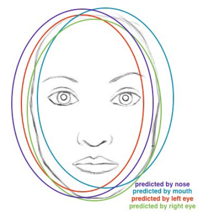



##### Limitation of CNNs

CNNs are good at extracting features from image data, and they are also good at learning these features. In addition, the max pooling introduces translation invariance, so that the system becomes invariant to the location of certain features. So, it does not care where a pattern was found only the fact that it was found. This actually can be a problem. Consider a CNN for face detection which learned features of corner of eyes, mouth, nose, etc. So, the CNN could recognize the following picture:

The problem is that, due to the translation invariance it also could recognize the following picture as a face too:

(Let's note that one could argue if this is really a problem for face detection problems. Most likely facial recognition systems will not have to recognize people with such face. However, there might be other situations in which translation invariance is a drawback, for instance in adversarial attacks.) 

In other words, the problem is that CNN does not learn and it cannot extract information about the relative positions of the extracted features, and they do not take into account important spatial hierarchies between simple and complex objects.
Hinton argues that translational invariance is not an advantage, instead we should chase translational equivariance. 

* Equivariant to translation means that a translation of input features results in an equivalent translation of outputs. So if your pattern [0,3,2,0,0] on the input results in [0,1,0,0] in the output, then the pattern [0,0,3,2,0] might lead to [0,0,1,0]
* Invariant to translation means that a translation of input features doe not change the outputs at all. So, if your pattern [0,3,2,0,0] on the input results in [0,1,0] in the output, then the pattern [0,0,3,2,0] would also lead to [0,1,0]

To solve this problem, the capsule units have been introduced in October, 2017. In short, a capsule is similar to a neural unit, but it is different in the following aspects:
1. Capsules takes vectors from other units contrary to neural networks which send scalars.
	
	a. Therefore, the length of the vector represents the probability of the entity represented by a capsule.
	
	b. The direction of the vector encode some internal state of the detected objects. Therefore it can be considered as a feature representation of the entity of the object represented by a capsule. These features can be for instance, scale, thickness, skewness.
2. Capsules also try to predict the output of the next layer!

The capsule receives three input vectors: \\(u_{1}, u_{2}, u_{3}\\), coming from other 3 capsules in the lower layer. So capsules work with vectors instead of scalars. This can be considered as a little other neural network is nested  in each hidden unit. It is like neural nets in neural nets. This also gives another depth to the model. In the case of CNNs the depth was the number of the layers. In capsule networks there are two types of depths (depths in two dimension).

Let us assume that the lower level capsules detect eyes (\\(u_{1}\\)), mouth (\\(u_{2}\\)) and nose (\\(u_{3}\\)), and the current capsule detects face.
The input vectors are multiplied by corresponding weight matrices \\(W\\) that encode important spatial and other relationships between the lower level features and the higher level features. That is, e.g., \\(W_{3j}\\) encodes relationhsip between nose and faces, face is centered around the  nose, its size is 10 times the size of the nose, and the orientation of the face and the nose should be the same. After multiplication, we get the predicted position of the higher level feature. In other words, \\(\hat{u_{1}}\\) should represent where the face should be according to the detected position of the eyes, \\(\hat{u_{2}}\\) should represent where the face should be according to the detected position of the mouth, and \\(\hat{u_{3}}\\) should represent where the face should be according to the detected position of the nose. If these 3 predictions of lower level feautres (i.e the uihat vectors point to the similar directions and their length is long enough) then it must be a face.

The "hut" vectors are weighted by scalars \\(c_{i}S\\) and they summed up resulting vector \\(s_{j}\\).
\\[s_{j} = \sum_{i}c_{ij}\hat{u}\_{ij}\\]

The next step is the squash which is a kind of non-linear activation function but for vectors (instead of scalars). It scales the length of the vector between [0,1]. If the vector is short, then after squashing its length will be close to zero. If the length of vector \\(s_{j}\\) is large, then it will be rescaled close to one. (but below one). The squashing is defined as follows:
\\[v_{j} = \frac{\left\\|s_{j}\right\\|^{2}}{1+\left\\|s_{j}\right\\|^{2}}\Bigg(\frac{s_{j}}{\left\\|s_{j}\right\\|}\Bigg)\\]

The length of \\(v_{j}\\) will represent the probability of the entity represented by the capsule.

The squashing function on scalar input. In real application the squashing function operates on vectors.

Now, let us discuss the \\(c_{ij}\\) coefficients. These scalars determine whether the input should be passed to capsule \\(j\\) or capsule \\(k\\) in the next ayer (both, capsules \\(j\\) and \\(k\\) are on the next layer). This is determined "on the fly" and it does depend on the inputs. The \\(c_{j}\\) will be determined such that the information will be passed to that capsule on the next level, where the information vectors agree the most. This is called by routing-by-agreement. Because this routing is calculated on-the-fly and it does depend on the actual input, it is called dynamic routing. So, lower level capsules will send their inputs to a higher level capsule that agrees with its inputs the most. The \\(c_{ij}\\) coefficient are called coupling coefficients. The coupling coefficients between capsule \\(i\\) in lower layer and all the capsules \\(j\\) in the higher level sum to 1. These are determined by softmax of \\(b_{ij}\\)s which are the log prior probabilities that capsule i should be coupled to capsule \\(j\\).

\\[c_{ij} = \frac{\exp(b_{ij})}{\sum_{k}\exp(b_{ik})}\\]

The dynamic routing algorithm (used for inference in forward propagation):

The vector multiplication in line 7 is scalar products of vectors. It is recommended to use 2-3 iteration of routing. 

The parameters \\(W_{ij}\\)s of the model are learned (calculated) by backpropagation.
In practice, the training is considered rather slow. But the advantages of this model compared to CNNs is that CapsNets require much less training data. 

Example: layer: \\(l−1\\) | layer: \\(l\\)

So, what is important here is that, the capsule 'eye' prefers the capsule 'face' in the higher level because its prediction u22hut agrees more with the prediction u32hut made by the capsule 'mouth'. Therefore, the capsules adjust the weights \\(c_{ij}\\) during forward propagation and the weights do depend on the actual input. This is contrary to the classic neural networks in which the weights are fixed during forward propagation (they are changed only during the training, but not during inference) no matter what input is being processed.

##### Tutorials:
1. [https://medium.com/ai³-theory-practice-business/understanding-hintons-capsule-networks-part-i-intuition-b4b559d1159b](https://medium.com/ai³-theory-practice-business/understanding-hintons-capsule-networks-part-i-intuition-b4b559d1159b)
2. It consists of three pages (forth is coming soon). Links are at the top.
[https://www.youtube.com/watch?v=pPN8d0E3900](https://www.youtube.com/watch?v=pPN8d0E3900)
3. Good link in the description under the video.
[https://jhui.github.io/2017/11/03/Dynamic-Routing-Between-Capsules/](https://jhui.github.io/2017/11/03/Dynamic-Routing-Between-Capsules/)

##### Reference:
Hinton et al: Dynamic routing between capsules. [https://arxiv.org/pdf/1710.09829.pdf](https://arxiv.org/pdf/1710.09829.pdf)