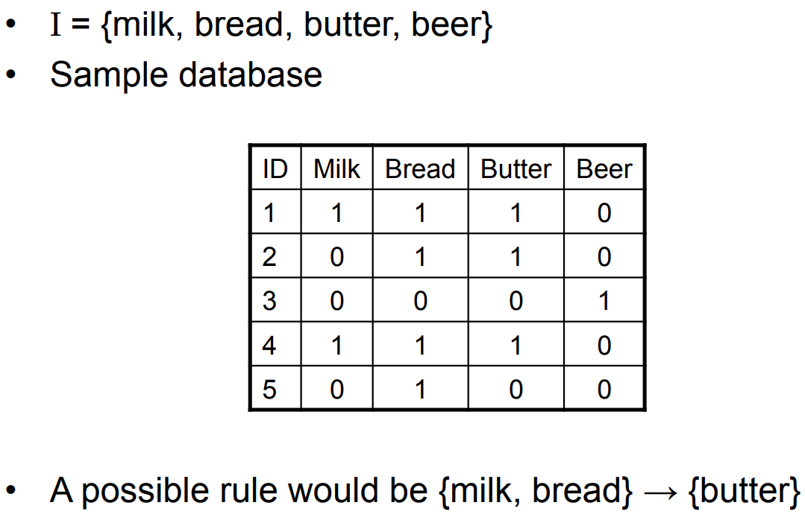
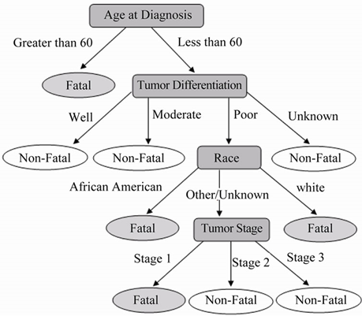
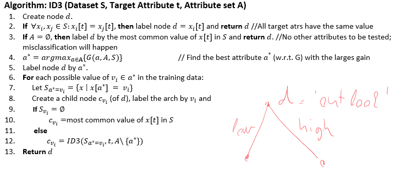
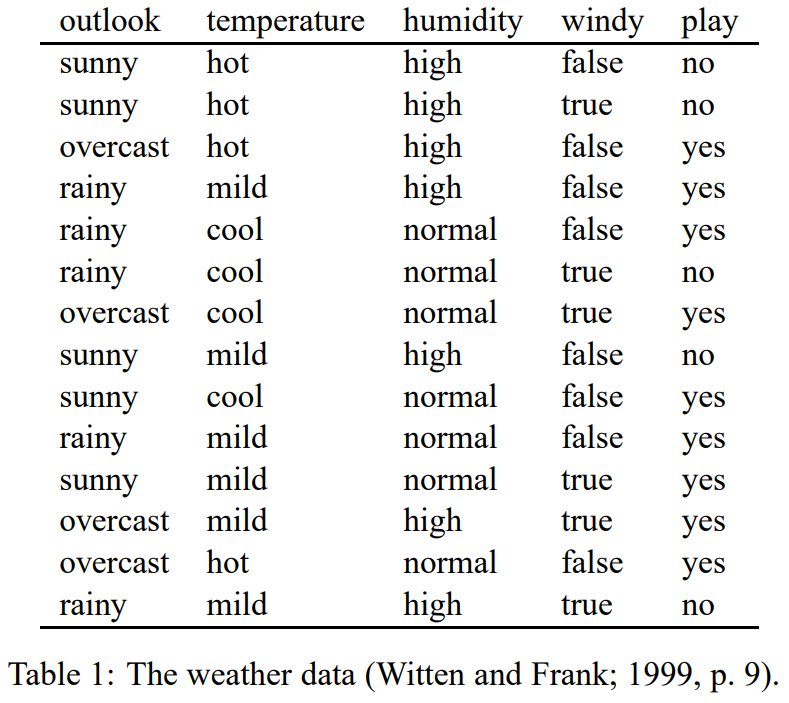
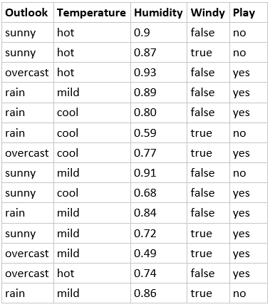
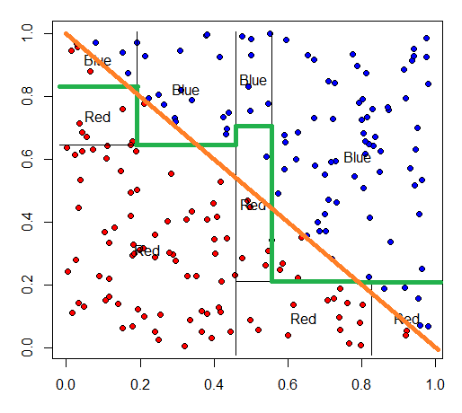



#### Rule-based machine learning.

Rule-based systems specify the system's behavior using if … then … rules, often manually constructed.
Rule-based machine learning is part of rule-based systems, however in this approach a set of rules are mined (constructed) from the data contrary to traditional rule-based systems in which rules are mainly crafted manually.

Here, when you are imagine a data, try to imagine one with more-or-less categorical or numerical features describing some entities. Do not imagine data as an image or speech data. 

An example. Consider the following shopping charts of customers (ID). We can notice it that if customers buy milk and bread, it is likely they buy butter as well.

#### Decision Trees

Decision trees represent a series of decision rules in a top-down approach. Leaves represent classes and thus decisions, intermediate nodes represent tests of data attributes. Decision trees also can be represented as a set of if-then rules where every rule corresponds to a node in the tree.

Example to classify if a cancer tumor is Non-Fatal/Fatal:

[ref: Bard, Hu, Journal of Cancer Therapy Vol.2 No.2(2011), Article ID:5664]

Decision trees are generally the best suited to problems with the following characteristics:
- Data instances are represented by attribute-value pairs, and attributes takes categorical values. Eg. Attribute: temperature, value: {Hot, Cold, Mild}
- The target function has discrete or categorical output values. (yes or no). Decision trees can be easily extended to multi-class classification problems.
- Training data contains missing values.
Note that neural networks are not appropriate for data having categorical features.

#### Learning a decision tree from training data

The standard algorithm to learn decision trees (DTs) is called ID3. This algorithm is essentially guided by the following question: "which attribute should be tested next?"

The principle of the ID3 algorithm is the following:
Let us consider the following data with class labels. Which test would split the data into two parts such that the class labels in each subset more homogeneous.

| Outlook:                 | overcast     | sunny     | overcast     | sunny     | overcast     |
|--------------------------|--------------|-----------|--------------|-----------|--------------|
| Humidity:                | low          | low       | high         | high      | high         |
| **Play tennis (target)** | **yes**      | **yes**   | **no**       | **no**    | **no**       |
{:class="table table-bordered"}

Splitting by the variable 'outlook' we would get:

| Outlook:                 | sunny     | sunny     |
|--------------------------|-----------|-----------|
| Humidity:                | low       | high      |
| **Play tennis (target)** | **yes**   | **no**    |
{:class="table table-bordered"}

| Outlook:                 | overcast     | overcast     | overcast     |
|--------------------------|--------------|--------------|--------------|
| Humidity:                | low          | high         | high         |
| **Play tennis (target)** | **yes**      | **no**       | **no**       |
{:class="table table-bordered"}

After splitting the data, the class labels mix in both dataset.

Splitting by the variable humidity we would get:

| Humidity:                | high         | high      | high         |
|--------------------------|--------------|-----------|--------------|
| Outlook:                 | overcast     | sunny     | overcast     |
| **Play tennis (target)** | **no**       | **no**    | **no**       |
{:class="table table-bordered"}

| Humidity:                | low          | low       |
|--------------------------|--------------|-----------|
| Outlook:                 | overcast     | sunny     |
| **Play tennis (target)** | **yes**      | **yes**   |
{:class="table table-bordered"}

After splitting, the class labels become uniform.

ID3 chooses the attribute that is the most useful for classifying examples, and the usefulness is measured by *information gain*.

There are several methods to define the function \\(G\\). Perhaps the most common is the information gain defined as follows. It utilizes the entropy. Let us define a distriubtion (a histogram) \\(P[t]\\) for a given target attribute \\(t\\) and let us denote the possible values of \\(t\\) with \\(t_{i}\\). The target attribute \\(t\\) can be, for instance, the class label and anything which we want to predict : e.g. for binary data: \\(t_{1} = "yes"\\) and \\(t_{2} = "no"\\).

\\[P[t] = [f(x[t] = t_{1};S), f(x[t] = t_{2};S), ..., f(x[t] = t_{k};S)]\\]

where \\(f(x[t] = t_{i};S)\\) denotes the ratio (frequency) of the data (in the dataset \\(S\\)) whose attribute \\(t\\) is equal to \\(t_{i}\\). \\(P[t]\\) is essentially the distribution of the attribute values. Note that \\(\sum_{i}f(x[t] = s_{i};S) = 1\\).

Let us define the uncertainty of an attribute \\(t\\) via the entropy:
\\[H(P[t]) = -\sum p_{i} \log p_{\nu} \text{, where } p_{i} = P[t]\_{i}\\]

If \\(H(t)\\) is high that means we are very uncertain to predict the value of the attribute \\(t\\) if we randomly sample a new data, i.e. the class labels roughly evely distributed in the set \\(S\\). If \\(H(t)\\) is low, then we can predict accurately the value of the attribute \\(t\\).

Now, let us define similar distribution but for a subset of the data. Let \\(S_{a=\nu_{i}}\\) be the subset of a data, where a specific attribute \\(a\\) has a value \\(\nu_{i}\\) that is: \\(S_{a=\nu_{i}} = \\{ x \in S| x[a] = \nu_{i} \\}\\).
Now we define the uncertainty in this subset with respect to a target attribute \\(t\\):
\\[P[t; S_{a=\nu_{i}}] = [f(x[t] = t_{1}; S_{a=\nu_{i}}), f(x[t] = t_{2}; S_{a=\nu_{i}}), ..., f(x[t] = t_{k}; S_{a=\nu_{i}}) ] \\]

Now, let \\(f_{a=\nu_{i}} := f(x[a] = \nu_{i};S)\\) be the frequency of the value \\(\nu_{i}\\) in attribute \\(a\\) in dataset \\(S(f_{a=\nu_{i}} := \frac{\mid s_{a=\nu_{i}}\mid}{\mid S \mid})\\).

Now we can define the information gain \\(G(a,A,S)\\) as follows:
\\[G(a,A,S) = H(P[t]) - \sum f_{a=\nu_{i}} H(P[t; S_{a=\nu_{i}}])\\]

The first term is the uncertainty in the target attribute (class labels). The second term is the uncertainty after partitioning the data \\(S\\) by the attribute \\(a\\).
The \\(G(a,A,S)\\) is the reduction in uncertainty caused by knowing the values of attribute \\(a\\).

ID3 algorithm selects the attribute \\(a^{\ast}\\) which reduces the uncertainty the most in each step.

**Example:** A training data to decide if the weather is good to play tennis.

Target attribute is "play" and it can have two values: "yes" and "no". The distribution of the values in the target attributes:
\\[P[play] = [\frac{5}{14}, \frac{9}{14}]\\]
And the uncertainty is:
\\[H(P[play]) = -(\frac{5}{14}\log\frac{5}{14} + \frac{9}{14}\log\frac{9}{14}) = 0.94\\]

Let us chose the attribute "temperature". It has three values: "hot", "mild", "cool".

\\(\mid S_{Temp=cool} \mid = 4\\)

\\(\mid S_{Temp=mild} \mid = 6\\)

\\(\mid S_{Temp=hot} \mid = 4\\)

\\(P(play;S_{Temp=cool}) = [\frac{1}{4},\frac{3}{4}]\\)

\\(P(play;S_{Temp=cool}) = [\frac{2}{6},\frac{4}{6}]\\)

\\(P(play;S_{Temp=hot}) = [\frac{1}{2},\frac{1}{2}]\\)

That is \\(P(play;S_{Temp=cool})\\) is the distribution of the class labels within the subset \\(S_{Temp=cool}\\)

\\(f_{Temp=cool} = \frac{4}{14}\\)

\\(f_{Temp=mild} = \frac{6}{14}\\)

\\(f_{Temp=hot} = \frac{4}{14}\\)

The information gain for the attribute "temperature"

\\[\\]

The ID3 algorithm will choose the attribute which yields the highest gain.

The ID3 algorithm can be extended for real-valued attributes. For a real valued attribute \\(r\\) one can create a new boolean attribute which is \\(true \Leftrightarrow r <= c\\). Now we need to find the optimal \\(c\\).  One can order the data instance by the value of \\(r\\) and calculate the best information gain at adjacent examples that differ in their target classification.
As an example, we included another attribute Humidity with numeric attributes. The format is as below:

In our example, the most information gain is attribute 'outlook'. In the subset rooted at "outlook.sunny", we would like to compute the information gain for 'Humidity' which is a numeric attribute. 

For humidity attribute, we need to create a new boolean value that is true when \\(humidity <= c\\) and false otherwise. The only thing left is to compute the best threshold \\(c\\). To do this, first, we sort humidity as below:

|----------------------|--------|--------|--------|--------|--------|
| Humidity:            | 0.68   | 0.72   | 0.87   | 0.9    | 0.91   |
| Play tennis (target) | yes    | no     | no     | no     | no     |
{:class="table table-bordered"}

We would like to pick a threshold that produces the greatest information gain. By sorting the numeric attribute values, then identifying adjacent examples that differ in their target classification, we can generate a set of candidate threshold. Then we compute information gain for each candidate and find the best one for splitting.

\\(Humidity>\frac{(0.72+0.87)}{2}\\) that is \\(Humidity>0.795\\), with the information gain \\(G(Humidity, A, S)=0.97\\). If we have more than 1 candidate here, we just need to find the best information gain one.

from [http://www.cse.unsw.edu.au/~cs9417ml/DT1/decisiontreealgorithm.html](http://www.cse.unsw.edu.au/~cs9417ml/DT1/decisiontreealgorithm.html)

The result:

Notes:
1. Decision trees are simple to understand and visualize, if the tree is not too big.
2. ID3 algorithm is a greedy algorithm and can be trapped in a local minimum.
3. Decision trees are able to handle both nominal and categorical data.
4. When applied to real-valued attributes, decision trees produce “axis-parallel” linear decision boundaries  
5. Decision trees can learn every single data instance in the dataset.
6. Decision trees do not perform well on correlated features:

