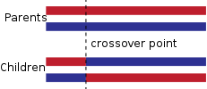



Genetic Algorithms (GA) are metaheuristic algorithms for global optimization and for search problems, which are inspired by the "survival of the fittest" paradigm (by Darwin). This method belongs to the class of evolutionary algorithms (EA).

Genetic Algorithms consists of three main components:
1. Representation,
    * To represent the model/problem. Typically, it contains several hundreds or thousands of randomly generated models allowing to spread over the entire model space. 
2. Fitness function,
    * To evaluate how well a model performs. It is basically uses some sort of cost function or accuracy. GA tries to generate models which maximizes this fitness function.
3. Genetic operator
    * To generate new model instances from the fittest ones. There are two main type of such operators: cross-over and mutation.
		

GAs are iterative algorithms starting from an initial population and stopping when the termination criterion fulfilled. The GA method is first initialized with a set of models randomly, and it is called *population*. Then, in each iteration, GA selects the top \\(n\\) fittest model from the population w.r.t. some evaluation criteria and discards the others. Then GA mates the fittest individuals using some genetic operators producing two offsprings from each pair of parents by crossing over their model representation at a random point. This procedure is repeated until the termination criterion has reached. The very specific fitness functions and genetic operators are usually domain and problem specific.

Elitism: It allows the best model to carry on to the next iteration unaltered. This guarantees that the solution obtained with GA so far does not decrease from one iteration to the next one.

Genetic Algorithms do not require the fitness function to be differentiable, continuous, monotone, computable. It can be noisy and/or it may change over time. 

**Genetic operators.**
*Cross-over operator*: It takes two (or more parents) and at one (or more) random point(s) in the model substructures are swapped.



The each horizontal bar represents different model encoding.

*Mutation operator*: The model parameter is randomly changed in some random position of the model structure. This helps maintain the diversity in the model population.

#### Differential Evolution

The GA is better for structure optimization while DE is more suitable for weight optimization. DE requires the population size to be at least 4.


**Algorithm DE.**

Let \\(cr \in [0,1]\\) be the cross-over probability and \\(F \in [0,2]\\) the differential scalar weight.

1. Select a model \\(x = [x_{1}, ..., x_{n}]\\), and for this model it will create a new model \\(y = [y_{1}, ..., y_{n}]\\).
2. Randomly select three other models: \\(a, b, c\\).
3. Select a random index \\(r \in \\{1, ..., n\\}\\)
4. For every position \\(i \rightarrow 1, ..., n \\)
    * Draw a random number \\(r_{i} \in U(0,1)\\) from the uniform distribution on \\([0,1]\\)
	* If \\(r_{i} < cr\\) or \\(i = r\\), then \\(y_{i} = a_{i} + F(b_{i} - c_{i})\\), otherwise \\(x_{i} = y_{i}\\)
5. If the model \\(y\\) has better fitness than \\(x\\), then replace \\(x\\) with \\(y\\).


#### Examples

1. Genetic algorithm for learning decision trees:

2. CPPN: compositional pattern-producing network
CPPNs are networks of functions (similar to a graph). A CPPN takes in the (x, y) position of a pixel as input, and outputs a grayscale value or tuple of HSV color values for that pixel. Like a neural network, the function the CPPN computes depends on the number and type of units in the CPPN, how they are connected, and the weights between neurons. Each CPPN unit can have one of a set of activation functions (here: sine, sigmoid, Gaussian and linear), which can provide geometric regularities to the image. For example, passing the x input into a Gaussian function will provide left-right symmetry, and passing the y input into a sine function provides top-bottom repetition.

\\[o = 50 * \exp(- \frac{x^{2}}{20}) + 5 * \sin(y)\\]
This plot was generated by the following matlab code:
```
x=[-10:0.01:10];
y=x;
[mx,my] = meshgrid(x,y);
b= 50*exp(-mx.^2/20)+5*sin(my);
image(b)
```

\\[o = 50 * \exp(- \frac{x^{2}}{20}) + 5 * \sin(x^{2} + y^{2})\\]
Evolution determines the topology, weights, and activation functions of each CPPN network in the population. 
GA with human fitness function: [http://picbreeder.org](http://picbreeder.org)
This site randomly generates pictures and users can select the pictures they like. Therefore, human users serve as fitness functions and the selected pictures will be carried on to the next iteration. 
After some iterations it can produces images like:


3. GA for hyper-parameter tuning of neural network training.
Note that: hyper-parameters are of those which are not updated by the optimizer such as learning rate, tread-off regularization parameter, number of hidden units, number of hidden layers, type of activation functions, etc.]
[ref: Jaderberg et al: Population based training of neural networks. 2017]