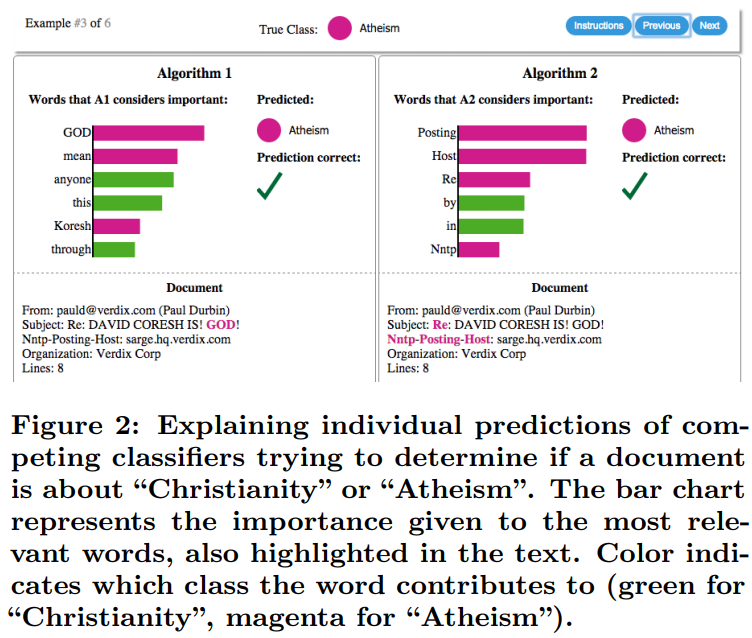



This lecture is heavily based on the online book:
Interpretable-ml-book: [https://christophm.github.io/interpretable-ml-book/index.html](https://christophm.github.io/interpretable-ml-book/index.html) And on the Lime: [https://arxiv.org/pdf/1602.04938v1.pdf](https://arxiv.org/pdf/1602.04938v1.pdf)

#### Interpretability, Explainable Artificial Intelligence, and Machine Learning Transparency

The complexity and the performance of the recent Machine learning methods has increased significantly. This also can be attributed to the development in computational power and the increasing availability of the data. Current complex systems include recommendation systems (at Ebay or amazon), autonomous vehicles, stock price forecasting etc. In some cases, it is not really important to understand how the model really works. For instance, if the recommendation system at Amazon is proven to generate more revenue, and the test is performed by A/B testing, then it is fine. Google is also testing several version of search algorithms per day with A/B testing and the performance is measured by clicks and clicks on ads. Such models often called as black-box models.

However, often in some sensitive areas, Artificial intelligence and machine learning systems have to earn our trust. Consider the following examples:
1. A surgery assistant system recommends the amputation of your legs. Would you like to know why?
2. You are a well-behaving prisoner in a jail, and the systems predicts you are recidivist. Would you like to know why?
3. The bank rejects your loan application so that you cannot buy your first home, or you cannot invest in your first company.
4. There is a new medicine developed and tested by the means of AI. Would you like to know if it is safe?
5. Cars are replaced by self-driving cars. Would you like to know if it is safe? How do they handle dangerous situations? Do they even realize that if they were involved in an accident?

In fact, as noted before, machine learning and statistical systems lack common sense and logic. However, they excel at one thing, to learn statistical correlation and patterns among the data, and they do it really well. If the training data is not designed well, these systems learn machine bias.

Also note that, we are living in a jurisdictions and our lives are regulated by law. When bad things happens responsible people are impeached at courts. Who would be responsible for a faulty decision made by AI systems? Interpretability and transparency is also needed to know that the system is not manipulated or it does not contains programming bugs.

#### Interpretability or ML system

In practice, simple, small and linear models are easy to interpret, aren't they?
Linear regression models are considered as easy to interpret, but are they so if they consist of millions of parameters?
Decision trees are considered as easy to interpret, but are they so if they consists of millions of branches?

Consider a simple linear regression which aims at predicting the price of a house based on some features such as its size, number of rooms, district, etc.
How would you interpret a negative coefficient corresponding to the number of the rooms?

#### I. Interpretable models, model specific interpretation

1. Linear regression models are easy to interpret if they contain few variables or they are sparse. The prediction is based on the weighted sum of the input features.
2. Logistic regression. Same.
3. Decision trees. The prediction goes through the branches of a tree and the leaves determine the predicted label/category.  The series of the branches can be translated to a series **if … then …** decisions. Small decision trees are also easy to interpret and investigate visually.

#### II. Example-based explanations

1. **Counterfactual explanations.** A counterfactual explanation of a prediction describes the smallest change to the feature values that changes the prediction to a predefined output. This approach is a model agnostic methods, because it only works with the model input and output. Example: Peter applies for a loan and gets rejected by the (machine learning powered) banking software. He wonders why his application was rejected and how he might improve his chances to get a loan. The question of “why” can be formulated as a counterfactual: What is the smallest change to the features (income, number of credit cards, age, …) that would change the prediction from rejected to approved? One possible answer could be: If Peter would earn 10,000 Euro more per year, he would get the loan. Or if Peter had fewer credit cards and hadn’t defaulted on a loan 5 years ago, he would get the loan. Peter will never know the reasons for the rejection, as the bank has no interest in transparency, but that’s another story.
The counterfactual explanations can be formulated as follows:
\\[ x' = argmin_{x'}\\{\lambda(f(x') - y')^{2} + d(x,x')\\} \\]
where \\(y'\\) is the desired output predefined by the user and \\(\lambda\\) is a user-defined trade off parameter balancing between the distance in prediction (first term) against the distance in feature values (second term). The interpretation of counterfactual explanations is very clear. If the feature values of an instance are changed according to the counterfactual, the prediction changes to the predefined prediction. There are no additional assumptions and no magic in the background.
2. **Adversarial examples.** These examples are somewhat similar to the counterfactual examples. However, the main difference is that: adversarial examples are created to deceive the model during application time and not to give explanations. 
Adversarial examples make machine learning models vulnerable to attacks, as in the following scenarios. (1) A self-driving car crashes into another car because it ignores a stop sign. Someone had placed a picture over the sign, which looks like a stop sign with a little dirt for humans, but was designed to look like a parking prohibition sign for the sign recognition software of the car. (2) A spam detector fails to classify an email as spam. The spam mail has been designed to resemble a normal email, but with the intention of cheating the recipient. (3) A machine-learning powered scanners scan suitcases for weapons at the airport. A knife was developed to avoid detection by making the system think it is an umbrella. For details of methods, see the Adversarial Attack lecture notes.
3. **Prototypes and criticism.** A prototype is a data instance that is representative of all the data. A criticism is a data instance that is not well represented by the set of prototypes. The purpose of criticisms is to provide insights together with prototypes, especially for data points which the prototypes do not represent well. Prototypes and criticisms can be used independently from a machine learning model to describe the data, but they can also be used to create an interpretable model or to make a black box model interpretable.
4. **Influential instances.** Machine learning models are ultimately a product of training data and deleting one of the training instances can affect the resulting model. We call a training instance “influential” when its deletion from the training data considerably changes the parameters or predictions of the model. By identifying influential training instances, we can “debug” machine learning models and better explain their behaviors and predictions.

FIGURE 1: A linear model with one featured trained once on the full data and once without the influential instance. Removing the influential instance changes the fitted slope (weight/coefficient) drastically.

#### III. Model agnostic methods
The advantage of model agnostic interpretability methods is that, their model interpretation is completely separated from the model design. Thus, ML developers are free to use any models they wish and the interpretation of the models becomes independent. 
1. Partial dependence plot (short PDP or PD plot) . This plot shows the marginal effect one or two features have on the predicted outcome of a machine learning model [1]. Let us suppose we have a model \\(f\\) trained on a data \\(D\\), and we are interested how the model prediction depends on a variable \\(x_{s}\\). The partial dependence function for regression is defined as:
\\[f(x_{s}) = E_{x_{c}}[f(x_{s},x_{c})] = \int_{x_{c}}f(x_{s},x_{c})dP(x_{c}) \\]
The feature being investigated is \\(x_{s}\\) and the rest of the features are grouped together and denoted as \\(x_{c}\\). For a particular training data as \\(f(x_{c})\\) can be calculated as follows:
\\[f(x_{s}) = \frac{1}{N}\sum_{i=1}^{N}f(x_{s},x_{c}^{i}) \\]
That is the estimation goes over all training data.
Example: consider a scenario in which we want to predict the number of the bike rented based on three features: temperature, humidity, and windspeed. The PDP for each features:

FIGURE 1: PDPs for the bicycle count prediction model and temperature, humidity and wind speed. The largest differences can be seen in the temperature. The hotter, the more bikes are rented. This trend goes up to 20C degrees, then flattens and drops slightly at 30C. Marks on the x-axis indicate the data distribution.

The disadvantages of this method are the following:
1. The model assumes independence between the features.  It is assumed that the feature(s) for which the partial dependence is computed are not correlated with other features. For example, suppose you want to predict how fast a person walks, given the person’s weight and height. For the partial dependence of one of the features, e.g. height, we assume that the other features (weight) are not correlated with height, which is obviously a false assumption. For the computation of the PDP at a certain height (e.g. 200 cm), we average over the marginal distribution of weight, which might include a weight below 50 kg, which is unrealistic for a 2 meter person. In other words: When the features are correlated, we create new data points in areas of the feature distribution where the actual probability is very low (for example it is unlikely that someone is 2 meters tall but weighs less than 50 kg). 
2. The Accumulated Local Effect (ALE) plots describe how features influence the prediction of a machine learning model on average. ALE plots are a faster and unbiased alternative to partial dependence plots (PDPs). 
3. Global surrogate methods are interpretable models that are trained to approximate the predictions of a black box model. We can draw conclusions about the black box model by interpreting the surrogate model. Solving machine learning interpretability by using more machine learning! The purpose of (interpretable) surrogate models is to approximate the predictions of the underlying model as accurately as possible and to be interpretable at the same time. The idea of surrogate models can be found under different names: Approximation model, metamodel, response surface model, emulator, …
4. Local surrogate models focus on training a surrogate model to explain an individual data \\(x\\), wherein the training is carried out on examples locally close to \\(x\\) with respect to some distance. On of the most interesting method is called local interpretable model-agnostic explanation (LIME). We will discuss here LIME now in details.

LIME: Local interpretable model-agnostic explanation [2].
Lime method selects some features from the input wich heavily influences the predictions. It does this so in a model-agnostic fashion, using only the input and the output of the algorithm.
Examples:

The basic idea of LIME:
Let us suppose we are given a trained and complicated (complex) model denoted by \\(f\\). Potentially, it can be a very deep neural network model. Assume that we are also given an exmaple x which we want to explain and we can evaluate the model's prediction on this example \\(f(x)\\). We would like to know the main features of x, which heavily influenced the output of \\(f\\).

Basically, LIME uses interpretable models to approximate the model \\(f\\) around \\(x\\). Let \\(g \in G\\) be an interpretable model, where \\(G\\) is a set of interpretable models. \\(G\\) can be linear regression, logistic regression models, decision trees, or if-then rule lists. Because large interpretable models also can become difficult to interpret, we introduce a regularization on \\(g\\) denoted by: \\(\\). This regularization can be depth of a decision tree or number of non-zero weights for linear models. Next, LIME generates several sampes \\(x'\\) from the neighborhood of \\(x\\) and also labels these samples with \\(f(x')\\). The sampling is problem specific but basically samples non-zero elements from \\(x\\) uniformly, where the number of samples is also uniformly sampled. In other words, \\(x'\\) contains a fraction of the non-zero elements of \\(x\\).

This procedure yields a training data \\(D = \\{(x_{i}^{'}, y_{i}^{'} = f(x_{i}^{'}))\\}\_{i=1}^{N}\\). Note that, this step creates a labeled dataset, so supervised learning methods can be used to train the interpretable model \\(g\\) on the dataset \\(D\\). The only restriction is that the distance \\(d(x, x_{i}^{'})\\) should be small.

Lime for text data:
The black box model is a deep decision tree trained on the document word matrix. Each comment is one document (= one row) and each column is the number of occurrences of a given word. Short decision trees are easy to understand, but in this case the tree is very deep. Moreover, there could have been a recurrent neural network or a support vector machine trained on word embeddings (abstract vectors) instead of this tree . Let us look at the two comments of this dataset and the corresponding classes (1 for spam, 0 for normal comment):

Now, we would like to know, why our tree classified the sentence ID=173 as spam.
The next step is to create some variations of the datasets used in a local model. For example, some variations of one of the comments:

Each column corresponds to one word in the sentence. Each row is a variation, 1 means that the word is part of this variation and 0 means that the word has been removed. The corresponding sentence for one of the variations (ID=3) is *“Christmas Song visit my ;)”*. Prob denotes the probability of the spam class (class=1). The 'weight' feature measures the fraction of the words being present in the generated sample. 
Here are the two sentences (one spam, one no spam) with their estimated local weights found by the LIME algorithm:

The word “channel” indicates a high probability of spam. For the non-spam comment no non-zero weight was estimated, because no matter which word is removed, the predicted class remains the same.

LIME for image data:

LIME for images works differently than LIME for tabular data and text. Intuitively, it would not make much sense to perturb individual pixels, since many more than one pixel contribute to one class. Randomly changing individual pixels would probably not change the predictions by much. Therefore, variations of the images are created by segmenting the image into “superpixels” and turning superpixels off or on. Superpixels are interconnected pixels with similar colors and can be turned off by replacing each pixel with a user-defined color such as gray. The user can also specify a probability for turning off a superpixel in each permutation.

Example
Since the computation of image explanations is rather slow, the [lime R package](https://github.com/thomasp85/lime) contains a precomputed example which we will also use to show the output of the method. The explanations can be displayed directly on the image samples. Since we can have several predicted labels per image (sorted by probability), we can explain the top n_labels. For the following image the top 3 predictions were *electric guitar; acoustic guitar; and labrador*.

FIGURE: LIME explanations for the top 3 classes for image classification made by Google’s Inception neural network. The example is taken from the LIME paper, Ribeiro 2016.
The prediction and explanation in the first case are very reasonable. The first prediction of electric guitar is of course wrong, but the explanation shows us that the neural network still behaved reasonably because the image part identified suggests that this could be an electric guitar.
Another example:

References.
[1] Friedman, Jerome H. “Greedy function approximation: a gradient boosting machine.” Annals of statistics (2001): 1189-1232. [https://arxiv.org/pdf/1602.04938.pdf](https://arxiv.org/pdf/1602.04938.pdf)
[2] Ribeiro, Marco Tulio, Sameer Singh, and Carlos Guestrin. “Why should I trust you?: Explaining the predictions of any classifier.” Proceedings of the 22nd ACM SIGKDD international conference on knowledge discovery and data mining. ACM, 2016 [https://arxiv.org/pdf/1602.04938.pdf](https://arxiv.org/pdf/1602.04938.pdf)