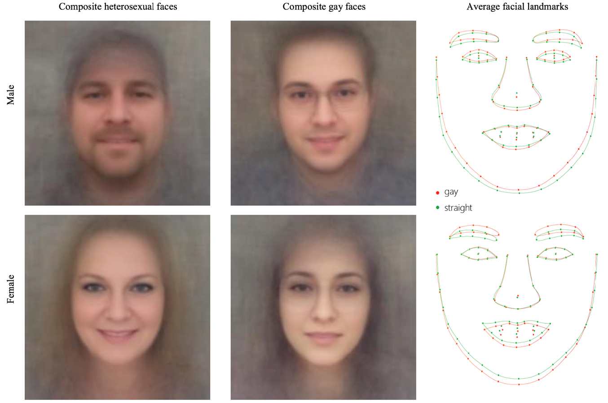
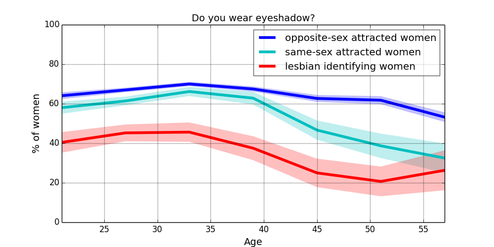
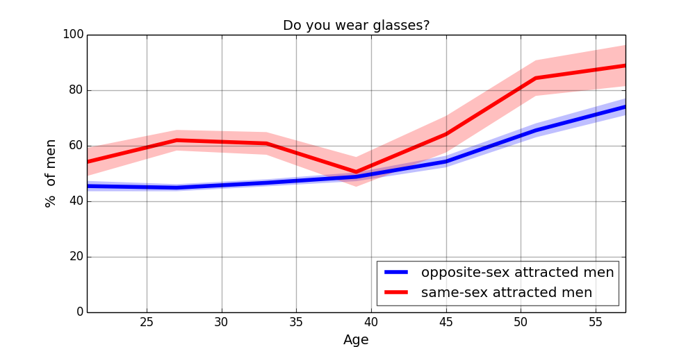



Machine bias refers to problems related to the gathering or use of data, where machine learning systems draw improper conclusions about data sets, either because of human intervention or as a result of a lack of cognitive assessment of data.
In general, machine bias emerges from the fact that statistical models and machine learning methods lack common sense and logic; thus, they require constant calibration and adjustment in order to prevent negative discrimination against legally-recognized protected groups, certain social classes, or races [1].

Examples:
1. One of the most prominent examples involves the use of machine learning systems to make judgments about individual people or groups of people. For example, when used in the field of criminal justice, some machine learning models have been shown to assume higher crime rates for individuals based on superficial data such as ethnicity, race, or location. Recidivism algorithms (COMPAS) used in US prisons to predict whether a prisoner can be released from the prison and safely put back to the society. COMPAS negatively discriminated black people. The interesting fact, the race of the prisoners were not included as a feature, but the system was able to guess it from the prisoners former address and neighborhood (zip code).
2. Google's  image-recognition algorithm that auto-tagged pictures of black people as “gorillas” in 2105. The company promised “immediate action” to prevent any repetition of the error; they solution is that they simply removed the category 'gorilla' [2].
3. Modern photo cameras have 'closed-eye' recognition, and often predicts closed-eyes for Asians even though they eyes are "open".

Consequence of the machine bias
In general, very simple models can also exhibit machine bias. For example,  consider the following simple excel sheet form, used by  human resource (HR) manager for hiring people. 

* Name, 
* Gradation, university, Harvard 10 point, University of somewhere, 2 points, high school 1p.
* Overall grade, mark (GPA):
* Skills: Relevant Skills, more skills higher points, less skills less points,
* Gender: male 2 p, female 1p,
* Experience in years: 
* Age: 
* Etc.

Sum up the points to get an overall score, so that HR department can rank the candidates and chose the one with the highest score. This is a simple mathematical model. 

This model is biased, because it prefers males to females based on the gender and not because of their working history/ working experience. And this will lead to that there will be less unemployed men than women, and thus it can result in more ingrained gender discrepancy.

The machine bias can put minorities, races, and less fortunate social groups in even harder situation. 
For instances:
1. Credit scores are used in United States, and measures that if a person is capable of paying back a loan or not. It is kind of measures how one can trust/rely on a person. Credit scores are built on your payment history. If you pay your mortgage and loan back on time, you increase your credit score. If you are a sort of unreliable person, you decrease your credit scores. When you apply for a bank loan, the bank will check your credit scores. If you have poor credit scores, the bank might rejects your loan application. You might be refused to get some services, such as renting cars.
Some time ago, HR personals also included the applicant's credit scores to their form. The main idea behind this was that, a person with good credit scores more likely to work better, and are more like to be more organized person, and follows deadlines, etc. The problem with this is that, if a person has a poor credit score, then he or she will remain unemployed, therefore, without salary, and thus receiving worse credit score, so that it becomes even more difficult to get a job. So, this would put people in need to a vicious circle.
2. Online job advertisement. There was study by the AdFisher company that revealed that Google's targeted advertising system was 6 times more likely to show high paying jobs to men than to women. The immediate consequence of this google's bias is that a woman may not see a high paying job advertisement and therefore is less likely to know about it and apply. The long-term result could mean a higher gap in gender salaries in high ranking positions. #more ingrained gender discrepancies in high ranking positions.
3. Criminalization of districts.  Let us suppose there is a district where the crime rate is a bit higher, the police commissioner sends more patrols to that district. Now, the police patrols there will stop and check more citizens, and reveal more minor felony, such as, possessing marihuana. Then, in turn, even more crime will show up in statistics in the given district. On the other hand, other discritcs will be checked and patroled by less extent, consequently, even less felony will be reported. The bias here is that this does not mean that, other disctrict are less vicious than the other ones. The increment of felony reports arises from more frequent sampling. Therefore, if you live in a bed neightbourhood, you are more likely to be stopped and searched by the police, or get a parking ticket, speeding ticket, or a fine for alcohol (beer) consuption in pulic places. Consequently, you are more likely to have a criminal record. 
4. Evaluation forms of progress for individuals or institutes can have bias. For instance, if teacher performance evaluation forms include the grades of their students, then teachers tend to give higher scores. Therefore, the teachers performance is seemingly increasing, this does not make them better performing teachers and students do not get better. Modern university rankings consider how international a university is. Therefore, universities started accepting international students and hiring international faculty in order to improve their rankings. Professors are nowadays also undergo by some performance evaluation which is heavily based on their publication records. As a consequence, the number of the publications has dramatically increased word-wide, however, their quality is questionable. 
5. China is about to introduce a citizen score around 2020, something similar to the credit scores in US, but it includes more things, such as who your friends are, your comments on websites, etc. It is to measure the trustworthiness of its 1.3 billion residents. We are to see how it will work out.

In general, the problem is not that you create a mathematical model, or some evaluation sheet which is biased. The problem is that if the bias is not revealed, and you keep using it. Therefore, it is recommended to make these models transparent and clear, and check often that the results are correct. You need to check from time-to-time that, the prediction output of your model is indeed correct and it is in accordance with your expectations.

Last year, the EU General Data Protection Regulation (GDPR) came effect in EU, and one of its points is the "right for explanation". So, individuals (in the EU) have a right for an explanation about decisions made by automatic systems that significantly affects individuals, particularly legally or financially. For instance, if your loan application (for an investment or for your first home) is rejected by an automatic system, EU citizens heve the rigth to get an explanation why it happened. (e.g. you don't have enough salary to pay the mortgage).

Sexual orientation prediction.
Finally, let us discuss an interesting story from 2017/2018. A research group led by Michal Kosinski [4] created an machine learning system, or an artificial intelligence system, which tried to predict the sexual orientation of a person based on solely on the person's face. Let me just emphasize that, it is NOT possible tell someone's sexual orientation based on the person's face. But this system achieved a 60 percent accuracy, which is much better than a random prediction. How come? How is this possible? 

Michal Kosinski, made even bolder claims: that such AI algorithms will soon be able to measure the intelligence, political orientation, and criminal inclinations of people from their facial images alone.
Last year, two computer scientists from China posted a non-peer-reviewed paper online in which they argued that their AI algorithm correctly categorizes “criminals” with nearly 90% accuracy from a government ID photo alone. Technology startups had also begun to crop up, claiming that they can profile people’s character from their facial images. 

So, there has been an investigation on this in more depth and it turned out the AI system learned some social patterns. For instance, it turned out homosexual women are a bit likely to wear less makeup than heterosexuals, while homosexual men are bit more open to glasses than to contact lenses. And the system's prediction mainly based on these social traits. For the full analysis see: [3]. It is interesting to read. In [3], a survey of 8,000 Americans using Amazon’s Mechanical Turk crowdsourcing platform was conducted  to see if we could independently confirm these patterns, asking 77 yes/no questions such as “Do you wear eyeshadow?”, “Do you wear glasses?”, and “Do you have a beard?”, as well as questions about gender and sexual orientation. The results show that lesbians indeed use eyeshadow much less than straight women do, gay men and women do both wear glasses more, and young opposite-sex-attracted men are considerably more likely to have prominent facial hair than their gay or same-sex-attracted peers.

###### References:
1. Cathy O'Neil: Weapons of math destruction, 2016, Crown Random House, ISBN: 0553418815, 9780553418811
2. [https://www.theguardian.com/technology/2018/jan/12/google-racism-ban-gorilla-black-people](https://www.theguardian.com/technology/2018/jan/12/google-racism-ban-gorilla-black-people)
3. [https://medium.com/@blaisea/do-algorithms-reveal-sexual-orientation-or-just-expose-our-stereotypes-d998fafdf477](https://medium.com/@blaisea/do-algorithms-reveal-sexual-orientation-or-just-expose-our-stereotypes-d998fafdf477)
4. [https://psyarxiv.com/hv28a/](https://psyarxiv.com/hv28a/)