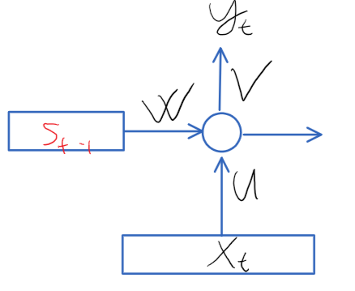
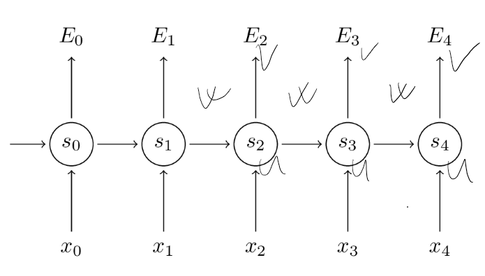
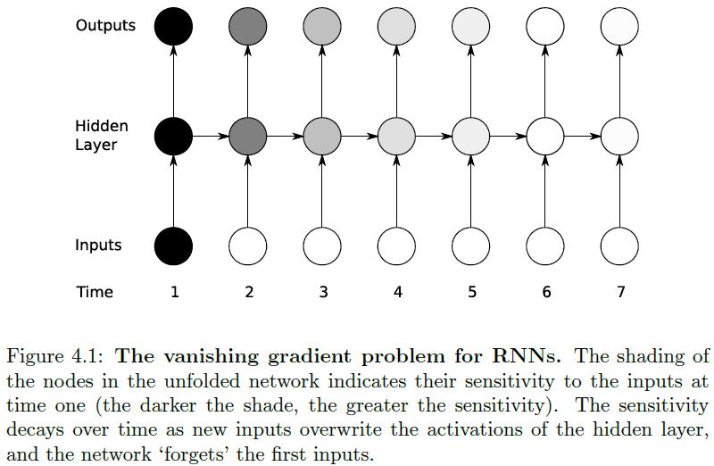
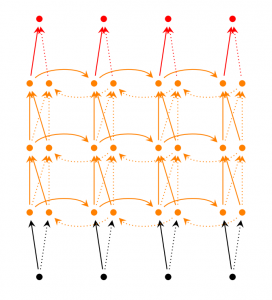



Here, we will discuss neural network-based models for sequential data. These models process sequential data, one data frame (one vector) at a time using a memory that is updated after each step. This memory is supposed to represent the essence (or the information) of the past data. Different methods (Recurrent Neural Networks, Long-Short Term Memory models, and Neural Turing Machines) are all use a memory but they differ in how they update or modify the memory.
Let us assume we are given a single data sequence \\(x = x_{1}, ..., x_{T}\\), where each \\(x_{i} \in R^{n}\\) and the desired output is a sequence: \\(y = y_{1}, ..., y_{T}\\). Note that, different sequences in the dataset can differ in length.
The recurrent neural network uses a memory, which is represented by a vector \\(h \in R^{H}\\), and every step it takes \\(x_{t}\\) as an input and produces a prediction \\(y_{t}'\\) and updates the memory \\(h\\).

Figure 1. Illustration of Recurrent Neural Networks.

The update of the hidden states is given by:
\\[s_{t} = tanh(W_{s_{t-1}} + U_{x_{t}} + b_{1}) = tanh(Z[s_{t-1}; x_{t}] + b_{1})\\]

where [.;.] indicates the vector concatenation, and \\(Z\\) contains both \\(W\\) and \\(U\\).
And the prediction of the current input:
\\[y_{t}' = \alpha(V_{s_{t}} + b_{2})\\]
where \\(b_{1}\\) and \\(b_{2}\\) are biases and \\(\alpha(.)\\) is an activation function. Note that logistic activation functions also could be used instead of tanh. The parameters in \\(V\\) and \\(U\\) can be interpreted as the same in standard neural networks. The parameters in the weight matrix \\(W\\) controls basically what to keep and what to forget from the previous state. The memory is usually set to be 0 vector at the beginning of process \\((s_{0} = 0)\\). Note that, the parameters of the network \\((U, V, W)\\) do not change over the time.

Now, the question is that how can we calculate the parameters of the model \\(W, V, U\\) and the biases? First, we need a loss function. This loss can be the same as what we used to use, for instance, cross-entropy for categorical target values or least squares for regression models. Now, the derivation of the cost function w.r.t. the parameters is basically straightforward but technical, one just need to consider the RNN as a deep neural network and calculate the derivatives at previous times \\((t - 1, t - 2, ..., 0)\\) and sum up the gradients. Now, we discuss this in more details.

Consider the following case, where the RNN is unfolded in time:

The parameters are in \\(W, V\\) and in \\(U\\). Thus, we need the following gradients:
\\[ \frac{\partial E}{\partial V}, \frac{\partial E}{\partial W}, \frac{\partial E}{\partial U}\\]
where \\(E\\) denotes the cost function. The calculation of the derivatives of \\(\frac{\partial E}{\partial V}\\) is done as in the case of standard neural networks. If the error is expressed in terms of the cross entropy then \\(\frac{\partial E}{\partial V} = \sum_{i} \frac{\partial E_{i}}{\partial V} = \sum_{i}s_{i}^{T}(g(s_{i}V + b_{2}) - y_{i})\\), where \\(g(.)\\) is the logistic sigmoid function. Note that, this is the gradients of the logistic regression. The gradients would change for different activation functions and different costs such as least squares, etc.

The \\(\frac{\partial E}{\partial W}\\) is a bit different. Let us consider the error \\(E_{i}\\) for only one data instance. Then we need to calculate the gradients for all the paths to \\(E_{i}\\) and sum them up.

For instance for \\(\frac{\partial E_{3}}{\partial W}\\)
\\[\frac{\partial E_{3}}{\partial y_{3}'} \frac{\partial y_{3}'}{\partial s_{3}} \frac{\partial s_{3}}{\partial W} \\]
and
\\[\frac{\partial E_{3}}{\partial y_{3}'} \frac{\partial y_{3}'}{\partial s_{3}} \frac{\partial s_{3}}{\partial s_{2}} \frac{\partial s_{2}}{\partial W} \\]
and
\\[\frac{\partial E_{3}}{\partial y_{3}'} \frac{\partial y_{3}'}{\partial s_{3}} \frac{\partial s_{3}}{\partial s_{2}} \frac{\partial s_{2}}{\partial s_{1}} \frac{\partial s_{1}}{\partial W} \\]
and
\\[ \frac{\partial E_{3}}{\partial y_{3}'} \frac{\partial y_{3}'}{\partial s_{3}} \frac{\partial s_{3}}{\partial s_{2}} \frac{\partial s_{2}}{\partial s_{1}} \frac{\partial s_{1}}{\partial s_{0}} \frac{\partial s_{0}}{\partial W}\\]
And in the end, we sum up these gradients.
In general:
\\[ \frac{\partial E_{i}}{\partial W} = \sum_{t=0}^{i} \frac{\partial E_{i}}{\partial y_{i}'}\frac{\partial y_{i}'}{\partial s_{i}} \frac{\partial s_{i}}{\partial s_{t}} \frac{\partial s_{t}}{\partial W}      \\]

Note that the \\(\frac{\partial s_{i}}{\partial s_{t}}\\) is "recursive" and it gets longer as \\(t \rightarrow 0: \frac{\partial s_{i}}{\partial s_{k}} = \prod_{j=k}^{i}\frac{\partial s_{j}}{\partial s_{j-1}}\\)
The total gradients for one sequence.

\\[ \frac{\partial E}{\partial W} = \sum_{i} \frac{\partial E_{i}}{\partial W} \\]

The calculation is similar for \\(\frac{\partial E}{\partial U'}\\), using the same approach we get:

\\[  \frac{\partial E_{i}}{\partial U} = \sum_{t=0}^{i} \frac{\partial E_{i}}{\partial y_{i}'} \frac{\partial y_{i}'}{\partial s_{i}} \frac{\partial s_{i}}{\partial s_{t}} \frac{\partial s_{t}}{\partial U}\\]

This method above is called the backpropagation through time (bptt).
The problems with BPTT are the following:
1. It can be slow for long sequences, because the gradient calculation of a data near the end of the sequence requires going back to the beginning, i.e. \\(\frac{\partial s_{i}}{\partial s_{k}}\\) can be long. For this problem, the BPTT is truncated. This can be done in two ways:
* Calculate the gradients only after \\(k\\) steps. This means that the gradients of \\(E_{i}\\) is calculated for not all \\(i\\), but only for every \\(k\\)-th step.
* Unrolling the network at most \\(l\\) steps. This means that the back propagation goes back at most \\(l\\) steps: \\(\sum_{t=i-l}^{i} \frac{\partial E}{\partial y_{i}'}\frac{\partial y_{i}'}{\partial s_{i}}\frac{\partial s_{i}}{\partial s_{t}}\frac{\partial s_{t}}{\partial W}\\)
This means that relevant information is saved for a fixed number of time steps, and everything beyond this point is forgetten.

2. Consider the term \\(\frac{\partial s_{i}}{\partial s_{k}} = \prod_{j=k}^{i}\frac{\partial s_{j}}{\partial s_{j-1}}\\). This represents a series of a vector multiplication, and it can be very long.
* If the gradients are small (<1), then the multiplication of small numbers can lead to tiny values (small gradients). This phenomenon is called vanishing gradients. More specifically, when the gradients are calculated via \\(\sum_{t=0}^{i} \frac{\partial E}{\partial y_{i}'} \frac{\partial y_{i}'}{\partial s_{i}} \frac{\partial s_{i}}{\partial s_{t}} \frac{\partial s_{t}}{\partial W}\\) then the long \\(\frac{\partial s_{i}}{\partial s_{t}}\\) terms in the sum converges to zero and they do vanish, however, for short \\(\frac{\partial s_{i}}{\partial s_{t}}\\) terms in the sum, the gradients can be useful. Therefore, RNNs have capability of learning short-term relationships, but they do have problems for learning long term relationships. In other words, the gradient's components in directions that correspond to long-term dependencies is small, while gradient's components correspond to short-term dependencies is large. As a result, RNNs easily learn the short-term but not the long-term dependencies.
* Contrary, the values can be large (>1) and the multiplication of these can explode. This also means that gradients from long term grow much faster than gradients from short terms. This is called exploding gradients. The exploding gradients can be circumvented by so called gradient clipping technique in which one does not allow parameter updates large than a predefined value.

3. In practice, RNNs are not capable of handling long term relationships in data, and they forget quite quickly. It is mainly due to their limited memory and to the fact that they update the memory with a linear transformation. However, RNNs are good to process sequential data in which there is no long term relationship. For instance, RNNs can perform well in human activity recognition (walking, running, etc.) because the current type of activity in the evening does not depend on what the user was doing (say) in the morning, etc. RNN also can be used for user tracking etc. An example on how the RNN is forgetting long-term information.

The resilient back propagation (Rprop) is a learning heuristic for backpropagation and it may cope with vanishing and exploding gradients. Rprop utilizes only the sign of the gradients and neglects its magnitude. However, the learning rate (the step size) is adjusted adaptively, briefly, if the sign of a particular gradient remains the same compared to the previous iteration, then its corresponding learning rate is increased; otherwise, if the sign of the gradient changes, then the learning rate is decreased.

#### Prop pseudo code:

\\[ 
    \begin{array}{l}
    \text{In each iteration:} \cr
	\hspace{10mm}\text{For each parameter } \theta_{i}^{t} \text{ in } \frac{\partial E}{\partial \theta^{t}}: \cr
	\hspace{20mm}\text{if } sign(\theta_{i}^{t}) \neq sign(\theta_{i}^{t-1}) \cr
	\hspace{30mm}\mu_{i} = \mu \ast \eta^{-}\text{, where } \eta^{-} < 1 \cr
	\text{} \cr
	\hspace{20mm}\text{if } sign(\theta_{i}^{t}) == sign(\theta_{i}^{t-1}) \cr
	\hspace{30mm} \mu_{i} = \mu \ast \eta^{+}\text{, where } \eta^{+} < 1 \cr
    \end{array}       
\\]

Here, \\(\mu_{i}\\) denotes the learning rate specifically to the parameter \\(\theta_{i}\\). And note that different parameters have different learning rates.
 
#### Extensions:

Bidirectional RNNs also take into account the future data samples (at time \\(t + 1\\)) when making a prediction output at time \\(t\\). This can be useful when the data is processed sequentially, but it is not sequential in time (it is not temporal). For instance, it can be used effectively for hadnwritten text recognition. For temporal data, the prediction for the data at time \\(t\\) is also based on the data coming later \\((t + i)\\). This increases the lag of the system. For instance, in speech recognition, the recognized text can be delivered not in real time, but with a little, say 5-10 sec delay.
Bidirectional RNNs are just two RNNs stacked on top of each other. The output is then computed based on the hidden state of both RNNs.

Deep RNNs.  RNNs also can have more hidden layers on top of each other. 

The hidden units in layer \\(l\\) are based on the hidden units in layer \\(l\\) in the previous steps \\((t - 1)\\), and the hidden layers in the previous layer \\((l - 1)\\) in the current step \\(t\\).
For an unidirected model:
\\(s_{t}^{(l)} = tanh(W^{(l)}s_{t-1}^{(l)} + W^{(l-1)}s_{t}^{(l-1)} + b_{l})\\), where \\(s_{t}^{(0)} = x_{t}\\), etc.

#### References:
1. [https://arxiv.org/pdf/1610.02583.pdf](https://arxiv.org/pdf/1610.02583.pdf)
2. [http://ai.dinfo.unifi.it/paolo//ps/tnn-94-gradient.pdf](http://ai.dinfo.unifi.it/paolo//ps/tnn-94-gradient.pdf)
3. [https://arxiv.org/pdf/1610.02583.pdf](https://arxiv.org/pdf/1610.02583.pdf)
4. [http://peterroelants.github.io/posts/rnn_implementation_part01/](http://peterroelants.github.io/posts/rnn_implementation_part01/)