

**Receiver Operator Characteristics (ROCs).**

Each binary classifier, Logistic regression, Neural Networks, and Support Vector Machines, and in general many other binary classifiers, provides a score for a data \\(x\\) calculated as \\(h_{\theta}(x)\\), then the classification is based on whether this score is above or under a certain pre-defined threshold. 
We can calculate these scores for all positive data instances, and we get a distribution of these scores. Similarly, we can calculate the scores for all data instances belonging to the negative classes, and we get another distribution for the negative class. 
The performance of a binary classifier is actually depends on how well these distributions are separated from each other. The ROC analysis is used to characterize how well these two distribution can be separated.

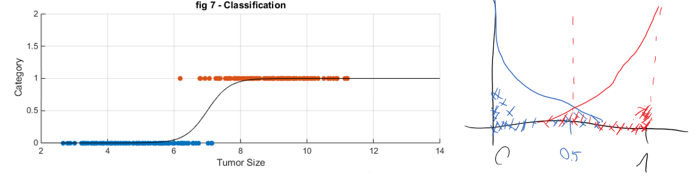

**Figure 1.** Example of such score distribution obtained from Logistic Regression Model.

Score distributions:

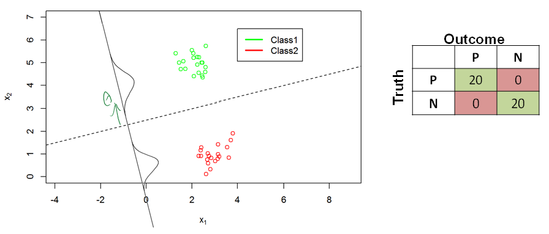

Overlapping groups.

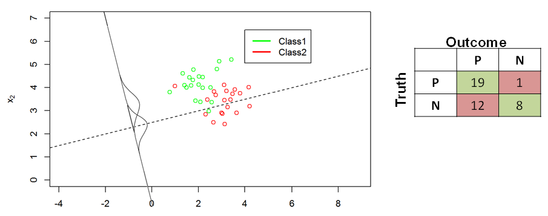

Indistinguishable groups

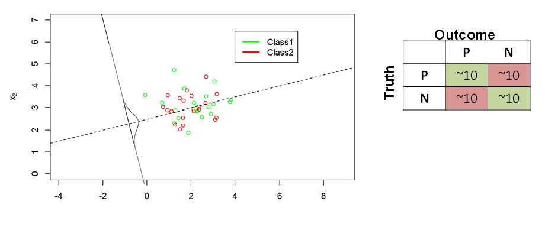

#### Calculating FPR, TPR

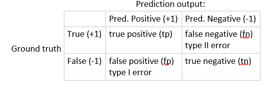

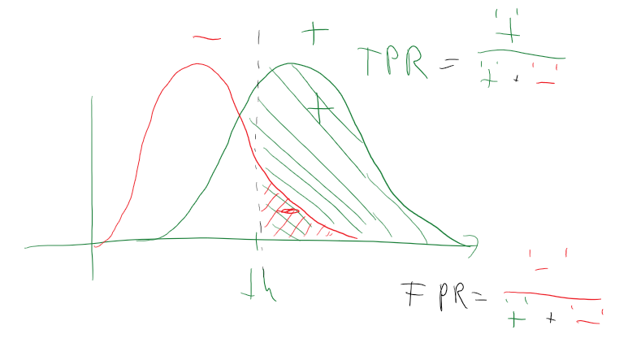

\\[True\ Positive\ Rate = \frac{TP}{(TP + FN)}\\]

\\[False\ Positive\ Rate = \frac{FP}{(FP + TP)}\\]

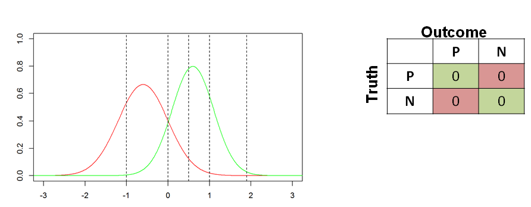

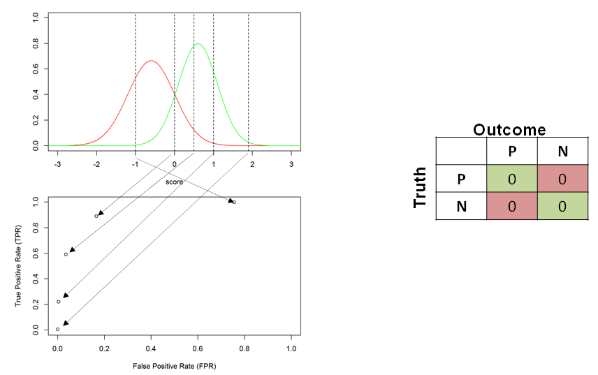

ROC curve:

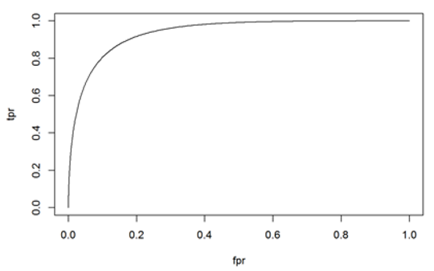

Area Under the curve (AUC):

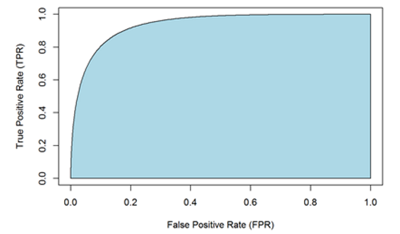

Examples for ROC curves.

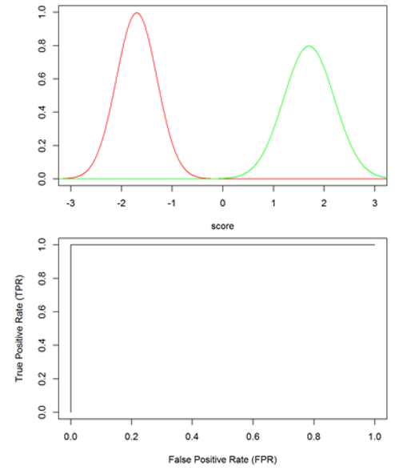

Good classification:

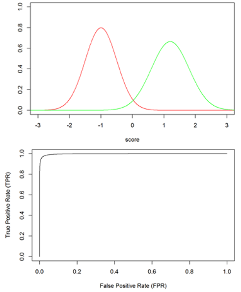

Poor classification:

No classification:

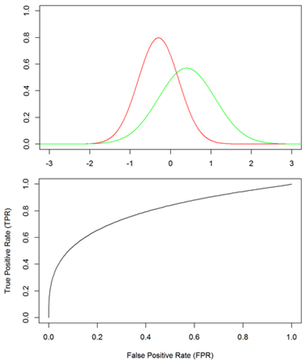

No separation:

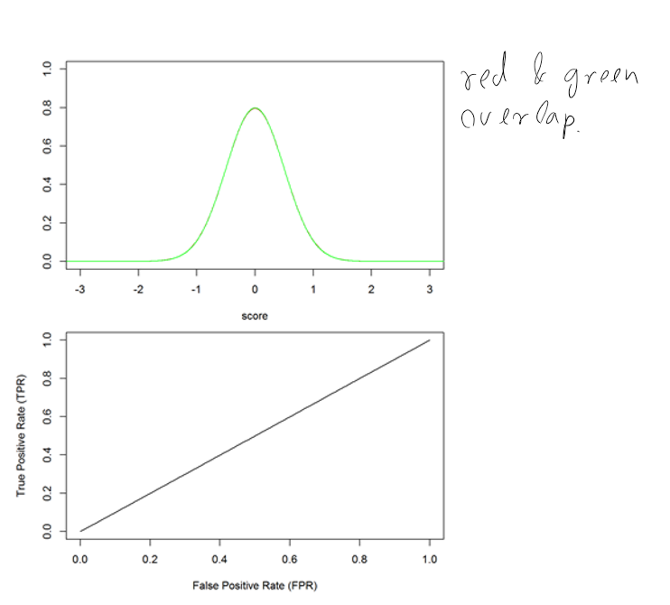

Local humps:

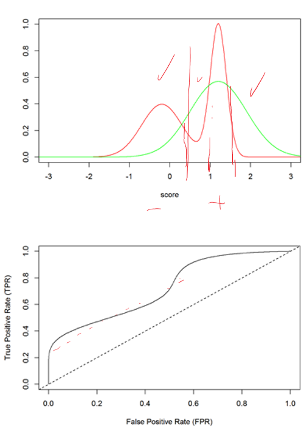

Notes:
1. The ROC analysis in a non-parametric method, it does not require the distributions in any specific parametric form. It is very closely related to the Wilcoxson statistics.
2. ROC analysis is not hindered by the class-imbalance problems.
3. The AUC can be interpreted as the probability of that in randomly chosen two data the positive data has higher score than a negative data. 