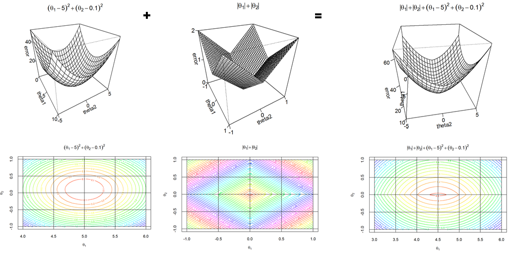
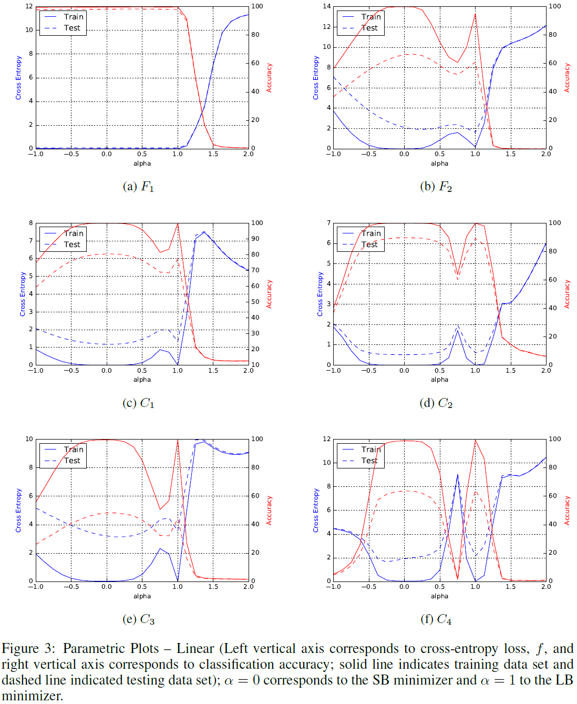



Regularization methods, here, will mean any kind of methods that aims to improve the generalization performance, even though, it increases the accuracy on the training error.

Regularization works as trading increased bias for reduced variance, and a good regularizer is one that makes a profitable trade that is reduces variance significantly, while increases bias moderately.

"In his story “Funes the Memorious,” Jorge Luis Borges tells of meeting a youth with perfect memory. This might at first seem like a great fortune, but it is in fact an awful curse. Funes can remember the exact shape of the clouds in the sky at an arbitrary time in the past, but he has
trouble understanding that a dog seen from the side at 3:14 p.m. is the same dog seen from the front at 3:15 p.m. His own face in the mirror surprises him every time he sees it. Funes can’t generalize; to him, two things are the same only if they look the same down to every last detail. An unrestricted rule learner is like Funes and is equally unable to function. Learning is forgetting the details as much as it is remembering the important parts. Computers are the ultimate idiot savants: they can remember everything with no trouble at all, but that’s not what we want them to do.
The problem is not limited to memorizing instances wholesale. Whenever a learner finds a pattern in the data that is not actually true in the real world, we say that it has overfit the data. Overfitting is the central problem in machine learning. More papers have been written
about it than about any other topic. Every powerful learner, whether symbolist, connectionist, or any other, has to worry about hallucinating patterns. The only safe way to avoid it is to severely restrict what the learner can learn, for example by requiring that it be a short conjunctive concept. Unfortunately, that throws out the baby with the bathwater, leaving the learner unable to see most of the true patterns that are visible in the data. Thus a good learner is forever walking the narrow path between blindness and hallucination. Humans are not immune to overfitting, either. You could even say that it’s the root cause of a lot of our evils. Consider the little white girl who, upon seeing a Latina baby at the mall, blurted out “Look, Mom, a baby maid!” (True event.) It’s not that she’s a natural-born bigot. Rather, she overgeneralized from the few Latina maids she has seen in her short life. The world is full of Latinas with other occupations, but she hasn’t met them yet. Our beliefs are based on our experience, which gives us a very incomplete picture of the world, and it’s easy to jump to false conclusions. Being smart and knowledgeable doesn’t immunize you against overfitting, either. Aristotle overfit when he said that it takes a force to keep an object moving. Galileo’s genius was to intuit that undisturbed objects keep moving without having visited outer space to witness it firsthand. 
The Bible Code, a 1998 bestseller, claimed that the Bible contains predictions of future events that you can find by skipping letters at regular intervals and assembling words from the letters you land on. Unfortunately, there are so many ways to do this that you’re guaranteed to find “predictions” in any sufficiently long text. Skeptics replied by finding them in Moby Dick and Supreme Court rulings, along with mentions of Roswell and UFOs in Genesis. John von Neumann, one of the founding fathers of computer science, famously said that “with four parameters I can fit an elephant, and with five I can make him wiggle his trunk.” Today we routinely learn models with millions of parameters, enough to give each elephant in the world his own distinctive wiggle. It’s even been said that data mining means “torturing the data until it confesses.” " [ref: P. Domingo: The Master Algorithm]

#### Bias-Variance trade-off control

Let's consider the following regularized learning.
\\[\Theta = argmin_{\Theta \in G}\\{L_{\Theta}(X,Y) + \lambda R(\Theta)\\}\\]

In the optimization of the cost function (above) the regularization part can be used to control the variance (in the model selection). Loosely speaking, if \\(\lambda\\) is zero or small, then the optimizer tries to achive a small error on fitting the model to the current data. If \\(\lambda\\) is big then the optimizer tries to find small parameter values of \\(\Theta\\) for the model and it will consider the model fitting less. Thus, if the parameter values are supressed then it will reduce the variance in the model selection.

#### Example for over and underfit: 
Revisit linear regression and generate more features \\(x,x^{2},x^{3},x^{4},...,x^{n},x_{1}x_{2}, x_{2}x_{3},...,x_{n-1}x_{n},...\\)

\\[J_{1}(\Theta\mid D) = \frac{1}{m}\sum_{i=1}^{m}\Bigg(Y_{i} - \bigg(\sum_{j=1}^{n}x_{i,j}\theta_{j} + \theta_{0}\bigg)\Bigg)^{2} + \frac{\lambda}{2n}\sum_{j=1}^{n} \theta_{j}^{2}\\]

Then the model is a polynomial function of degree \\(n\\). If the regularization parameter low, close to zero, or zero, then the coefficient of the variables can be high. The higher the coefficient the "curlier" the polynomial function. Figure below shows an example.

However, if the regularization parameter is high, then it will suppress the coefficients. The lower the coefficients are the "flatter" the polynomial function is. Figure shows an example.

An optimal choice of the regularization parameter \\(\lambda\\) might give a reasonably "curvy" model. 

Note that, this parameter penalty regularization does not control the degree of a polynomial model nor the complexity of the model. It only can suppress the value of the coefficients in the model. In generally speaking, smaller the coefficients the "flatter" the model.

If the coefficients are suppressed then the models \\(\theta_{i}\\) (represented by red dots) and the mean of \\(\Theta\\) (blue square in the figure below) is shifted toward zero, hence the bias is increased but the variance of \\(\Theta\\) is reduced.

When overfitting occurs: reduce the number of the parameters of the model. Increase the data if you can.
When underfitting occurs: increase the number of the parameters of the model.

#### Regularization of k-Nearest Neighbors (kNNs).
Consider an k-NN model shown below, where the black dashed line represents the true (usually unknown) model. 

k = 1: overfitting:

k = 100, underfitting:

k = 29 would give a well regularized model.

Figures taken from: 
Source: [http://scott.fortmann-roe.com/docs/BiasVariance.html](http://scott.fortmann-roe.com/docs/BiasVariance.html)

#### Regularization for Decision Trees (DTs)

Decision trees are also prone to overfitting. DTs are actually capable of learning all data examples in the training data (especially in the case of wide data). If the decision tree is too deep then the decision boundary it represents can become too non-linear. 

**Figure:** Decision tree for regression.

Tree pruning methods are used to decrease the complexity (the size) of the tree. 
These methods cut the branches of the decision tree and replace a branch with a leave node, where the label of the new leaf is chosen by the majority of the corresponding samples.

#### Parameter norm penalty

The training of the parameters \\(\theta\\) of a model is done via optimizing a cost functions (also called learning objective):
\\[J(\theta;D) = \frac{1}{m}\sum_{i}L_{\theta}(x_{i},y_{i}) + \lambda\Omega(\theta)\\]

where \\(L(.)\\) is a cost function, \\(\Omega\\) is a regularization function on model parameters, \\(\lambda\\) the trade-off parameter between cost and regularization.

The objective function for linear regression with \\(l_{2}\\) regularization (reminder):

The objective function for linear regression with \\(l_{1}\\) regularization becomes: 

#### \\(l_{2}\\) norm

One of the most commonly used regularization is the \\(l_{2}\\) norm, also called as ridge regression or Tikhonov regularization, and it is defined as: \\(\Omega(\theta) = \frac{1}{2}\theta^{T}\theta = \frac{1}{2}\lVert \theta \rVert_{2}^{2}\\)

This gives us the learning objective:
\\[J(\theta;D) = \sum_{i}L_{\theta}(x_{i},y_{i}) + \frac{\lambda}{2}\theta^{T}\theta\\]

The corresponding gradient and the update can be written as:
\\[\nabla_{\theta}J(\theta;D) = \sum_{i}\nabla_{\theta}L_{\theta}(x_{i}, y_{i}) + \lambda\theta\\]

The update rule:
\\[\theta^{(l+1)} = \theta^{(l)} - \epsilon(\lambda\theta^{(l)} + \sum_{i}\nabla_{\theta}L_{\theta}(x_{i}, y_{i}))\\]
That is:
\\[\theta^{(l+1)} = (1 -\epsilon\lambda)\theta^{(l)} - \epsilon(\sum_{i}\nabla_{\theta}L_{\theta}(x_{i}, y_{i}))\\]

This shows that during the training the parameter term exponentially decays. (cf. Momentum methods).
Let us approximate the learning objective function via quadratic function via Taylor series at its minimum location \\(\theta^{\ast}(\theta^{\ast} = argmin_{\theta}\\{\sum L_{\theta}(x_{i}, y_{i})\\})\\). Then:
\\[J(\theta) = J(\theta^{\ast}) + \frac{1}{2}(\theta - \theta^{\ast})^{T} H(\theta - \theta^{\ast}) + \alpha\frac{1}{2}\theta^{T}\theta \\]
where \\(H\\) is the hessian matrix of \\(J\\) w.r.t. \\(\theta\\) at \\(\theta^{\ast}\\). There is no first order term, because this is defined at the minimum location where gradients (the first order term) vanish.
Moreover, because \\(\theta^{\ast}\\) is the local minimum, therefore the Hessian is positive semidefinite.

If we set the derivatives of the new function to zero and solve it:
\\[\nabla_{\theta}J(\theta) = \frac{1}{2}\nabla_{\theta}(\theta - \theta^{\ast})^{T} H(\theta - \theta^{\ast}) + \alpha\frac{1}{2}\nabla_{\theta}(\theta^{T}\theta) = 0\\]

Then we get the following forms
\\[\alpha\theta + H(\theta - \theta^{\ast}) = 0\\]
\\[(H = \alpha I)\theta = H\theta^{\ast}\\]
\\[\theta = (H + \alpha I)^{-1}H\theta^{\ast}\\]

Let \\(\theta'\\) denote the solution of the equation above. Then \\(\theta' = (H + \alpha I)^{-1}H\theta^{\ast}\\)
As \\(\lambda \rightarrow 0\\) then \\(\theta' \rightarrow \theta^{\ast}\\).
Because \\(H\\) is real, symmetric, we can decompose it as \\(H = Q\Lambda Q^{T}\\), where \\(Q\\) is matrix formed from  orthonormal basis of eighenvectors, and \\(\Lambda\\) is a diagonal matrix containing the eigenvalues. Using this decomposition it gives us the following form:
\\[\theta' = (Q\Lambda Q^{T} + \alpha  I)^{-1}Q\Lambda Q^{T}\theta^{\ast}\\]
\\[\theta' = (Q(\Lambda + \alpha I)Q^{T})^{-1}Q\Lambda Q^{T}\theta^{\ast}\\]
\\[\theta' = Q(\Lambda + \alpha I)^{-1}\Lambda Q^{T}\theta^{\ast}\\]

This means that the regularization parameter \\(\alpha\\) rescales \\(\theta^{\ast}\\) along the axes defined by the eighenvectors of \\(H\\). In a direction where the corresponding eigenvalue is small, a step in that direction does not reduce the cost function "greatly". Specifically, components are rescaled by a factor of \\(\frac{\lambda_{i}}{\lambda_{i} + \alpha}\\). When \\(\lambda_{i} \gg \alpha\\), then the effect of the regularization is small. When \\(\lambda_{i} \ll \alpha\\), then it will be shifted toward zero by a larger magnitude. Note that, if a component of \\(\theta^{\ast}\\) is nonzero, then the corresponding component of the optimal value remains nonzero.

#### \\(l_{1}\\) norm:

This type of regularization is defined as \\(\Omega(\theta) = \lVert\theta\rVert_{1} = \sum_{i}\mid\theta_{i}\mid\\). Doing the similar calculations with the learning objective function we get:

This gives us the learning objective:
\\[J(\theta ; D) = \sum_{i} L_{\theta}(x_{i}, y_{i}) + \lambda\lVert\theta\rVert_{1}\\]

The corresponding gradient and the update can be written as:
\\[\nabla_{\theta}J(\theta ; D) = \sum_{i}\nabla_{\theta}L_{\theta}(x_{i}, y_{i}) + \lambda\sum_{i} sign(\theta_{i})\\]
where sign(.) is applied element-wise.

This formulation does not give us clean analytical formulas. In order to proceed further, in the subsequent part, we will assume that the Hessian matrix is diagonal. That is: \\(H = diag([H_{1,1}, H_{2,2}, ..., H_{n,n}])\\). This might be not a strict assumption, as such Hessian matrix can be achieved by using PCA filtering beforehand.

The learning objective can be approximated by its Taylor series as before and we get
\\[J(\theta) = J(\theta^{\ast}) + \frac{1}{2}(\theta - \theta^{\ast})^{T}H(\theta - \theta^{\ast}) + \alpha\frac{1}{2}\lVert\theta\rVert_{1}\\]

Because we assumed that the Hessian \\(H\\) is diagonal, it can be rewritten in the following form:
\\[J(\theta) = J(\theta^{\ast}) + \sum_{i}[\frac{1}{2}H_{i,i}(\theta_{i} - \theta_{i}^{\ast})^{2} + \alpha|\theta_{i}|]\\]

The minimization of this function can be done analytically:
\\[\theta_{i}' = sign(\theta_{i}^{\ast}) max\\{\mid\theta_{i}^{\ast}\mid - \frac{\alpha}{H_{i,i}}, 0\\}\\]

Let's consider a situation when \\(\theta_{i}^{\ast}\\) is positive.
1. \\(\theta_{i}^{\ast} \leq \frac{\alpha}{H_{i,i}} \\) : then the optimal value is simply set to zero: \\(\theta_{i}' = 0\\).
2.  \\(\theta_{i}^{\ast} > \frac{\alpha}{H_{i,i}} \\) : The optimal value \\(\theta_{i}'\\) does not move to zero, but it just shits \\(\theta_{i}'\\) by \\(\frac{\alpha}{H_{i,i}}\\) towards zero.

Similar arguments can be done for negative \\(\theta_{i}^{\ast}\\).

One of the good thing in this regularization is that if \\(\theta_{i}^{\ast}\\) is zero, then the optimal value \\(\theta_{i}'\\) remains zero; and if \\(\theta_{i}^{\ast}\\) is nonzero, then the optimal value \\(\theta_{i}'\\) can become zero for \\(\alpha\\) large enough and the corresponding feature may safely be removed. This property can lead to sparse representation and thus \\(l_{1}\\) norm can be used for feature selection.

#### Early-stopping:

When one monitors the learning curves while training a model; it can be seen the training error is decreasing while the error on the validation set is increasing. Let's name it, this is the case of overfitting. Therefore, stopping the training when it reaches the lowest validation error and before the algorithm reaches the local minima; hopefully this can give a better generalization error on the test set. This is called early-stopping.

Training usually starts with random initialization of the parameters \\(\theta^{(0)}\\) with very small but random numbers around zero. Thus, during the training, the parameter point \\(\theta^{(l)}\\) starts wandering from zero to one of the local minima. Early stopping terminates this walk before it could reach the local minimum. Therefore, early stopping does not let the parameter values grow, they will have smaller values than at the local minimum. Regularization introduces a penalty on the value of the parameters, and smaller parameter values are preferred. Early stopping introduces a shift  from the local minimum towards zero. Loosley speaking this shift is the bias. Therefore, since early stopping has the same effect, it can be considered as a regularizer.

Now we will show that how early stopping is related to \\(l_{2}\\) normalization.
Let \\(\tau\\) be the hyper-parameter when the optimization procedure stopped after \\(\tau\\)  iteration. Let \\(\theta^{(0)}\\) be the starting point around zero; that is \\(\theta^{(0)} \approx 0\\). Let \\(J(\theta) = J(\theta^{\ast}) + \frac{1}{2}(\theta - \theta^{\ast})^{T}H(\theta - \theta^{\ast})\\) be the cost function and \\(\nabla_{\theta}J(\theta) = H(\theta - \theta^{\ast})\\) be the gradient, where \\(H\\) is the Hessian at \\(\theta^{\ast}\\).
\\[\theta^{(\tau)} = \theta^{(\tau - 1)} - \epsilon\nabla_{\theta}J(\theta^{(\tau - 1)})\\]
\\[\theta^{(\tau)} = \theta^{(\tau - 1)} - \epsilon H(\theta^{(\tau - 1)} - \theta^{\ast})\\]
\\[\theta^{(\tau)} - \theta^{\ast} = ( I - \epsilon H)(\theta^{(\tau - 1)} - \theta^{\ast})\\]

If we decompose Hessian matrix \\(H\\) as \\(H = Q\Lambda Q^{T}\\)
\\[\theta^{(\tau)} - \theta^{\ast} = (I - \epsilon Q\Lambda Q^{T})(\theta^{(\tau - 1)} - \theta^{\ast})\\]
\\[Q^{T}(\theta^{(\tau)} - \theta^{\ast}) = (I - \epsilon\Lambda)Q^{T}(\theta^{(\tau - 1)} - \theta^{\ast}) \\]

Assuming \\(\theta^{(0)} = 0\\) and \\(\epsilon\\) is small enough to guarantee that \\(\mid 1 - \epsilon\lambda_{i}\mid < 1\\) then \\(Q^{T} = (\theta^{(\tau)} - \theta^{\ast}) = (I - \epsilon\Lambda)(I - \epsilon\Lambda)(I - \epsilon\Lambda)...(I - \epsilon\Lambda)Q^{T}(\theta^{(0)} - \theta^{\ast})\\)

\\[Q^{T}\theta^{(\tau)} - Q^{T}\theta^{\ast} = (I - \epsilon\Lambda)^{\tau}Q^{T}(-\theta^{\ast})\\]
\\[Q^{T}\theta^{(\tau)} - Q^{T}\theta^{\ast} - (I - \epsilon\Lambda)^{\tau}Q^{T}\theta^{\ast}\\]
\\[Q^{T}\theta^{(\tau)} = [I - (I - \epsilon\Lambda)^{\tau}]Q^{T}\theta^{\tau} \text{ (1)}\\] 

Now, recall that from \\(l_{2}\\) normalization we have:
\\[\theta' = Q(\Lambda + \alpha I)^{-1}\Lambda Q^{T}\theta^{\ast}\\]
\\[Q^{T}\theta' = (\Lambda + \alpha I)^{-1}\Lambda Q^{T}\theta^{\ast}\\]
\\[Q^{T}\theta' = [I - (\Lambda + \alpha I)^{-1}\alpha]Q^{T}\theta^{\ast}\\ \text{ (2)}\\]

When we compare the two equation (1) and (2) we see if the hyperparameters \\(\epsilon, \alpha, \tau\\) are chosen such that
\\[(I - \epsilon\Lambda)^{\tau} = (\Lambda + \alpha I)^{-1}\alpha\\]
Then \\(l_{2}\\) regularization and early stopping can be seen to be equivalent. Going further, by taking logarithms and using the series of expansion for \\(\log(1+x)\\), we can conclude that if all \\(\lambda_{i}\\) are small then
\\[\tau \approx \frac{1}{\epsilon\alpha}\\]
\\[\alpha \approx \frac{1}{\tau\epsilon}\\]

However, when one monitors the learning curve and terminates the optimizer when validation increases to prevent overfitting, potentially one can get a good generalization error. However using \\(l_{2}\\) regularization one does not have this visual feedback and needs to adjust the trade-off parameter blindly several times in order to choose the most appropriate \\(\alpha\\).

#### Dataset augmentation

Training of a model needs lots of data. It is a thumb rule that for an \\(n\\)-dimensional data one should be provided \\(2^{n}\\) data. The optimal number of training examples also depends on the number of the model parameters as well.
When enough data is not available, often more data are generated. There are two approach for this:

1. For any \\((x,y) \in D\\), one can generate a new data \\((\widetilde{x}, y)\\) with linear transformation and add it to the traning dataset. This can be easily done for image classification, when images can be shifted by some pixels or rotated a bit. However, this should be carried out carefully as not to transform one example to another class. For instance, the digit '6' can be transformed to '9' with 180 degree rotation or 'b' could be transformed to 'd' with vertical flipping.
2. For any \\((x,y) \in D\\), one can generate \\((\widetilde{x}, y)\\) via adding some noise: \\(\widetilde{x} + N(0, \eta I)\\). This technique increases the robustness of neural networks as practice shows.

In some cases it is difficult or impossible to generate new data. For instance, it is difficult to generate data for density estimation problems without first solving the density estimation problem.

Dataset augmentation needs to be handled carefully during benchmarking different  learning algorithms. Let's suppose, one trains an algorithm A on a dataset, and an algorithm B using dataset augmentation. Then during evaluation it should be considered that, B might yield improved performance due to dataset augmentation, and not because it is better. 
Many learning algorithm includes some noise addition to the input implicitly or explicitly. However, when the dataset augmentation is domain specific then it is often considered as pre-processing.

Noise can be added not only to input but to hidden units, latent variables, weight matrices, or output targets as well.

1. Injecting noise to the hidden nodes can be considered as dataset augmentation at multiple levels of abstraction.
2. Injecting noise to weights can be considered as a regularizer.
Let's consider a regression problem modeled with a multi-layer neural network. 
\\[J = \frac{1}{m}\sum_{i}(f(x_{i}) - y_{i})^{2}\\]
Let \\(f_{\epsilon}\\) be the neural network in which the weights are perturbed with a noise \\(W_{\epsilon} = W + N(0, \eta I)\\)
The learning objective can be written as:
\\[J_{\epsilon} = \frac{1}{m}\sum_{i}(f_{\epsilon}(x_{i}) - y_{i})^{2} = \frac{1}{m}\sum_{i}f_{\epsilon}^{2}(x_{i}) - y_{i}^{2} + 2f_{\epsilon}(x_{i})y_{i}\\]
This will lead to an extra term in the learning objective \\(\frac{\eta}{m}||\nabla_{\theta}f_{\epsilon}(x)||^{2}\\). This regularization will get the optimizer find solution surrounded with flat region.
3. Injecting noise to output targets: Instead of using hard coded class labels like 0 and 1 one can introduce a little noise ϵ on them. This would give as more relaxed class labels as \\(\epsilon\\) and \\(1 - \epsilon\\), respectively and they can plugged in the cross-entropy loss as
\\[c_{\Theta}(x_{i},y_{i}) = -(y_{i} - \epsilon)\log(h_{\Theta}(x_{i})) - (1 - y_{i} + \epsilon) \log(1 - h_{\Theta}(x_{i}))\\]

#### Parameter sharing and tying

For this we have seen examples already, for example in the case of GMMs, when the covariance matrices can be restricted to be i) diagonal, ii)spherical), iii) or all Gaussian components have the same covariance matrices. Other examples are first-order hidden Markov model, or  first-order Markov chains. On the lecture we discussed first order HMMs might be not adequate for speech recognition, but using first-order methods keeps the number of parameters and the whole model tractable. Other example of this kind technique is the convolution layers in neural networks.
Other type of parameter sharing and tying can be applied in multi-task learning. For more details see section 7.7.

#### Dropout

The motivation of dropout method is to prevent co-adaptation of units in neural networks and it is thought to ensure that different units learn different weights.
Dropout is a method used during the training such that, between every parameter update cycle around ~50% of the units are locked and the rest of them participate in the training. Let's recall the forward propagation step:
\\[A_{i} = g(\Theta^{(i)})A_{i-1}\\]
where \\(A_{i-1}\\) is the output from the previous layer, \\(\Theta_{i}\\) the parameter matrix at layer \\(i\\), and \\(g(.)\\) is the activation function (such as sigmoid) applied component-wise, and \\(A_{0} = x\\) is the input data.

In the case of dropout method, a binary mask vector is used to indicate which units participate in the training and which ones are held out. Let \\(r^{(i)}\\) be a binary vector of size \\(1 \times n\\) for layer \\(i\\), where \\(n\\) indicates the number of units in the layer \\(i\\). Now the forward propagation becomes \\(r_{j}^{(i)} \sim Bernoulli(p)\\) is a random bit vector which indicates whether unit \\(j\\) should be active in layer \\(i\\). \\(p\\) is usually set to be 0.5. Bias unites are always present, i.e. \\(r_{0}^{(i)} = 1\\).

\\[\Theta^{'(i)} = \Theta^{(i)}[r^{(i-1)} == 1, r^{(i)} == 1]\\]

This means that keep the row \\(j\\) of \\(\Theta^{(i)}\\) if \\(r_{j}^{(i)} = 1\\) , otherwise delete it; and keep the column \\(j\\) of \\(\Theta^{(i)}\\) if \\(r_{j}^{(i-1)} = 1\\), otherwise delete it.

Finally, 
\\[A_{i}' = g(\Theta'^{(i)}A_{i-1}')\\]

In the back propagation and in the parameter update use units which were active during forward propagation. Keep parameters of locked units unchanged.

All units are used in test time.

Dropout method has been reportedly proved to be a good method to increase generalization performance in various practical methods. This technique can be used to Restricted Boltzmann machines, or auto-encoders, as well. For more details, see [1,2].

#### Generalization gap and sharp minima

In recent years, it has been observed in practical applications that stochastic gradient descent (SGD) methods using small-batches (SB) provide smaller generalization error than using large-batches (LB) for classification tasks. (Note that, for generative learning (such as RBMs or VAEs) mini-batches are also strongly recommended).

Typical sizes of mini-batches: 32,64,…, 512
The theoretical properties of mini-batches are: 
1. Convergence to global optimum for convex functions,
2. Convergence to local optimum for non-convex functions,
3. Saddle-point avoidance,
4. Robustness to input data

The reasons of that LB provides worse generalization error are the following:
1. LB methods lack the explorative properties of SB methods and tend to zoom-In on the closest global minimum.
2. SB and LB methods converges to different local minima with different generalization properties.

It is said that LB methods converge to sharp minimum, while SB methods tend to converge to flat minimum.

The concept of sharp and flat minima are defined in terms of the \\(\\nabla^{2}f(x)\\).
Experiments. The following architectures and data were used in a research study [3]:

And the overall results obtained with SB (256 data) and LB (10% of the total data):

Error surface characterization. The local minima obtained with LB and SB are denoted by \\(x_{l}^{\ast}\\) and \\(x_{s}^{\ast}\\). respectively. Then the loss function were plotted along the line-segment containing these two local minina. Secifically, for \\(\alpha = [-1,2]\\), the loss function \\(f(\alpha x_{l}^{\ast} + (1 - \alpha)x_{s}^{\ast})\\) were plotted below. The plots show that local minima found by SB is stringkingly flatter than the local minima found by LB.

#### Batch normalization

In the training of a deep neural network, a little change in the weights at the lower levels might end up in a large change in the higher levels. The training of a deep neural network is hindered by the fact that inputs to each layer is affected by all preceding layers. That is, at the fist layer the data has a certain fixed distribution, but changing the parameters by backpropagation the distribution of the feature data (activations) changes and the learner has to compensate and modify the weights so that the higher layers can adapt to the new feature distribution.

Batch normalization aims to mitigate this problem introducing a layer-wise normalization in which the mini-batch of the data is normalized and centralized at every hidden layers.
Let \\(MB = \\{h_{1}, h_{2},...,h_{n}\\}\\) be the mini-batch data at level \\(k\\). For first layer \\((k = 0)\\), this data is equivalent to the input raw data \\(h_{i} = x_{i}\\), while at higher layers this data is obtained by transforming the original data through the preceding layer's \\((l = 1, ..., k)\\) transformation and activation.

The mini-batch normalization is defined by:
\\[\mu_{B} := \frac{1}{m}\sum h_{i}\\]
\\[\sigma_{B}^{2} := \frac{1}{m}\sum(h_{i} - \mu_{B})^{2}\\]
\\[\widehat{h_{i}} := \frac{(h_{i} - \mu_{b})}{\sqrt{\sigma_{B}^{2} + \epsilon}}\\]
\\[\overline{h_{i}} := \gamma\widehat{h_{i}} + \beta \\]

where \\(\epsilon\\) is used only for numerical stability. After the normalization the training proceeds with \\(\\{\widehat{h_{i}}\\}\\). That is at every layer with every mini-batch, the data is centralized and normalized, then scaled. Here the assumption is that the mini-batch more-or-less well approximates the whole data distribution, or equivalently, the gradients obtained on the mini-batch data is a good approximation of the true gradients that we would get on a large batch.
The question remains if this transformation is differentiable when it is applied in the forward propagation at every layer? The answer is yes, and more importantly, the scaling parameters \\(\gamma, \beta\\) can be learned as well:

For a given loss function \\(l\\):
\\[ \frac{\partial l}{\partial\widehat{h_{i}}} = \frac{\partial l}{\partial \overline{h_{i}}} \cdot \gamma \\]

\\[ \frac{\partial l}{\partial \sigma_{B}^{2}} = \sum\frac{\partial l}{\partial\widehat{h_{i}}} \cdot (h_{i} - \mu_{B}) \cdot \frac{-1}{2}(\sigma_{B}^{2} + \epsilon)^{-\frac{3}{2}} \\]

\\[ \frac{\partial l}{\partial \mu_{B}} = ( \frac{-1}{\sqrt{\sigma_{B}^{2}+ \epsilon} } \sum \frac{\partial l}{\partial\widehat{h_{i}}}) + \frac{\partial l}{\partial\sigma_{B}^{2}} \cdot \frac{\sum_{i} - 2(h_{i} - \mu_{B})}{m} \\]

\\[ \frac{\partial l}{\partial h_{i}} = \frac{\partial l}{\partial\widehat{h_{i}}} \cdot \frac{1}{\sqrt{\sigma_{B}^{2} + \epsilon}} \frac{\partial l}{\partial\sigma_{B}^{2}} \\]

\\[\frac{\partial l}{\partial \mu_{B}} = (\frac{-1}{\sqrt{\sigma_{B}^{2}+\epsilon}}\sum \frac{\partial l}{\partial\widehat{h_{i}}}) + \frac{\partial l}{\partial\sigma_{B}^{2}} \cdot \frac{-2(h_{i} - \mu_{B})}{m} + \frac{1}{m} \frac{\partial l}{m \partial\mu_{B}} \\]

\\[\frac{\partial l}{\partial\gamma} = \sum_{i}\frac{\partial l}{\partial \overline{h_{i}}} \cdot \widehat{h_{i}}\\]

\\[\frac{\partial l}{\partial\beta} = \sum_{i}\frac{\partial l}{\partial \overline{h_{i}}}\\]

The scaling and the fact its parameters are learnable is important here. If the batch normalization would rather harm the optimization of the loss then the setting \\(\gamma \sqrt{Var[h_{i}]}\\) and \\(\beta = E[h_{i}]\\) would recover the original data if that were the optimal thing to do.

How would you calculate the normalization parameters for inference (test phase)?
In the inference part the normalization parameters are the averages of the normalization parameters of each mini-batches.

\\[E[x] = E[\mu_{B}]\\]

\\[Var[x] = \frac{m}{m - 1}E[\sigma_{B}^{2}]\\]

\\[\overline{h} := \frac{\gamma}{\sqrt{Var[x] + \epsilon}}h + (\beta - \frac{\gamma E[X]}{Var[x] + \epsilon}) \\]

[ref: Ioffe, Szegedy. Batch Normalization: Accelerating Deep Network Training by Reducing Internal Covariate Shift, 2015]

#### Exploding and vanishing gradients 

Later with RNNs.

…

Flat region as minima:
[https://towardsdatascience.com/recent-advances-for-a-better-understanding-of-deep-learning-part-i-5ce34d1cc914
](https://towardsdatascience.com/recent-advances-for-a-better-understanding-of-deep-learning-part-i-5ce34d1cc914)

#### References:
1. [http://arxiv.org/pdf/1207.0580v1.pdf](http://arxiv.org/pdf/1207.0580v1.pdf)
2. [https://www.cs.toronto.edu/~hinton/absps/JMLRdropout.pdf](https://www.cs.toronto.edu/~hinton/absps/JMLRdropout.pdf)
3. [http://www.deeplearningbook.org/contents/regularization.html](http://www.deeplearningbook.org/contents/regularization.html)
4. On Large-batch training: [https://arxiv.org/pdf/1609.04836.pdf](https://arxiv.org/pdf/1609.04836.pdf)