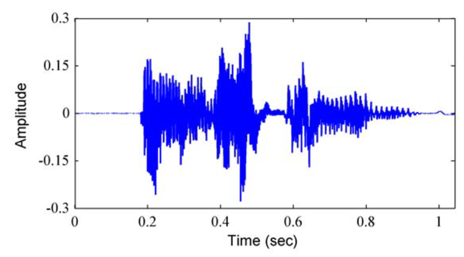
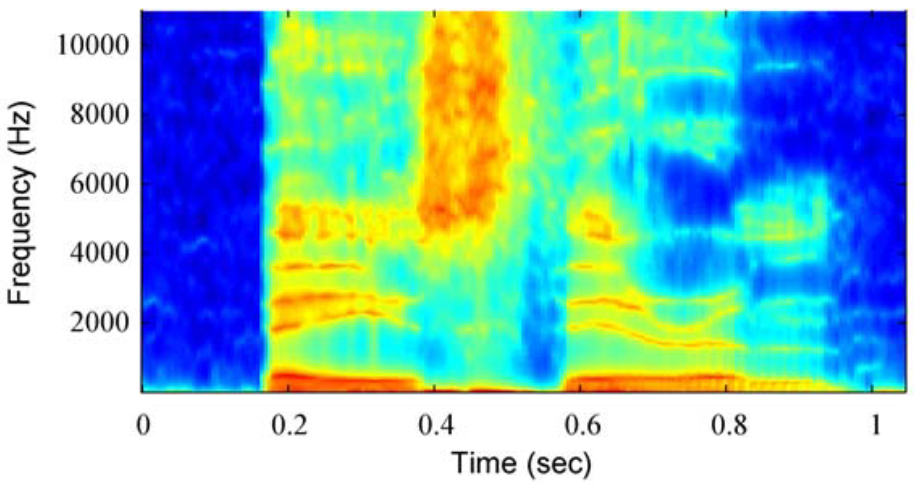
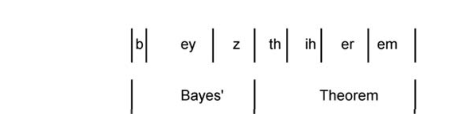



In the previous lectures when we discussed the data, we, did not say, but we strongly assumed that every data instance was sampled independently. This means that a picture of a cat \\(x_{i}\\) was totally independent  of a picture of a cat \\(x_{i+1}\\), and if you shuffled your dataset, then it would not affect your method.

In this lecture we will discuss methods for sequential data. In this type of data, we strongly assume that there is a very strong correlation between two subsequent data. In this case, we assume that either data \\(x_{i}\\) and \\(x_{i+1}\\) are very similar to each other, or they have a strong relationhips in some sense and the entropy of \\(P(x_{i+1}\mid x_{i},..,x_{i-k})\\) is high (written text). Shuffling this data would mostly damage all the information in this data.

For the first type of data you can consider a video stream, in which the subsequent image frames are very similar to each other, it hardly changes. You may also consider a speech data at high frequency in which the speech audio frames are also very similar.

#### 1. Speech data

**Figure.** Raw speech wave data.

**Figure.** Preprocessed speech data.

**Figure.** Segmentation of speech data. 

Some sequential data have time meaning and it make sense to add time stamps to each data frames and consider this data as recorded through time. This type of data called temporal data. Therefore, the frames of this type of data often indexed by time \\(t\\).
Some other sequential data does not have this time interpretation, for instance, a hand-written text on the picture, biological sequences (DNA, Proteins, etc), or a series of objects on a single picture used for image captioning. 

• Text sequences can be used with sequential models, but first sequences need to be transformed to a numerical representation. One simply method is one-hot-encoding, more sophisticated methods include Word2Vec models. These words can be fed to neural networks, etc.
[https://medium.com/@athif.shaffy/one-hot-encoding-of-text-b69124bef0a7](https://medium.com/@athif.shaffy/one-hot-encoding-of-text-b69124bef0a7)