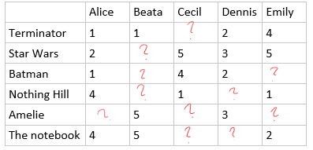
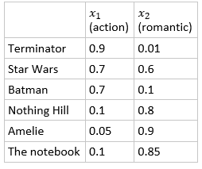


Content based recommendation systems offers new contents or products for customers based on their personal preference (in order to increase selling and revenue). It is extensively used by online retail stores such as Amazon, eBay, Netflix.

**Example:** Consider a movie rental store which has some movies rated by some users, organized in a table as follows(illustration):

The task is to recommend some new movies for the users what they might like (and increase the revenue).
First, let's introduce some feature vectors to represent the products.

So, if we include the usual constant 1 for the bias parameter then each movie can be represented by a feature vector \\(x = [1, x_{1}, x_{2}]^{T}\\), e.g.: Terminator = \\([1,0.9,0.1]^{T}\\).

The idea is that we model the rating of each user by a linear regression, that is, the rate of a user on a product is a linear combination of the features. Let's denote the number of users \\(U\\) and number of products \\(n\\) and the number of features \\(m\\). Then we want \\(\Theta_{u} = [\theta_{0},\theta_{1},...,\theta_{m}]^{T}\\) for each user \\(1 \leq u \leq U\\).

This can be learned by minimizing the following error function.
\\[J(\Theta_{u}\mid D) = \frac{1}{n}\sum_{i=1; y_{i},u \neq ?}^{n}(\Theta_{u}^{T}x_{i} - y_{i,u})^{2} + \lambda\sum_{j=1}^{m}(\theta_{u,j})^{2} \\]

The parameters \\(\Theta_{u}\\) for user \\(u\\) is independet and thus they could be learned using a single optimization:
\\[ J(\Theta_{1}, \Theta_{2}, ..., \Theta_{U}\mid D) = \sum_{u=1}^{U} \frac{1}{n} \sum_{i=0; y_{i},u \neq ?}^{n} (\Theta_{u}^{T}x_{i} - y_{i,u})^{2} + \lambda\sum_{u=1}^{U}\sum_{j=1}^{m}(\theta_{u,j})^{2}  \\]

When the parameters \\(\Theta_{u}\\) are given, the one can learn the features for the products to indentify the best parameters vector associated with a product:
\\[ J(x_{1}, x_{2}, ..., x_{n}\mid D) = \sum_{i=1}^{n} \frac{1}{U} \sum_{u=1; y_{i},u \neq ?}^{U} (\Theta_{u}^{T}x_{i} - y_{i,u})^{2} + \lambda\sum_{i=1}^{n}\sum_{j=1}^{m}(x_{i,j})^{2}  \\]

When neither \\(\Theta_{u}\\) nor \\(x_{i}\\) feature vectors are given (but only some user preference), one can randomly initialize both parameters and can exacute the two optimization back and forth and updateing the parameters after each optimization. However, the optimization can be solved simultaneiously:
\\[ J(x_{1}, x_{2}, ..., x_{n}, \Theta_{1}, \Theta_{2}, ..., \Theta_{U}\mid D) = \sum_{i=1}^{n}\sum_{u=1; y_{i},u \neq ?}^{U} (\Theta_{u}^{T}x_{i} - y_{i,u})^{2} + \lambda\sum_{i=1}^{n}\sum_{j=1}^{m}(x_{i,j})^{2} + \lambda\sum_{u=1}^{U}\sum_{j=1}^{m}(\theta_{u,j})^{2} \\]

The procedure, above, for learning product feature parameters \\(x_{i}\\) and user preference parameters \\(\Theta_{u}\\) called **collaborative filtering**. 