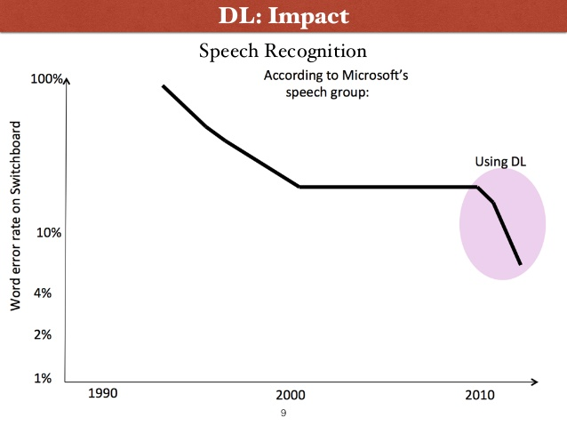
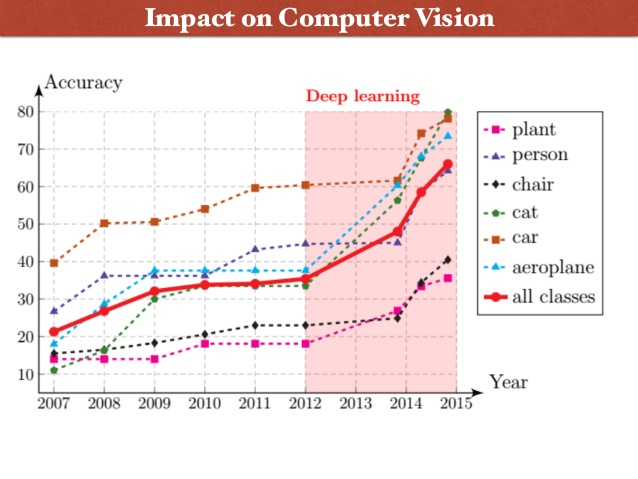
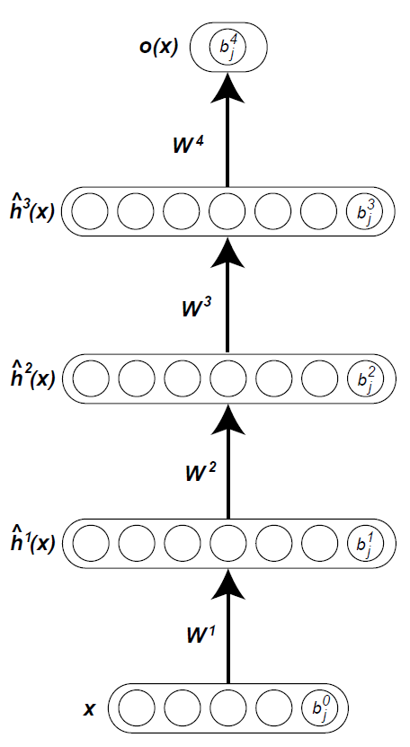
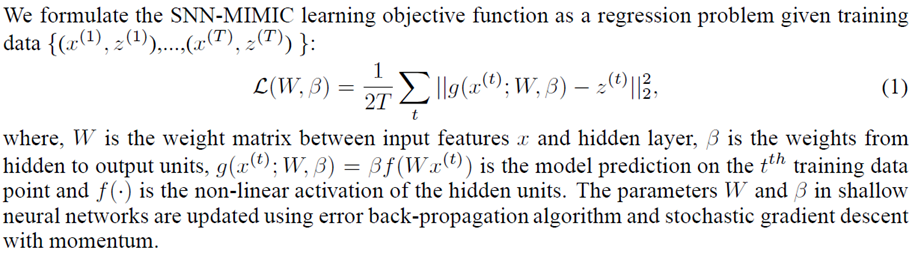
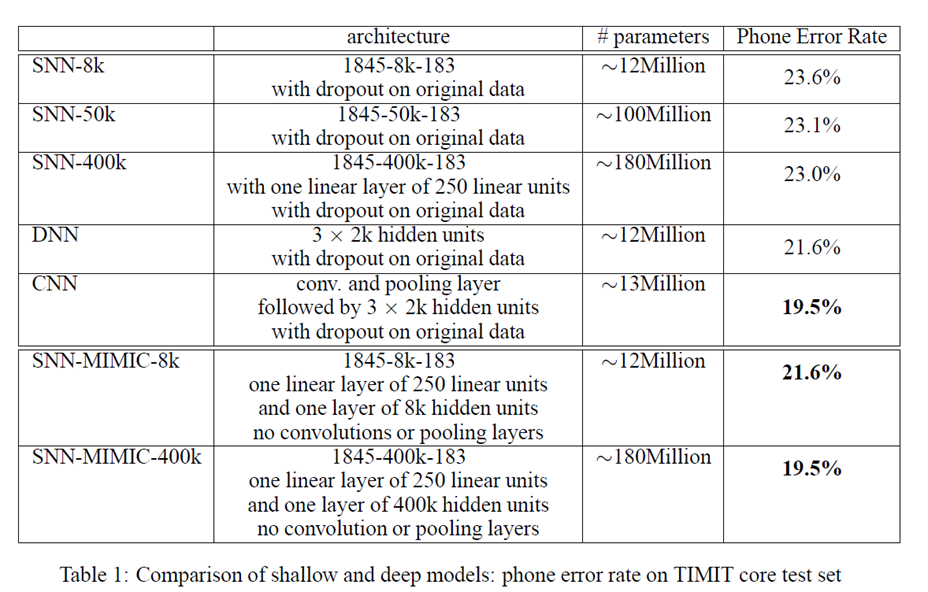
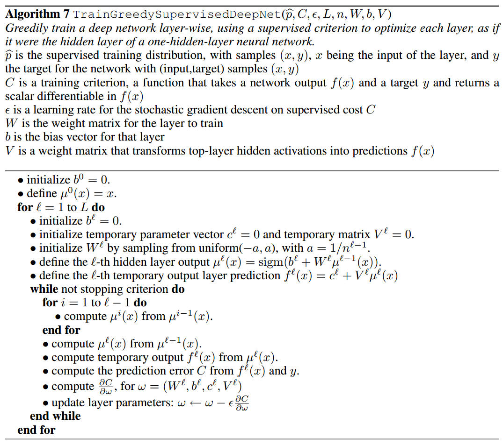
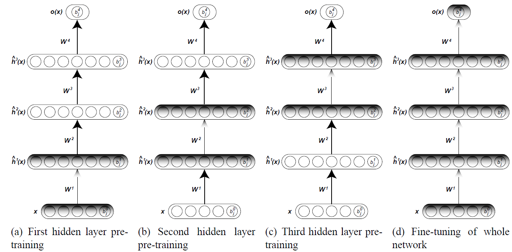
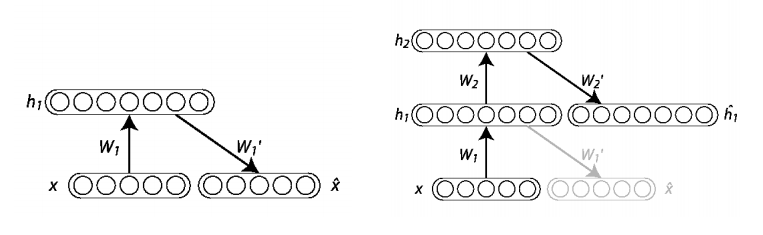



#### Motivation of deep models

Before we dive into deep learning (DL), let's step back and look at the problem from further. At the beginning of this course I emphasized the importance of that a model should be capable of fitting to data. That is, we assumed that the model can be fit to the data and machine learning is a mechanism which tries to optimize the model parameters in accordance with the given data. For instance using linear regression we assumed there is a linear relationship between the input and the target data. When we used Logistic Regression, or linear SVM, we assumed the data can be separated by a linear hyperplane. In the case of generative models we assume our data is distributed according to a Gaussian distribution (or to any other specific distribution what we think it is correct), etc. In Artificial Neural Networks, we also assume that our data were generated by several sigmoid (or linear) functions connected to each other and arranged in layers. However, real data is not generated by such models. If we are to create an image recognition program which could recognize e.g. cats on pictures, well, it is very unlikely the picture of cats were generated by an ANN. In the case of speech recognition, it is also questionable whether the speech data is generated by a HMM or by an ANN. In fact, speech data was generated by human speakers, and the sound was generated by lips, teeth, tongue, palate, larynx, and all these sounds are recorded by a microphone etc. So, what we are doing in practice is that, we create some models of very high capacity such as a multi-layer ANN with hundreds of thousands of nodes and with millions of parameters for data of thousands of dimensions.  Then we use regularization techniques in order to avoid overfitting. Finally, we hope the best, that is our model will be able to capture some information from data. 

Please read chapter 1.2.4 at [http://www.deeplearningbook.org/contents/intro.html](http://www.deeplearningbook.org/contents/intro.html) for further discussion on Deep Learning.

The performance on the classic Artificial Intelligence (AI) tasks (speech recognition and image recognition (Vision)) has been improved dramatically using Deep Learning techniques as it is shown in the next two figures:

Slides were taken from: [http://www.slideshare.net/roelofp/deep-learning-a-birdseye-view](http://www.slideshare.net/roelofp/deep-learning-a-birdseye-view)

Definition: The depth of a model is defined as by the number of level the input data is embedded to the model. For instance, in a multi-layer neural network the depth is defined as the number of the layer of weight which is \\(k\\) in the following example:
\\[h(x) = g(\Theta_{k}g(\Theta_{k-1}g(... .g(\Theta_{1}x))..) \text{ Eq. (1)}\\]
where \\(g\\) is the activation function, usually sigmoid function defined for vectors as element-wise. The breadth is defined as the number of the units at a level.

When one hears that Google bought a company called DeepMind whose products have “deep neural networks” enhanced by “deep learning,” one cannot help taking the word “deep” to mean “profound,” and thus “powerful,” “insightful,” “wise.” And yet, the meaning of “deep” in this context comes simply from the fact that these neural networks have more layers (12, say) than do older networks, which might have only two or three. But the depth does not imply that such a network is profound.

When the depth of a model is larger than 1 (k>1), we talk about **deep models**, if the depth of a model is 1 (k=1) we call it as a **shallow model**. The linear and non-linear SVMs, Logistic Regression, k-NN and single layer ANNs are shallow models.

**Figure 1.** Example of a deep network and its parameters.

##### Universal approximation theorem

The universal approximation theorem says that, loosely, every continuous function can be approximated (or represented) by a shallow neural network (with one hidden layer of units). As a consequence any continuous functions can be approximated by such a neural network. See ref [2].
Similarly, it can be shown that SVMs with dot-product, Gaussian kernel, and polynomial kernel functions are universal approximators as well [3].

So the question is that if a shallow SVM or a shallow ANN can approximate any continuous functions at arbitrary precision, why do we bother with deep Neural Networks (DNNs)?

Bengio 2007 argues that a function can be represented by a deep architecture using (sometimes) exponentially less units and weights than an architecture having one less layers of units. The study shows this hypothesis using Boolean circuits [4]. In fact, it has been shown that any Boolean function that can be represented by a two-layer circuit of logic gates, however, most Boolean function require an exponential number of logic gates (w.r.t input size) to be represented by a single-layer circuit [8]. Moreover, deep models can learn a function using much less parameters therefore they are expected to have better generalization performance. These statements are only hypotheses and yet to be proven.

In fact, Ba and Caruana  [5] have found similar observations in speech recognition tasks as well. In short, they trained Shallow Neural Networks (SNN) using 12M, 100M, 180M parameters and achieved 23.6%, 23.1%, and 23.0% error rate (resp). They have then trained a DNN using 3 hidden layers each containing 2K units and 12M parameters in total. This model has achieved a slightly better, 21.6% error rate.
They have also noticed an interesting phenomenon. A DNN can be mimicked by a SNN. This means the process when randomly generated data \\(x\\)  is passed through a trained DNN to observe an output score \\(z\\). These data pairs \\((x, z)\\) generated this way are used to train a SNN.

SNN = Shallow Neural Network; CNN=Convolutional Neural Network. 

The conclusion of the work above is that if a shallow model can approximate a larger model, then it was not representing a complex model clearly.
Question remains, why a shallow model cannot be trained on the original data as well as the mimic model? It is still not known (2015).

##### General Training of DNN

It has turned out gradient descent-based back-propagation algorithms are not suitable to train DNNs. The reason most likely is that back-propagation gets stuck in a poor local-minimum or the error gradients are cannot be propagated backward properly. However, a good model can be achieved if the weights of DNN are initialized approximately well. In practice, therefore, the main question is how can we initialize the weights well, so the standard back-propagation algorithms can be used to fine-tune the weights?

##### Greedy layer-wise supervised training

Perhaps, one of the most simplest way to train and create deep models. The procedure is the following:
1. Train a single layer neural network in a supervised manner using back-propagation and randomly initialized weights.
2. Keep the learned weights fixed and insert a new layer on the top with random initialization. 
3. Re-run the back-propagation method again in supervised manner.
4. Repeat 2-3 until the desired number of layers or performance is achieved. 

The pseudo-code in more details:

This approach although is not widely used.

##### Greedy layer-wise unsupervised training

Each layer in a multi-layer neural network can be considered as a representation of the input data obtained by a series of (often non-linear) transformation. Hence, each layer should capture useful information in the distribution of the input data from the previous layer. Exploiting this observation Hinton 2006 has proposed a method to train the parameters of the hidden layers iteratively using unsupervised learning. This pre-training provides a good initialization of the parameters which is then used by the final phase of fine-tuning the parameters with back-propagation in the usual supervised manner.
Let \\(D = \{(x_{i},y_{i}):x_{i} \in R^{d}, y_{i} \in \{-1,+1\}\}_{i=1}^{n}\\) be the training data, and \\(h_{l}\\) are the varaibles in the layer \\(l =  0, ..., L\\) and \\(W_{l}\\) are the parameters in layer \\(l\\), where \\(h_{0}\\) represents the input data. The general framework is the following:

Repeat until stopping criteria is met:
1. For \\(l = 1 \rightarrow L\\)
	1a. using an unsupervised method, train the parameters \\(W_{l}\\) between layers \\(h_{l-1}\\) and \\(h_{l}\\) using \\(h_{l-1}\\) as input and \\(h_{l}\\) as output. This layer can be considered as a restricted boltzmann machine and the parameters can be learned by e.g Contrastive Divergence. Simialrly, this layer can also be learned using the coding layer of auto-encoders.
	1b. Update the weights \\(W_{l}\\).
2. Use back-propagation (or other supervised training method) to fine-tune the parameters w.r.t to minimize the classification error on the training dataset. 

**Figure**, Illustration of greedy layer-wise training.

##### Stacked Auto-Encoders

When Auto-Encoders (AE) are used in the layer-vise unsupervised learning, we talk about Stacked Auto-Encoders or Deep Auto-Encoders. In this case the AE are used to learn a representation of the data using one of the ways we discussed in the previous lecture.
The Deep AE learns data representation iteratively. In each iteration an AE learns a more abstract (finer) representation from the previous layer.

Figure. Iterative construction of Deep Auto-Encoders.

##### References:
1. Kurt Hornik: Approximation Capabilities of Multilayer Feedforward Networks. Neural Networks, vol. 4, 1991.
2. [http://citeseerx.ist.psu.edu/viewdoc/download?doi=10.1.1.101.2647&rep=rep1&type=pdf](http://citeseerx.ist.psu.edu/viewdoc/download?doi=10.1.1.101.2647&rep=rep1&type=pdf)
3. Barbara Hammer and Kai Gersmann: A Note on the Universal Approximation Capability of Support Vector Machines, Neural Processing Letters, 2003
4. [http://www.iro.umontreal.ca/~bengioy/papers/ftml.pdf](http://www.iro.umontreal.ca/~bengioy/papers/ftml.pdf)
5. [https://papers.nips.cc/paper/5484-do-deep-nets-really-need-to-be-deep.pdf](https://papers.nips.cc/paper/5484-do-deep-nets-really-need-to-be-deep.pdf)
6. [http://neuralnetworksanddeeplearning.com/chap4.html](http://neuralnetworksanddeeplearning.com/chap4.html)
7. [http://deeplearning.cs.cmu.edu/pdfs/Cybenko.pdf](http://deeplearning.cs.cmu.edu/pdfs/Cybenko.pdf)
Ingo Wegener: The Complexity of Boolean Functions. John Wiley & Sons, 1987.