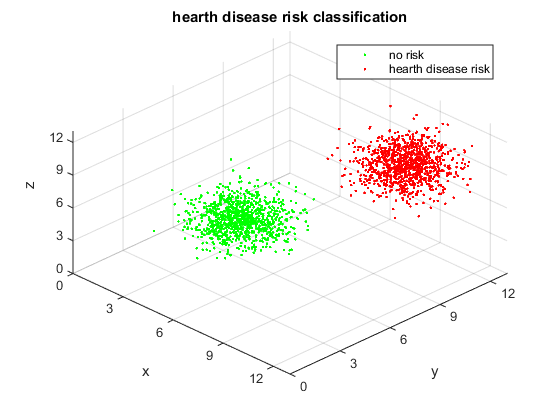
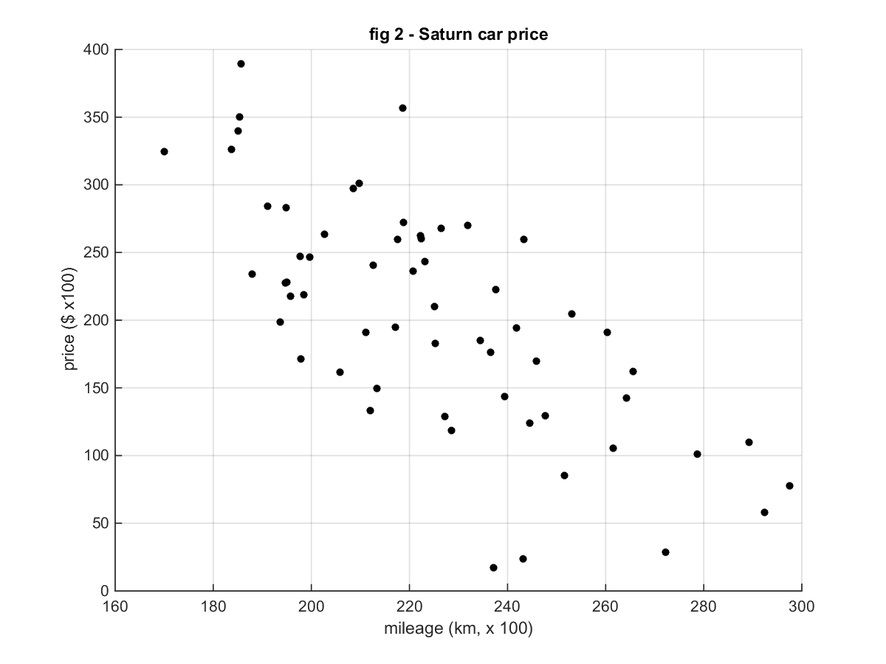
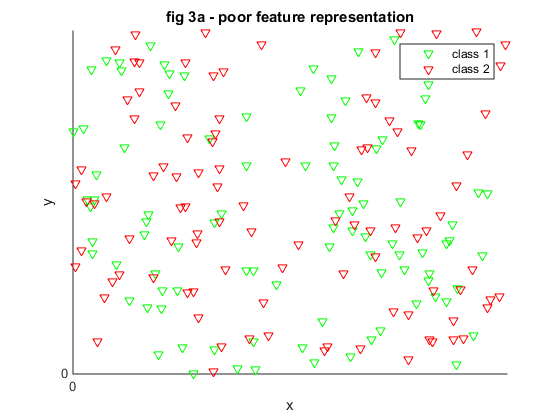
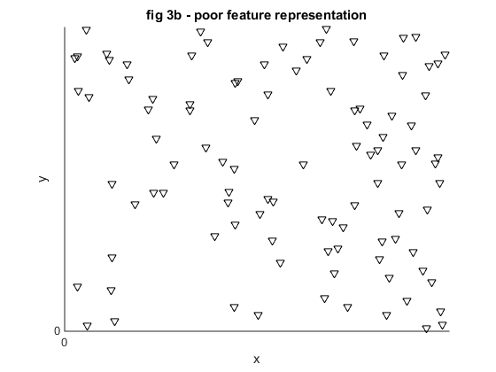
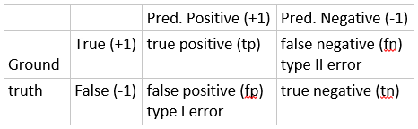
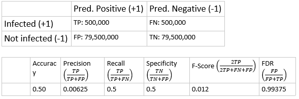
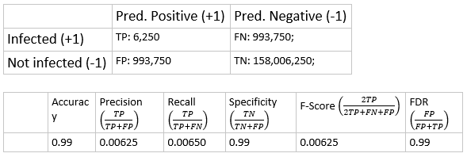
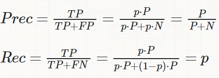
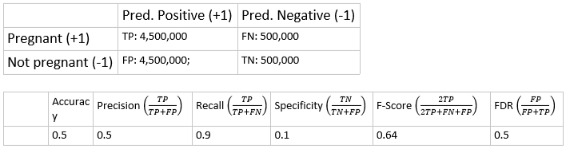
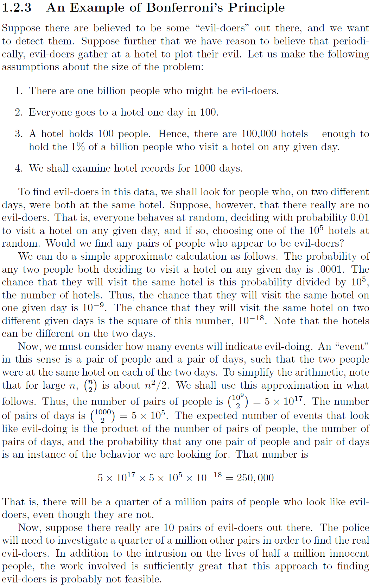



#### Definition (Machine Learning):

Machine learning is - generally speaking - about solving problem with computers where the computer algorithm is calibrated using real world data. In other words, the parameters of the computer algorithm is adjusted (tuned) to the problem using ereal world data.

<u>Tasks</u>: the problem to be solved; such as facial recognition or speech recognition.

<u>Experiences</u>: database or data from real world, used to adapt the algorithm to solve the task.

<u>Performance measure</u>: Measures how well the algorithm solves the task  with respect to the experience.
A computer programs is said to learn a function (i.e. calculate tens of thousands parameters of an algorithm) from experience E in order to perform task T as well as "possible" with respect to performance measure P.

Related definitions:
* [https://goo.gl/SIOXgM](https://goo.gl/SIOXgM)
* [https://goo.gl/9BV1dT](https://goo.gl/9BV1dT)

**<u>Features</u>** describe a real world entity such as a car, picture, bank account.

Objects are represented as features, attributes, and real-life entities first undergo some sort of digitalization.
Consider a banking system which predicts whether a person will be able to pay a bank loan back in the near future.  Clearly, no computational method accepts any person as "input". First, some characteristics are extracted from the person's payment history than his/her credibility can be predicted. Now, the feature extraction can be good or poor. It requires domain specific knowledge and expertise. Clearly, features to predict credibility cannot be used to predict if the person has cancer or diabetes.

types of features can be:

1. categorical: only '=' is defined, no ordering. 
  * a. A,B,C,
  * b. binary 'Y/N'
  * c. weather = {'sunny', 'rainy', 'windy'}
2. ordinal:' =','<','>' are defined. 
  * a. 1,2,3,...
3. real-valued,
4. unstructured: text.
5. Pixels (of pictures)

The feature extraction can be considered as a function which maps a real word entity to a digital data vector. This feature mapping can lose lot of information if it is not designed properly. Usually, feature extraction is done by domain experts. When the feature extraction is poor, then no method can save you.

When design features for  a Machine Learning system, think if you could perform the task only from the given features and ask" When I see these features, could I really perform the task well?"
Examples:
Feature extraction for disease diagnosis: Hearth disease risk (3 features: x=weight, y=height, z=blood pressure) (toy data, only for illustration)

Predict Car price from mileage.  (Real data, source is below)

Source: [http://www.amstat.org/publications/jse/v16n3/kuiper.xls](http://www.amstat.org/publications/jse/v16n3/kuiper.xls)

Examples for poor feature extraction:

**Figure 3:** Examples for poor features in classification (top) and regression (bottom).

#### Tasks

Set of data given as \\(D = \\{(x_{i}, y_{i})\_{n=1}^{n}\mid x_{i} \in R^{n}, y_{i} \in C \\} \\), where \\(C\\) can be
1. either categorical labels such as \\(C  = \\{0,1,2,...,k\\}\\) without ordering, \\(C = \\{+1, -1\\}, C = \\{'true', 'false'\\}\\) or \\(C = \\{'green', 'red', 'blue', ..\\}\\)
2. or real valued (i.e. \\(C = R\\))
3. structure such as tree, sentence, sequence of symbols

<u>Inductive Learning Problem:</u> construct a function \\(F\\) such that \\(F: R^{n} \rightarrow C\\), \\(F(x) = y\\).

When \\(C\\) is categorical we talk about classification problems.

When \\(C\\) is real valued we talk about regression problems.

#### Examples for tasks:

1. Classification: the goal is to find the appropriate label for a given query data.
 
a. Disease diagnosis: Hearth disease risk (3 features: x=weight, y=height, z=blood pressure) (toy data, only for illustration)

b. Face recognition

2. Regression: Predict Car price from mileage.  (Real data, source is below)

Source: [http://www.amstat.org/publications/jse/v16n3/kuiper.xls](http://www.amstat.org/publications/jse/v16n3/kuiper.xls)

3. Transcription:  speech recognition, video or image capturing, machine translation, video description
4. Structured output: outputs a structure containing relationships between the input elements.  e.g. transforms a sentence to a tree that describes its grammatical structure. Natural Language Processing, Information Retrieval,
5. Anomaly detection: analyses same elements and flags the some as being unusual. e.g. credit card detection, engine failure, 
6. Synthesis and sampling: text to speech synthesis.
7. Imputation of missing values: predict value of the missing elements of \\(x \in R^{n}\\).
8. Recommendation systems
9. Denoising: remove noise from corrupted \\(x \in R^{n}\\) obtained by an unknown corruption.
10. Representation learning or unsupervised learning when \\(C\\) is not available.
11. Object tracking, face detection on images or in videos, 
12. Public surveillance, crime detection on public security cameras
13. Neural cell detection on medical light microscopic images.
14. Pneumonia detection on X-ray images
15. Autonomous car driving
16. Human activity recognition (that is to predict if the user is cooking, running, walking, travelling, etc.)
17. Fact-checking
 * Input: sentence. Output: “Claim” or “Not Claim”
 * More ambitious/futuristic example:
 * Input: Claim sentence. Output: “True” or “False”
 * [Full Fact](https://fullfact.org/) is an organization building automatic fact-checking tools for the benefit of the public. Part of their pipeline is a classifier that reads news articles and detects claims (classifies text as either “claim” or “not claim”) which can later be fact-checked (by humans now, by with ML later, hopefully).
 * Video: [Sentence embeddings for automated factchecking - Lev Konstantinovskiy.](https://www.youtube.com/watch?v=ddf0lgPCoSo)
 From [http://jalammar.github.io/illustrated-bert/](http://jalammar.github.io/illustrated-bert/)

#### Performance measures

Sometimes the performance is expressed in terms of error, i.e. how many/big errors the algorithm makes. 
In practice each discipline has its own standard performance measures and often along with gold standard datasets.

**For regression tasks** the most common error measure is the norm \\(L_{2}\\) defined as \\(L_{2}(y, \widetilde{y}) = (y - \widetilde{y})^{2}\\), where \\(y\\) is the 
true value from the gold standard dataset and \\(\widetilde{y}\\) is the approximation of \\(y\\), approximated by the algorithm.

**For classification tasks** it is measured by the proportion of the misclassified objects usually. The errors often organized in a form of table and this table is often called contingency table,  confusion matrix, or error matrix. For binary classification problems it is a defined as follows:

Prediction output:

Note 1: positive prediction (TP, FP) sometimes called discovery

Note 2: It can be naturally defined to \\(n\\) classes.
 
Common performance measures for binary (two-class) classification:
\\[Accuracy = \frac{TP + TN}{TP+FN+FP+TN}\\]
\\[Precision = Positive Predicitve Value (PPV) = \frac{TP}{TP+FP}\\]
\\[Recall = Sensitivity = Hit Rate = \frac{TP}{TP+FN}\\]
\\[True Negative Rate = Specificity = \frac{TN}{TN+FP}\\]
\\[Fscore=2\frac{Precision \dot Recall}{Precision + Recall} = \frac{2}{\frac{1}{Recall} + \frac{1}{Precision}} = \frac{2TP}{2TP + FN + FP}\\]
\\[True Positive Rate = \frac{TP}{TP + FP}\\]
\\[False Positive Rate = \frac{TP}{FP + TP}\\]
\\[False Negative Rate = \frac{FN}{FN + TP} = 1 - True Positive Rate\\]
\\[False Discovery Rate(FDR) = \frac{FP}{FP + TP}\\]

For FDR: smaller is better. 

Receiver Operating Characteristic (ROC) − later. 

**Exercises:**

**It is estimated ~1,000,000 person are infected with HIV in Russia (total pop. 160 million)**

**Exercise 1**:  Given an HIV infection detector system which predicts a person to be infected with HIV by flipping a coin p=0.5. What is the performance of this system.

Fill the contingency table and calculate the metrics:

**Exercise 2**: Given an HIV infection detector system which predicts a person to be infected with HIV with p=1/160. What is the performance of this system.

Fill the contingency table and calculate the metrics:

Note that, how much the accuracy was improved by a simple but another random method!

**Exercise:**

My understanding of precision and recall tells me that there is a tradeoff between these two measures: you can improve one at the cost of the other.
Calculate the recall and precision for a random classifier (on a binary task) that outputs positive class with probability p. The number of positive and negative samples is P and N, respectively.

**Exercise 3**: Given an pregnancy test system which predicts if a woman is pregnant with the following performance:

p(positive | pregnant) = 0.9

p(negative | not pregnant) = 0.1

What is the performance of this system, if there are 10 million young women tested and half of them are truly pregnant.

Fill the contingency table and calculate the metrics:

**Exercise 4.** Discuss that, what is worse, to diagnose a person as HIV positive and she/he is not infected, or diagnose a person as negative and she/he is infected?

**Homework 1.** Read the following example (It is from: Jure Leskovec, Anand Rajaraman, Jeffrey D. Ullman: Mining of Massive Datasets, 2014)

A common argument against big data mining is that, anyone can find any suspicious patterns in it merely by chance provided that the data is really big. Therefore, it is needed to perform some sort of corrections (Bonferroni, etc.) to calculate statistical significance or to find a more complicated patters, as it is illustrated by the following chapter from the "The Master Algorithm" by Pedro Domingo (2015):
"A common complaint about big data is that the more data you have, the easier it is to find spurious patterns in it. This may be true if the data is just a huge set of disconnected entities, but if they’re interrelated, the picture changes. For example, critics of using data mining to catch terrorists argue that, ethical issues aside, it will never work because there
are too many innocents and too few terrorists and so mining for suspicious patterns will either cause too many false alarms or never catch anyone. Is someone videotaping the New York City Hall a tourist or a terrorist scoping out a bombing site? And is someone buying large quantities of ammonium nitrate a farmer or a bomb maker? Each of these looks innocent enough in isolation, but if the “tourist” and the “farmer” have been in close phone contact, and the latter just drove his heavily laden pickup into Manhattan, maybe it’s time for someone to take a closer look. The NSA likes to mine records of who called whom not just because it’s arguably legal, but because they’re often more informative to the prediction algorithms than the content of the calls, which it would take a human to understand."

### The future of AI

Nowadays, there is a huge discussion about the impact of Machine Learning (ML) and Artificial Intelligence (AI) on jobs, markets, automatization, and world economy. Much of this progress has been the result of progress in three areas:
1. Improvements in computational capacity. Graphical Processing Units (GPUs), High Performing Computing (HPC), Cloud systems. 
2. Data availability: The world creates an unprecedented amount of data every day, feeding algorithms the raw material needed to produce new insights.
3. Progress in algorithms.

It is estimated by simulations that AI could potentially deliver global economic activity of around $13 trillion globally by 2030, or about 16 percent higher cumulative GDP compared with today. Although, this money might be not "new" money, but produced by automation 
For economics and management students these are must-read, for CS students it is highly recommended:

#### References
1. [https://www.mckinsey.com/featured-insights/artificial-intelligence/notes-from-the-ai-frontier-modeling-the-impact-of-ai-on-the-world-economy
http://image-src.bcg.com/Images/Mind_the%28AI%29Gap-Focus_tcm108-208965.pdf](https://www.mckinsey.com/featured-insights/artificial-intelligence/notes-from-the-ai-frontier-modeling-the-impact-of-ai-on-the-world-economy
http://image-src.bcg.com/Images/Mind_the%28AI%29Gap-Focus_tcm108-208965.pdf)
2. [http://image-src.bcg.com/Images/Mind_the%28AI%29Gap-Focus_tcm108-208965.pdf](http://image-src.bcg.com/Images/Mind_the%28AI%29Gap-Focus_tcm108-208965.pdf)