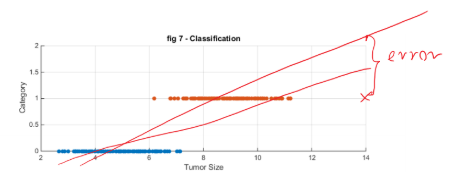
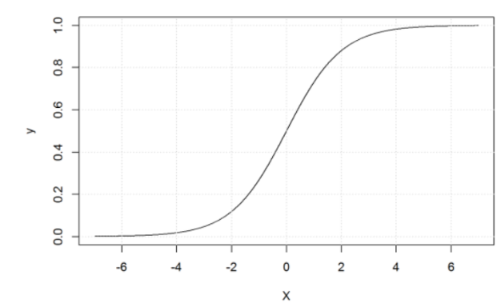
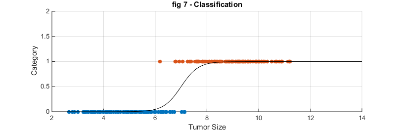
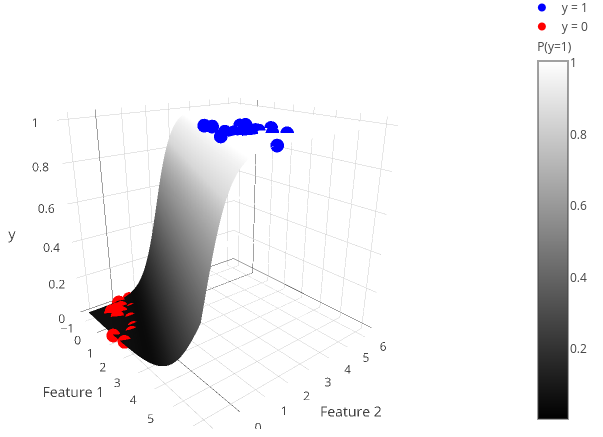
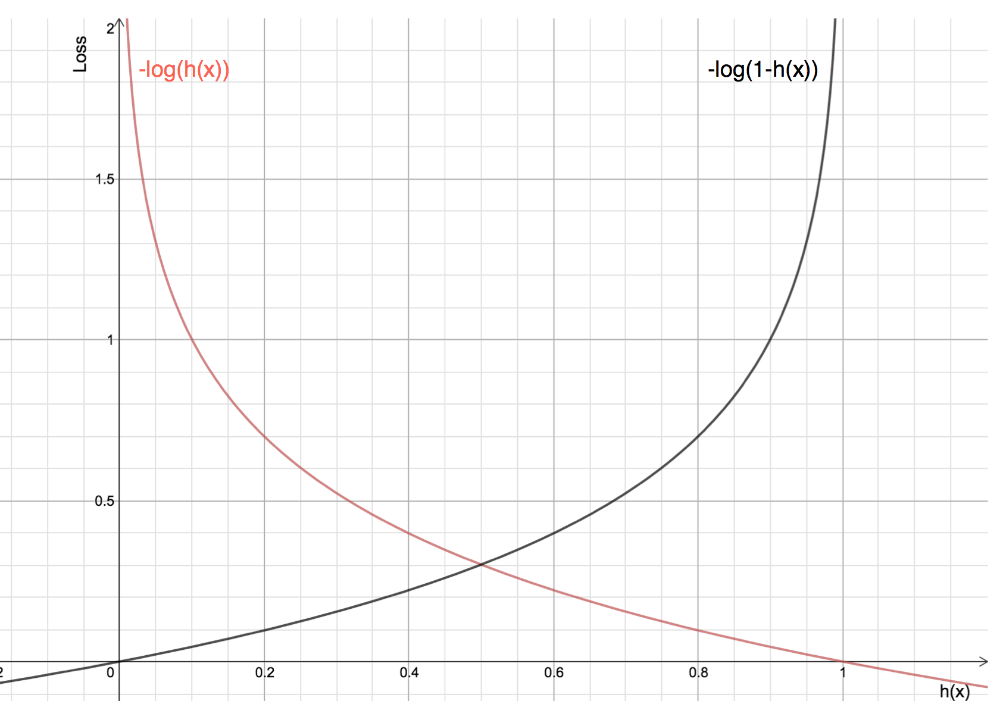
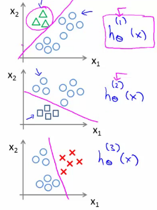



Now we have a different type of data (experience): \\( D = \\{ (X_i,Y_i)|X_i \in R^n, y_i \in C \\} \\), where \\( C \\) is categorical. For now, lets
assume \\( C = \\{0,1\\} \\) . For an unseen data \\( x \in R^n \\), we need a function \\( F:R^n \rightarrow  C \\) which predicts its category label whether
it belongs to class '0' or to class '1', formally: \\( F(x) \in \\{0,1\\} \\)
For instance:
1. Email classification: Spam or not spam
2. Medical diagnosis: cancer or not,
3. Fraud detection: employer is cheating or not
4. Customer will pay back the loan or not.

**Figure 1.** Classification problem.

One could fit a regression line and rounding the outcome, the regressand to 0 or 1. This approach would not work here.
A large value of \\(x\\), say \\(x=14\\), would indicate a strong relation to the class labeled by '1'. However, the corresponding
outcome of the regression function at point x could be large, far from 1.0 which would dominate in the loss function. In order to abate the overall
error the optimizer would choose another \\(\theta_{i}\\) parameters so that the \\(F(x)\\) would be closer to 1. This could increase much more 
classification error around the decision boundary.

Instead of using a linear regression, we fit an S-shaped function on the data. Many S-shaped functions are available, e.g.
arc tangent. However the most frequently used one is the sigmoid function or also called logistic function, defined as: \\(g(x) = \frac{1}{1+e^{-x}}\\)
The reason of preferring the sigmoid function over the arctan is that (i) sigmoid has a nice derivative function and (ii) it
has some sort of probabilistic distribution interpretation.

**Figure 2.** Sigmoid function. If you zoom out this plot the shape of the sigmoid function resembles to a step function.

We can use this sigmoid functions as a model to represent the relationship between data \\((X)\\) and the categories \\((C)\\) in
the following way:

\\[ h_{\Theta}(x) = \frac{1}{1+e^{-\Theta^{T}x}} = \frac{1}{1+e^{-(\theta_{0}+\theta_{1}x_{1}+\theta_{2}x_{2}+...+\theta_{n}x_{n} )}} \\]

This is just a non-linear transformation of the linear combination of the feature \\(x_{i}\\)'s. Using this model, the classification rule can be defined as for a data \\(x\\):
\\[ 
    f(x) = 
    \begin{cases}
      0, & h_{\Theta}(x) \lt t \cr
      1, & h_{\Theta}(x) \geq t
    \end{cases}       
\\]

The value \\(t\\) is called the decision threshold. And the region \\(x\\), where \\(f(x) = t\\) is called the becision boundary. The value
of \\(t\\) could depend on the application but in our case here let's choose \\(t = 0.5\\) .

**Figure 2a.** A logistic regression representing a classification problem.

**Figure 2b.** A logistic regression representing a classification problem.

The model parameters are \\(\theta\\)'s, and we need a way to learn these parameters. Now the question is how?
To learn the parameters, first we need to define the loss function (also called cost function). One could define the cost
for one data as following:

\\[ c_{\theta}(x_{i},y_{i}) = (\frac{1}{1+e^{-(\theta_{0}+\sum_{j=1}^{n}\theta_{i}x_{i,j})}} - y_{i})^{2} \\]

This leads the following loss function using the regularization term as:
\\[ J(\Theta\mid D) = \frac{1}{m}\sum_{i=1}^{m}(h_{\Theta}(x_{i})-y_{i})^{2} + \lambda \sum_{j=1}^{n} = \frac{1}{m}\sum_{i=1}^{m}(\frac{1}{1+e^{-(\theta_{0}+\sum_{j=1}^{n} \theta_{i}x_{i,j})}}-y_{i})^{2} + \lambda \sum_{j=1}^{n} \theta_{j}^{2} \\]

**Discussion 1.** What is the problem with this objective function?

**Solution.** This error function is non-convex, which means that the optimization procedure is hindered by local-optima problem, and an global optimizer could stack in a local minimum.

How can we make this error function convex?
Let's take a logarithmic transformation of \\(h_{\Theta}(x)\\): and we get \\(-\log(h_{\Theta}(x))\\).

[source:https://houxianxu.github.io/2015/04/23/logistic-softmax-regression/](https://houxianxu.github.io/2015/04/23/logistic-softmax-regression/)

Now, let's define the cost of an error as following: 
\\[ c_{\Theta}(x_{i},y_{i}) = -y_{i} \log(h_{\Theta}(x_{i})) - (1-y_{i}) \log(1-h_{\Theta}(x_{i})))\\]

Using this cost function \\(c_{\Theta}\\) in the error function \\(J(\Theta\mid D)\\) we get:

\\[ J(\Theta\mid D) = \frac{1}{m}\sum_{i=1}^{m}(-y_{i}\log(h_{\Theta}(x_{i})) - (1 - y_{i})\log(1 - h_{\Theta}(x_{i}))) + \lambda \sum_{j=1}^{n} \theta_{j}^{2} \\]
Now, this leads to a convex error function and we can find the \\( \Theta \\) parameters which minimize the error function using e.g. the gradient descent algorithm.

#### Algorithm 2

Initialize \\( \theta_{j} \\) with random values

\\[
    \begin{array}{ll}
        \text{repeat until convergence \\{} \cr
        \hspace{1cm}\widetilde{\theta_{j}} = \theta_{j} - \mu \frac{\partial}{\partial\theta_{j}}J(\Theta\mid D), & \text{for all j;} \cr
        \hspace{1cm}\theta_{j} = \widetilde{\theta_{j}}, & \text{for all j;} \cr
        \text{\\}}
    \end{array}
\\]

Note: update \\(\theta_{j}\\)'s simultenously.

We just need the derivatives of \\(J\\). After simple calculus, we get that:

\\( h_{\Theta}(x)' = h(x)(1-h(x)) \\), so

\\[ 
\begin{array}{ll} 
\frac{\partial}{\partial\theta_{j}}J(\Theta\mid D) = \frac{\partial}{\partial\theta_{j}}(\frac{1}{2m}\sum_{i=1}^{m}(-y_{i}\log(h_{\Theta}(x_{i})) - (1-y_{i})\log(1-h_{\Theta}(x_{i}))) + \lambda\sum_{j=1}^{n}\theta_{j}^{2})= \cr
\frac{\partial}{\partial\theta_{j}}J(\Theta\mid D) = \frac{1}{2m}\sum_{i=1}^{m}(h_{\Theta}(x_{i}) - y_{i})x_{i,j} + 2\lambda\theta_{i} & \text{for } j \gt 0 \cr
\frac{\partial}{\partial\theta_{j}}J(\Theta\mid D) = \frac{1}{2m}\sum_{i=1}^{m}(h_{\Theta}(x_{i}) - y_{i}) & \text{for } j = 0  \cr
\end{array}
\\]

This summarises algorithm 2 as follows:
\\[ 
\begin{array}{ll} 
    \text{repeat until convergence \\{} \cr
    \hspace{1cm}\widetilde{\theta_{j}} = \theta_{j} - \mu(\sum_{i=1}^{m}(h_{\Theta}(x_{i}) - y_{i})x_{i,j} + 2\lambda\theta_{i}), & \text{for } j \gt 0 \cr
    \hspace{1cm}\widetilde{\theta_{0}} =  \theta_{0} - \mu\sum_{i=1}^{m}(h_{\Theta}(x_{i}) - y_{i}), & \text{for } j = 0 \cr
    \hspace{1cm}\theta_{j} = \widetilde{\theta_{j}}, & \text{for } \forall j \cr
    \text{\\}}
\end{array}   
\\]

Note that, the features are needed to be normalized.

Question: Why should be the features normalized?

#### Vectorization

Mathematical modelling languages, such as Matlab, R, numpy in Python are able to work with matrices and common mathematical functions are extended over matrices and vectors as well.
Let \\(\Theta \in R^{n+1}\\) a column vector containing the parameters of the model \\([\theta_{0}, \theta_{1}, ... , \theta_{n}]^{T} \\). Let \\( X \in R^{(n+1) \times m} \\) be a
matrix containing the data in its columns where we added a constant 1 to each data in the 0th position.
Hence, \\(X\\) and \\(\theta\\) are "compatibile". Let \\( Y \in R^{1 \times m} \\) be a row vector containing category labels.

Let \\( X = \left[\begin{array}{cccc}
1, & X_{1}  \cr
1, & X_{2}  \cr
1, & X_{3}   \cr
 ... \cr
1, & X_{m}
\end{array}\right] = \left[\begin{array}{cccc}
1, & x_{1,1}, & x_{1,2}, & ... & x_{1,n}   \cr
1, & x_{2,1}, & x_{2,2}, & ... & x_{2,n}   \cr
1, & x_{3,1}, & x_{3,2}, & ... & x_{3,n}   \cr
& & ... & & \cr
1, & x_{m,1}, & x_{m,2}, & ... & x_{m,n}
\end{array}\right]\\) and let \\(Y = \left[\begin{array}{cccc}
y_{1}  \cr
y_{2}  \cr
y_{3}   \cr
... \cr
y_{m}
\end{array}\right]  \\)

Let \\(X[,i]^{T} = [1,x_{1,i},x_{2,i}, ...,x_{n,i}]^{T}\\) be a column vector denoting the ith data in \\(X\\). Let \\(g(.)\\) be the sigmoid function
extended over matrices and vectors as elementwise. Thus, \\(g(X\theta)\\) is a vector.
Hence, the Gradient Descent algorithm for Logistic Regression can be rewritten as follows:

#### Algorithm 3

Initialize the parameters randomly

\\( 
    \begin{array}{l}
        \text{repeat until convergence \\{} \cr
        \Delta = X^{T}(g(X\theta)-Y)) \cr
        \Delta[-1] = \Delta[-1] - 2\lambda\theta[-1] \text{   Add up regularization term without the bias.} \cr
        \theta = \theta - \mu\Delta \cr
        error = \frac{1}{m}(-Y \ast \log(g(X\Theta)) - (1 - Y) \ast \log(1 - g(x\Theta))) + \lambda \ast sum(\Theta^{2}) \cr
        \text{Print out current error. So you can see if the algorithm converges or diverges.} \cr
        \text{\\}}
    \end{array}{l}        
\\)

That is it, logistic regression using gradient descent optimization can be implemented in 7-10 code of lines in a mathematical programing languages.
Implementation issue: The algorithm above calculates \\(g(X\Theta)\\) three times. To make it computationally more efficient in implementation, it would be 
worthwhile calculating it once and storing it in a local variable.

#### Multi-class classification problem

The method above can be used with two categories, i.e. in binary classification problems. However, we need an approach to deal with multi-class classification problems.

In multi-class classification problems, for each category a logisitc regression model is built. Let's suppose there are \\(K\\) categories, i.e. \\(y \in \\{1,2,...,K\\}\\).
Then the kth logistic regression model is assigned to the kth class, such that, the k-th class is treated as positive class (1) and all the other classes are joined 
and marked as negative class (0). A new data instance is to be classifed to the class whose model gives the highest score. This approach is called one-vs-all classification.

**Figure 3.** One-vs-all classification. For each class a logistic regression model is built.

[From http://www.holehouse.org/mlclass/06_Logistic_Regression.html](http://www.holehouse.org/mlclass/06_Logistic_Regression.html)

In this case we have \\(K\\) model parameters in vector form \\(\Theta_{1}, ..., \Theta_{K}\\), which can be merged in to a matrix \\(\Theta = [\Theta_{1},\Theta_{2},...,\Theta_{K}]\\) in which the kth column corresponds to the kth class.

We also can recode the class labels. For every class label \\(y_{i} \in \\{1,2,...,K\\}\\) we assign a vector whose elemets are zero except there is a one (1) at position of \\(y_{i}\\). For instance, if \\(y_{i} = 3\\) and \\(K = 10\\) then \\(Y_{i} = [0,0,1,0,0,0,0,0,0,0]\\). This coding is called one-hot encoding. Now, we can extend the former training algorithm for multi-class logistic regression. The cost functions is:
\\[ J(\theta|D) = -mean(Y \ast. \log(g(X\theta))) + (1-Y) \ast. \log(1-g(X\theta))) + \lambda mean(\theta^{\uparrow.2}) \\]
Note: \\(\ast.\\) element-wise production, \\(mean\\) takes the mean of all elements in its argument and \\(\uparrow.2\\) is performed element-wise. Note that \\(\Theta\\) is matrix and \\(X\Theta\\) will have the same size as \\(Y\\).

Now the training algorithm can be formulated as:
\\[ 
    \begin{array}{l}
        \text{repeat until convergence \\{} \cr
        \Delta = X^{T}(g(X\theta)-Y)) \cr
        \Delta[-1] = \Delta[-1] - 2\lambda\theta[-1] \cr
        \theta = \theta - \mu\Delta \cr
        error = mean(-Y \ast. \log{g(X\theta)}) - (1-Y) \ast. \log{1-g(g\theta)})) + \lambda \ast mean(\theta^{2}) \cr
        \text{Print out current error. So you can see if the algorithm converges or diverges.} \cr
        \text{\\}}
    \end{array}       
\\]

Some remarks:
1. The cost function here is also called cross-entropy (xent). The cross-entropy of two discrete probabilistic distributions \\(P\\) and \\(Q\\) is defined as:
\\[ H(P,Q) = -\sum_{k}P(k) \log Q(k) \\] Now, let us consider a single data \\(x\\) and a binary class logistic regression problem \\((k=2)\\). We can consider \\(P\\) as the <u>true</u> distribution over the class labels which is defined in the following form \\(P(Y_{i} = 1) = 1\\) iff \\(x\\) belongs to the positive class, otherwise  \\(P(Y_{i} = 0) = 0\\) (\\(x\\) belongs to the negative class). \\(P\\) is a probability distribution. Now, we can define \\(Q\\) as a distribution over the classes calculated by our model \\(Q(Y_{i} = 1) = g(x\Theta)\\) and \\(Q(Y_{i} = 0) = 1 - Q(1) = 1 - g(x\Theta)\\). Check that \\( Q(Y_{i} = 1) + Q(Y_{i} = 0) = g(x\Theta) + 1 - g(x\Theta) = 1 \\).

2. Consider the binary logistic regression problem. We mentioned earlier that, the sigmoid functions bears some probabilistic distribution interpretation. 
In fact, \\(g(x\theta) = P(y=1|x)\\) and \\(P(y=0|x) = 1 - g(x\Theta)\\). This can be written as \\(P(y|x) = g(x\Theta)^{y}(1-g(x\Theta))^{1-y}\\)
For a given dataset, the likelihood function is defined as \\(l(\Theta) = \prod_{i} P(y_{i}|x_{i}) = \prod_{i}g(x_{i}\Theta)^{y_{i}}(1-g(x_{i}\Theta))^{1-y_{i}}\\).
The loglikelihood: \\(\log(l(\Theta)) = \sum_{i} y_{i} \log g(x_{i}\Theta) + (1-y_{i})\log(1-g(x_{i}\Theta)) \\). The only difference between the cross entropy function and this maximum likelihood estimation is the sign (-1). This is also a reason why sigmoid functions is preferred to other S-shaped functions, such as arctan. Note that, in the case above we fit two distributions, one for the positive and one for the negative class, but the model parameters are tied.