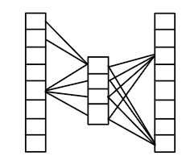



We have seen that, the collaborative filtering is capable of learning a vector representation of data instances based on their relative relation to each other and to the users.

In this part, we will see other methods for learning real-valued, fixed dimensional representation for words and other real-world entities.  These are often called 'word-embedding' (to real-valued vector space), or 'word representation', or also called 'distributed representations' of words and phrases, etc. Neural word embedding refers to the fact the embedding is done using neural networks.
When a word representation is available, then documents or sentences can be encoded by the list of the word representations of the corresponding words. Word embedding provides a way to represent words with numerical vectors so that words and texts can be processed with using machine learning methods.

#### One-hot-encoding for words representation

Perhaps, this is the simplest method as it works as follows. 
1. Take a large collection of unstructured text from, for instance, Wikipedia or Twitter. 
2. Collect or identify all unique words from the text. This process is called tokenization, therefore unique words are called tokens, sometimes.
3. Give some ordering over the tokens and index each word (token) by their ordinal number. Let us suppose the total number of different tokens is \\(N\\).
4. Create an N-dimensional vector for each token which contains '1' at the index of the token, all other vector components are zero.

For example:
Consider the following words, 'a', 'abbreviation', apple, 'auto', 'bear', …, 'zoology'.
The corresponding word-embeddings are:

The problem with this approach is that it consumes too much memory and the representation is too sparse. In a typical real-world application, the number of the tokens can be several million (N=2-3 million). Thus, there is a several million dimensional vector for every token, where there is only one component with non-zero element. 
The other problem with one-hot-encoding is that, the vector space does not yield a semantic similarity measure corresponding to the original words. That is, the distance (or the scalar product) of the one-hot vectors does not correspond to the semantic differences of the corresponding words.

#### Word2vec method

This approach aims at providing real-valued, dense representation for (English) words from a very large collection of text. This approach takes into account some semantic relationship between the words. When the words tend to appear in similar semantic context, then they obtain similar real-valued representation. One of the advantages of word2vec method is that it does not require a well-annotated, labeled data, word2vec requires only a large unstructured text. This large amount of text can be taken from, e.g. all articles from Wikipedia or all messaged from Twitter. 

The word2vec method actually refers to two different approaches: 'skip-gram' model and 'Continuous Bag of Words (CBOW)', both types uses a neural network to learn the word embedding.

#### CBOW method

The main idea of this method is to predict the probability of a word given a context. The length of the context can vary from one to few tens. Let us demonstrate how this works through an example. Let us suppose, we have a small text:

"Hey this is sample corpus using only one context word." 

First, the words are represented via one-hot-encoding embedding. The number of the tokens is: \\(V=10\\)

One-hot-Encoding for every word:

The training input-output pairs are constructed from the word and from its context (window). The context of every word is one of the adjacent words in the sentence. Therefore our data looks like this:

If larger context (context=2)were used, then the data would have look like this:

Etc.

The goal of CBOW is to predict the probability of the target word from the context words. That is, we want to calculate:
\\[p(target\ word \mid context_{1}, context_{2}, ..., context_{K}) \\]
This is achieved with a three-layer neural network (shown for one context):

**Figure 1.** The three-layer neural network used in the CBOW model. Input is one context word and the output is the target word. Context and target words are represented with one-hot-encoding.

* In real-world applications, the number of the hidden units is around 300 (N=300).
* The input and the output layer, both are one-hot encoded of size [1×V].
* There is no activation function at the hidden layer.
* There is a soft-max normalization at the output layer.
* The error between the true output and the observed output is back-propagated.
* The word representation (embedding) of the target word is taken from the weights between the hidden and the output layer.

When more than one context words are given, then the model is defined as:

**Figure 2.** CBOW for k context words. In this case the hidden data are averaged.

#### Forward propagation in the CBOW model.

The inputs are a one-hot-encoding of the context words: \\(x_{1},x_{2},...,x_{K}\\). The hidden activation is given as: \\(h = \frac{1}{K}\sum_{K}(Wx_{k}) = \frac{1}{K}W(\sum_{k}x_{k})\\).

The output vector is then calculated as \\(u = W'h\\). Remember, the shape of the output vector \\(u\\) is of \\([1,V]\\).
The output is put through a soft-max layer to convert the output vector to a discrete probability distribution. The probability of the \\(j\\)th word is given by:
\\[y_{j} = p(target\ word\ with\ index\ j \mid x_{1},x_{2},...,x_{K}) = \frac{exp(u_{j})}{\sum_{i=1}^{V}\exp(u_{i})}\\]

**The learning objective** of CBOW is defined by a soft-max function.

\\[W,W' \leftarrow arxmax_{\Theta}\Bigg\\{p(target\ word\ j \mid context_{1}, context_{2}, ..., context_{K}) = \frac{exp(u_{j})}{\sum_{i=1}^{V}\exp(u_{i})} \Bigg\\}\\]

#### Model dissection

Note that the context words and the target words are one-hot encoded. So, there is only one non-zero element in their corresponding vectors. 

The word representation of the target word (with index \\(j\\)) is composed from the weights of the \\(j\\)th column of \\(W'\\) matrix, and it is denoted as \\(W'\_{j}\\). Note that the word representation is of shape \\([N,1]\\).

For a context word with index \\(k\\) we have \\(h = W_{k}\\), where \\(W_{k}\\) is the *k*th row from weight matrix \\(W\\). The probability of the target word with index \\(j\\) with respect to one context word with index \\(k\\):
\\[p(jth\ target\ word\ \mid x_{k}) = \frac{\exp(W_{j}'^{T}h)}{\sum_{i=1}^{V}\exp(W_{i}'^{T}h)} = \frac{\exp(W_{j}'^{T}W_{k})}{\sum_{i=1}^{V}\exp(W_{i}'^{T}W_{k})}\\]

For \\(K\\) different context words the hidden activation is given: \\(h = \sum_{k=1}^{K}W_{k}\\).
The probability of the target word with index \\(j\\) with respect to \\(K\\) different context words:
\\[p(jth\ target\ word \mid x_{1},x_{2},...,x_{k}) = \frac{\exp(W_{j}'^{T}h)}{\sum_{i=1}^{V}\exp(W_{i}'^{T}h)} = \frac{\exp(W_{j}'^{T}(\sum_{k=1}^{K}W_{k}))}{\sum_{i=1}^{V}\exp(W_{i}'^{T}(\sum_{k=1}^{K}W_{k}))} \\]
Advantage: This model is of low-memory cost. 

#### Skip-gram model

Here, the aim is to calculate some distributed word representation but the model structure and the aim is the opposite. In this approach, we want to predict the context words for a given target word that is \\(p(context_{x}\mid target_{\downarrow}word)\\) Consider the previous example: *"Hey this is sample corpus using only one context word."*

Now, for a target word "corpus" we want to get high probability for the context words: "sample" and "using". This approach does start with one-hot encodings of the words as before.

Note that, there is no activation function here either.

#### Forward propagation

Consider a target word with index \\(k\\). The input vector is \\(V\\)-dimensional, there is one non-zeros component at index \\(k\\). Therefore, the hidden activation is \\(h = x_{k}^{T}W = W_{k}\\) (of shape \\([1,N]\\)), that is: the first layer will just select the kth row from the first weight matrix \\(W\\). Now, we calculate the outputs at the last layer as follows:
\\[u = hW'\\]
The probability of a word with index \\(j\\) of being in the context of the target word with index \\(k\\) is given by:
\\[p(context_{j} \mid target\ word\ k) = \frac{\exp(u_{j})}{\sum_{i=1}^{V}\exp(u_{i})}\\]

#### Learning objective

For a given target word \\(k\\) and for \\(J\\) different context words, the learning objective is given as:
\\[W,W^{'} \leftarrow argmax_{\Theta}\Bigg\\{p(context_{1}, context_{2}, ..., context_{J} \mid target\ word\ k) = \log\Bigg\(\prod_{j=1}^{J}\frac{\exp(u_{j})}{\sum_{i=1}^{V}\exp(u_{i})}\Bigg\)\Bigg\\}\\]

#### Model dissection

The distributed word representation of a target word with index \\(k\\) is formed from the weights on the \\(k\\)th row of the first weight matrix \\(W\\). It is given as \\(W_{k}\\).

#### Semantics of the word representations

The representations calculated with skip-gram and CBOW has an interesting characteristics. <u>Sometimes</u>, the word representations (the vectors) are more meaningful in terms of describing the relationships between the words. For instance, subtracting two related words might reveal meaningful concepts such as gender or verb tense. Sometimes, arithmetic of the vectors results in a meaningful representations as well e.g.

* King + Woman - Man = Queen
* Paris - France + China = Beijing

Note that, the words "Queen" and "Beijing" were identified by the words whose embedding is the closest to the result vector.

#### Parameterization

For practical applications, the dimensionality of the word vectors is set to be between 100 and 1000. The context window is recommended to be set to 10 for skip-gram and 5 for CBOW according to the authors based on their experience.

#### Optimization techniques 

Let us revisit the cost function again:

\\[p(context_{j} \mid target\ word\ k) = \frac{\exp(u_{j})}{\sum_{i=1}^{V}\exp(u_{i})}\\]

The problem with this in practice is that the \\(V\\) can be really large, couple of millions, and the training data pairs (target and context words) are often couple of billions. It can be time consuming to calculate the denominator for every training data. Two heuristics has emerged to cope with this problem: hierarchical softmax and negative sampling.

#### Hierarchical softmax

This approach uses a binary tree to encode all the words and calculates \\(p(context_{j}\mid target\ word\ k)\\) by going on a path from the root to a leaf node. Therefore, the calculation of \\(p\\) takes only \\(O(\log V)\\), instead of \\(O(V)\\) steps. As we will see, this approach produces correct probability distribution over the words without performing any normalization. This is not really a softmax anymore. First, a binary coding tree is built, something like the following. This can be done with Huffman coding trees, etc.

Note that, in traditional Huffman coding the characters are encoded and characters obtain a binary code. Now, in our case, each word remains intact and each word will obtain a unique binary code. For instance, the word "much" is encoded by 11101, where the binary digits tell if you need to turn left or right in the tree to reach the appropriate leaf. Also note that, frequent words obtain shorter codes and hence shorter path, while rare words obtained longer code words and their corresponding leaves are located in a deeper levels. We will use the fact that, there are \\(V-1\\) inner nodes for a binary tree with \\(V\\) leaves.

In the hierarchical softmax model for word embedding, there is a vector for every inner node. Let us denote these vectors by \\(v_{i}\\) which corresponds to the ith inner node. Let \\(L(w)\\) denote the length of the path from the root to the leaf of the word \\(w\\). For instance \\(L('much')=6\\) \\(L('wood' )=3\\).

The probability of a word with the hierarchical softmax is given as:
\\[p(w) = \prod_{j=1}^{L(w)-1}\sigma((-1)^{c_{j}}v_{w_{j}}^{T}h)\\]

where \\(c\\) denotes the code word of word \\(w\\) and \\(c_{j}\\) denotes a binary digit in the code word at position \\(j\\). For the word \\(w = 'much'\\) the code word is \\(c = 11101\\) and \\(c_{1} = c_{2} = c_{3} = c_{5} = 1\\) and \\(c_{4} = 0\\). The vector \\(v_{w_{j}}\\) denotes the vector of the inner nodes on the corresponding of the word \\(w\\). For instance, the probability of the word 'much' is calculated:
\\[p(much) = \sigma (-v_{1}^{T}h) \sigma (-v_{3}^{T}h) \sigma (-v_{4}^{T}h) \sigma (-v_{6}^{T}h) \sigma (-v_{8}^{T}h)\\]

Note that: \\(\sigma (-\alpha) = 1 - \sigma (-\alpha) \\)

It can be shown that \\(\sum_{word \in vocabulary} p(word) = 1\\)

The important point here is that, the probability of a word \\(p(word)\\) is appropriately normalized, that is the probability of all words sum up to 1, the calculation requires only \\(O(log(V))\\) factors. For instance, for the word='much' one needs to calculate only 5 sigmoidal factors.

Finally, the learning objective of the skip gram model is given as:

\\[W,V \leftarrow argmax_{\Theta}\Bigg\\{p(context_{1}, context_{2}, ..., context_{J} \mid target\ word\ k) = \sum_{j=1}^{J}p(context_{j})\Bigg\\}\\]

where the word probabilities are calculated with using the binary tree. Note that the optimization optimizes the vectors of the inner nodes and all of these vectors are arranged in a matrix \\(V\\).

#### Negative sampling

The idea of negative sampling is straightforward. Simply, instead of considering \\(u_{i}\\) of all words \\(word_{i} \in vocabulary\\), we just sample few words from it. Certainly, the target word should be kept in the sample. Now, instead of using softmax as training objective, we can simply use the cross entropy function. The learning objective with negative sampling is given as:

\\[J = - \log(u_{j}) - \sum_{u \in negative\ samples, j \neq i} 1 - \log(u_{i})\\]
for a target word with index \\(i\\). The negative samples are drawn according to some noise distribution.

That is, the learning objective for the skip gram model is given as:

\\[W, W' \leftarrow argmax_{\Theta}\Bigg\\{p(c_{1}, c_{2}, ..., c_{J} \mid target\ word\ k) = \sum_{j=1}^{J}\Bigg\(- \log(u_{j}) - \sum_{u \in negative\ samples, j \neq i} 1 - \log(u_{i})\Bigg\) \Bigg\\} \\]

A really good article which explains the word2vec methods in details is given in [4].

#### Data representation

There are several data representation methodologies:
1. Local data representation. It is essentially the one-hot encoding. 
2. Semi local (or semi distributed) data representation. 
3. Distributed data representation. It is similar to the word embedding. In this approach, a single feature may participate in representing several entities. 

#### Word2Vec on other data items

In the previous sections, we gave a method to calculate distributed representations for words. We note that, we did not really exploit anything from the words itself, we only used one-hot-encoding and the relative positions of the words in the given sentences. This suggests that, if we can exploit some information about the relationships of the data instances then we can get distributed representations for any kind of data such as music songs (Spotify), apartments (Airbnb), product recommendation (Amazon, Yahoo), matching advertisements to search queries (Yahoo) using word2vec method.

#### Music embedding for music recommendations

The assumption is that users tend to listen to similar tracks in sequence. Each song is like a single word in a text dataset, and songs belonging to the same playlist should have similar vector representation. 

One use of this is the create a kind of music taste vector for a user by averaging the vectors of the songs that the user likes to listen to. This taste vector can then be used in similarity search to retrieve songs similar vector to the taste vector.
See: [https://towardsdatascience.com/using-word2vec-for-music-recommendations-bb9649ac2484](https://towardsdatascience.com/using-word2vec-for-music-recommendations-bb9649ac2484)

#### Listing recommendation at Airbnb

Apartment listings can be represented with a real-valued vector as well. Here, the assumption is that a user is likely to investigate a number of listings which fit her preferences and are comparable in features like amenities and design taste. The user activity data is formed from the click data. Airbnb is able to learn a vector representation of their listings using word2vec approach. An important note is that Airbnb used to train their embedding with negative samples, but they found that the negative samples are to be drawn from the same city.
Another problem relates to the cold start problem, i.e. how to generate a new vector for new apartment listings. Airbnb data engineers simply averaged the vectors of the three geographically closest listings to create a new vector.

#### Product recommendations in Yahoo Mail

Mail providers can extract information based on your only shopping history, see below:

Here, the assumption is that users purchases related items in a sequence. For instance, perhaps they are purchasing a number of items around the same time because they go together (like a camera and a lens), or because they are all part of a project they are working on, or because they are preparing for a trip they are taking. A user’s sequence of purchases may also reflect shopper taste–shoppers who like item A also tend to like item B and are interested in buying both. Yahoo augmented the word2vec approach with a few notable innovations. The most interesting was that their use of clustering to promote diversity in their recommendations. After learning vectors for all the products in their database, they clustered these vectors into groups. When making recommendations for a user based on a product the user just purchased, they don’t recommend products from within the same cluster. Instead, they identify which other clusters users most often purchase from after purchasing from the current cluster, and they recommend products from those other clusters instead.

**Figure.**  After purchasing a product from the Nerf cluster, customers are most likely to purchase a product from either the Xbox, Pokemon, or LEGO clusters. (Note that the paper doesn’t provide example cluster contents, so the ones above are entirely fabricated).

#### Matching Ads to Search Queries

The goal is to learn vector representations for search queries and for advertisements in the same “embedding space”, so that a given search query can be matched against available advertisements in order to find the most relevant ads to show the user. The training data consists of user “search sessions” which consist of search queries entered, advertisements clicked, and search result links clicked. The sequence of these user actions is treated like the words in a sentence, and vectors are learned for each of them based on their context–the actions that tend to occur around them. If users often click a particular ad after entering a particular query, then we’ll learn similar vectors for the ad and the query. All three types of actions (searches entered, ads clicked, links clicked) are part of a single “vocabulary” for the model, such that the model doesn’t really distinguish these from one another.

These examples (above) were taken from [3].

#### References:
1. [http://mccormickml.com/assets/word2vec/Alex_Minnaar_Word2Vec_Tutorial_Part_II_The_Continuous_Bag-of-Words_Model.pdf](http://mccormickml.com/assets/word2vec/Alex_Minnaar_Word2Vec_Tutorial_Part_II_The_Continuous_Bag-of-Words_Model.pdf)
2. [http://mccormickml.com/assets/word2vec/Alex_Minnaar_Word2Vec_Tutorial_Part_I_The_Skip-Gram_Model.pdf](http://mccormickml.com/assets/word2vec/Alex_Minnaar_Word2Vec_Tutorial_Part_I_The_Skip-Gram_Model.pdf)
3. [http://mccormickml.com/2018/06/15/applying-word2vec-to-recommenders-and-advertising/](http://mccormickml.com/2018/06/15/applying-word2vec-to-recommenders-and-advertising/)
4. [https://arxiv.org/pdf/1411.2738.pdf](https://arxiv.org/pdf/1411.2738.pdf)