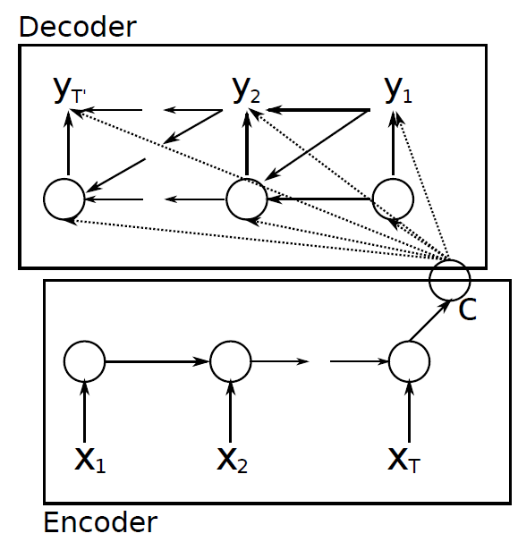
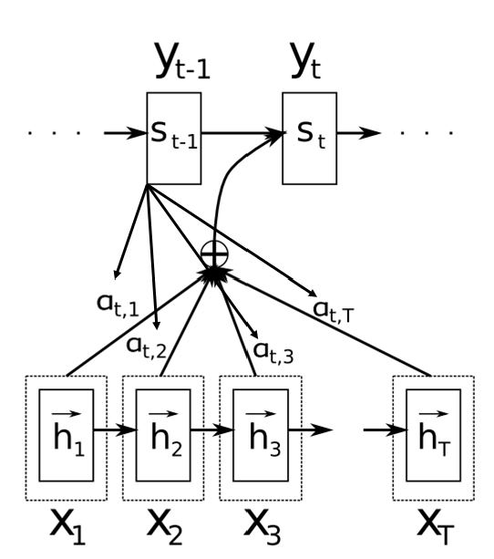



### Encoder-decoder RNNs, Sequence-to-sequence models, and Statistical Neural Machine Translation (SMT)

A particular RNN structure is the encoder-decoder RNN. The structure is depicted on the following figure:

Figure. Encoder-decoder RNN structure. Note that the model is not restricted to GRU units, it can be used with LSTM, or any other types of recurrent units.

This model reads the whole input sequence and produces a hidden state vector (called encoder state, context vector) which summarizes all the information in the input sequence. Then, the decoder model takes the context vector containing this representation and extracts information from it, and possibly translates it in a human readable format. This structure is used in statistical neural machine translation systems (NMT or SMT), caption generation systems, machine reasoning systems. 

The current statistical machine translation systems are based on LSTMs (or RNNs). The underlying idea is that the input is a sentence in language A (e.g. English) and the desired output is a sentence with the same meaning in language B (e.g. Russian). The input sequence is a series of word-vectors. One approach is the following. Let \\(x = x_{1}, ..., x_{T}\\) be a sentence in language \\(A\\), where all words \\(x_{i} \in B^{n}\\) represented with distributed word vectors (Word2Vec), and the desired outputs is a sequence of words \\(y = y_{1}, ..., y_{T}\\), \\(y_{i} \in B^{m}\\) on language \\(B\\). Note that \\(T\\) and \\(T′\\) can be different. The aim is to learn:
\\[p(y_{1}, ..., y_{T'} | x_{1}, ..., x_{T})\\]

The encoder is an RNN that reads each symbol of an input sequence \\(x\\) sequentially. As it reads
each symbol, the hidden memory state of the RNN changes according \\(p_{t} = tanh(W[h_{t-1};x_{t}] + b_{1})\\). After reading the end of the sequence (marked by an end-of-sequence symbol), the hidden memory state of the RNN is a context vector \\(c = h_{T}\\) of the whole input sequence. Note that this context vector can be really-really large dimensional.

The decoder of the proposed model is another RNN which is trained to generate the output sequence by predicting the next symbol \\(y_{t}\\) given the hidden state \\(h_{t}\\); however, both \\(y_{t}\\) and \\(h_{t}\\) are also conditioned on \\(y_{t-1}\\) and on the summary \\(c\\) of the input sequence. Hence, the hidden state of the decoder at time \\(t\\) is computed by,
\\[h_{t} = a(W_{h}[h_{t-1};y_{t-1};c] + b_{h})\\]
Where \\(a\\) is an activation function, and similarly, the conditional distribution of the next symbol is:
\\[y_{t} = P(y_{t}|y_{t-1},c) = softmax(W_{y}[h_{t};y_{t-1};c] + b_{y})\\]
And it is continued until and EOL is produced or some certain stop sign.

The encoder-decoder RNN for SMT is jointly trained to maximize the conditional log-likelihood
\\[argmax_{\theta} \sum_{n=1}^{N} \log p_{\theta}(y_{n}|x_{n})\\]

where \\(y_{n},x_{n}\\)  is sentence pair, \\(\theta\\) denotes model parameters.

Note that, chat-bots can be built in this principle as well.

### Attention models

One of the potential problem with this model is that, the context vector might not be large enough to store all the relevant information from long sentences. One approach to overcome this issue is called attention. The general principle of the attention models is that different context vectors are generated for different output symbols.

Figure. Attention layer for seq-to-seq models.

The context vector is a weighted sum of the encoder hidden state vectors, in which the weights (\\(a_{t,i}\\)) reflect the similarity betweenthe previous decoder hidden state (\\(s_{t-1}\\)) and the hidden states of the encoder RNN. Formally:
let \\(e_{tj} = a(s_{t-1}, h_{j})\\) be the similarity between the former hidden state vector of the decoder RNN and the hidden state vector \\(h_{j}\\) of the encoder RNN, and let \\(a_{tj} = \frac{exp(e_{tj})}{\sum_{k}exp e_{tk}}\\) be the soft-max normalization of \\(e_{tj}\\)'s. The attention function \\(a(.,.)\\) calculates a similarity-like score between its input vectors. For instance, \\(a\\) can be defined as:

\\(a(s_{t-1}, h_{j}) = s_{t-1}^{T}h_{j}\\) (dot product), or

\\(a(s_{t-1}, h_{j}) = s_{t-1}^{T}Wh_{j}\\) (weighted dot product), or

\\(a(s_{t-1}, h_{j}) = \nu^{T}\sigma(W[s_{t-1};h_{j}])\\) single layer neural network with parameters (\\(W\\) and \\(\nu\\)) are  part of the whole model and they are learned with back-propagation simultenously with all the other parameters.

Now, the context vector \\(c_{t}\\) to generate the \\(s_{t}\\) state vector with the decoder RNN is: \\(c_{t} = \sum_{j=1}^{T_{x}}a_{tj}h_{j}\\) that it, it is the weighted sum of the state vectors of the encoder RNN.

The state vector is obtained with
\\[s_{t} = f(s_{t-1}, y_{t-1}, c_{t}) = activation(W_{h}[s_{t-1};y_{t-1};c_{t}] + b_{h})\\]

And the output symbol can be obtained with
\\[p(y_{t}|y_{1}, ..., y_{t-1}, x) = g(s_{t}, y_{t-1}, c_{t}) = softmax(W_{y}[s_{t-1};y_{t-1};c_{t}] + b_{y})\\]

References SNMT:
[https://arxiv.org/pdf/1406.1078v3.pdf](https://arxiv.org/pdf/1406.1078v3.pdf)
[https://arxiv.org/abs/1409.3215](https://arxiv.org/abs/1409.3215)